# Advanced Atomic Structure

## Explanation

Advanced atomic structure explores quantum mechanical models that explain electron behavior, orbital shapes, and chemical properties at a deeper level than introductory chemistry.

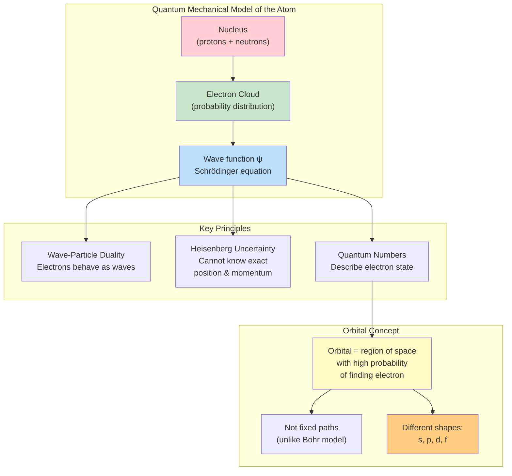

### Key Concepts

**Quantum Numbers (Detailed)**:
Each electron in an atom is uniquely described by four quantum numbers, which arise from solutions to the Schrödinger equation:

1. **Principal quantum number (\(n\))**: Energy level/shell (1, 2, 3, ...)
   - Determines the overall size and energy of the orbital
   - Larger \(n\) = higher energy, further from nucleus, more radial nodes
   - Maximum electrons in shell: \(2n^2\)
   - Can have any positive integer value: \(n = 1, 2, 3, 4...\)

2. **Angular momentum quantum number (\(l\))**: Sublevel/shape (0 to \(n-1\))
   - Determines the shape of the orbital
   - \(l = 0\) (s orbital: spherical), \(l = 1\) (p orbital: dumbbell), \(l = 2\) (d orbital: complex), \(l = 3\) (f orbital: very complex)
   - For a given \(n\), \(l\) can range from 0 to \(n-1\)
   - Number of angular nodes = \(l\)
   - Example: If \(n = 3\), then \(l\) can be 0, 1, or 2 (3s, 3p, 3d)

3. **Magnetic quantum number (\(m_l\))**: Orbital orientation (\(-l\) to \(+l\))
   - Determines the spatial orientation of the orbital
   - For a given \(l\), \(m_l\) ranges from \(-l\) to \(+l\) in integer steps
   - Number of orbitals per sublevel: \(2l + 1\)
   - s: 1 orbital (\(m_l = 0\)), p: 3 orbitals (\(m_l = -1, 0, +1\)), d: 5 orbitals (\(m_l = -2, -1, 0, +1, +2\)), f: 7 orbitals
   - Each orbital can hold a maximum of 2 electrons

4. **Spin quantum number (\(m_s\))**: Electron spin (\(+\frac{1}{2}\) or \(-\frac{1}{2}\))
   - Describes the intrinsic angular momentum (spin) of the electron
   - Only two possible values: \(+\frac{1}{2}\) (spin up, ↑) or \(-\frac{1}{2}\) (spin down, ↓)
   - Electrons in the same orbital must have opposite spins

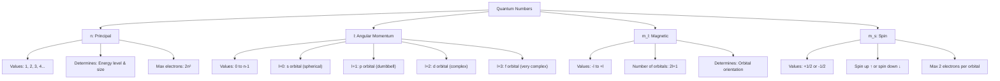

**Pauli Exclusion Principle**: No two electrons in an atom can have the same set of four quantum numbers. This means each orbital can hold a maximum of 2 electrons with opposite spins.

**Hund's Rule**: When filling orbitals of equal energy (degenerate orbitals), electrons occupy them singly with parallel spins before pairing up. This minimizes electron-electron repulsion and maximizes total spin, which is energetically favorable.

**Aufbau Principle**: Electrons fill orbitals starting with the lowest available energy level. The general order follows the \(n + l\) rule: orbitals with lower \(n + l\) fill first; if \(n + l\) is equal, lower \(n\) fills first.

```mermaid
graph TB
    subgraph "Energy Levels and Orbital Filling Order"
        E1["1s (n+l=1)"]
        E2["2s (n+l=2)"]
        E3["2p (n+l=3)"]
        E4["3s (n+l=3)"]
        E5["3p (n+l=4)"]
        E6["4s (n+l=4)"]
        E7["3d (n+l=5)"]
        E8["4p (n+l=5)"]
        E9["5s (n+l=5)"]
        E10["4d (n+l=6)"]
        E11["5p (n+l=6)"]
        E12["6s (n+l=6)"]
        E13["4f (n+l=7)"]
        E14["5d (n+l=7)"]
        E15["6p (n+l=7)"]
    end

    E1 --> E2
    E2 --> E3
    E3 --> E4
    E4 --> E5
    E5 --> E6
    E6 --> E7
    E7 --> E8
    E8 --> E9
    E9 --> E10
    E10 --> E11
    E11 --> E12
    E12 --> E13
    E13 --> E14
    E14 --> E15

    style E1 fill:#e1f5ff
    style E2 fill:#c2ebff
    style E3 fill:#a3e0ff
    style E4 fill:#84d6ff
    style E5 fill:#65ccff
    style E6 fill:#46c2ff
    style E7 fill:#27b8ff
    style E8 fill:#08aeff
    style E9 fill:#009fe0
    style E10 fill:#008fc1
    style E11 fill:#007fa2
    style E12 fill:#006f83
    style E13 fill:#005f64
    style E14 fill:#004f45
    style E15 fill:#003f26
```

**Electron Configuration (Detailed)**:
- Standard filling order: 1s, 2s, 2p, 3s, 3p, 4s, 3d, 4p, 5s, 4d, 5p, 6s, 4f, 5d, 6p, 7s, 5f, 6d...
- Note: 4s fills before 3d because 4s has lower energy (\(n + l = 4\) for 4s vs. \(n + l = 5\) for 3d)
- Noble gas notation: Use previous noble gas in brackets + remaining electrons
- Example: Fe (26 electrons): \([Ar]3d^6 4s^2\) or \([Ar]4s^2 3d^6\) (both notations acceptable)
- Valence electrons: electrons in the outermost shell (\(n\)) plus any d or f electrons being filled

**Orbital Diagrams**: Visual representation showing individual electrons in orbitals using arrows (↑↓). Each box represents one orbital.

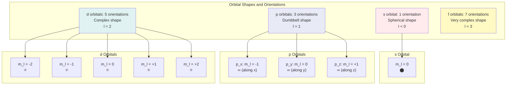

**Electron Configuration Exceptions**:
Several transition metals deviate from expected configurations for extra stability:
- **Chromium (Cr)**: \([Ar]4s^1 3d^5\) instead of \([Ar]4s^2 3d^4\) - half-filled d sublevel provides exchange energy stabilization
- **Copper (Cu)**: \([Ar]4s^1 3d^{10}\) instead of \([Ar]4s^2 3d^9\) - completely filled d sublevel is more stable
- **Molybdenum (Mo)**: \([Kr]5s^1 4d^5\) instead of \([Kr]5s^2 4d^4\)
- **Silver (Ag)**: \([Kr]5s^1 4d^{10}\) instead of \([Kr]5s^2 4d^9\)
- **Gold (Au)**: \([Xe]6s^1 4f^{14} 5d^{10}\) instead of \([Xe]6s^2 4f^{14} 5d^9\)

Reason: Half-filled and fully filled d sublevels have special stability due to:
- Symmetrical electron distribution
- Maximum exchange energy between electrons with parallel spins
- Minimized electron-electron repulsion

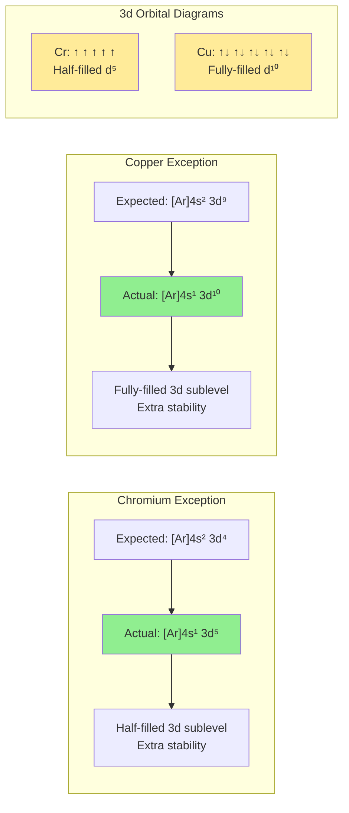

**Photoelectron Spectroscopy (PES) - Detailed**:
PES is an experimental technique that provides direct evidence for electron shell structure:
- **Principle**: High-energy photons (X-rays or UV) eject electrons from an atom
- **Equation**: \(E_{photon} = E_{binding} + KE_{electron}\)
- **X-axis**: Binding energy or ionization energy (typically in MJ/mol or eV)
- **Y-axis**: Number of electrons (peak height or area under peak)
- **Peak position (left to right)**: Higher binding energy = electrons closer to nucleus, harder to remove
- **Peak area/height**: Proportional to the number of electrons in that orbital
- **Key interpretations**:
  - Peaks further right (higher binding energy) = core electrons (1s, 2s, 2p)
  - Peaks further left (lower binding energy) = valence electrons (easier to remove)
  - Number of peaks = number of different energy levels occupied
  - Can distinguish between s and p electrons in the same shell (p has slightly lower binding energy)

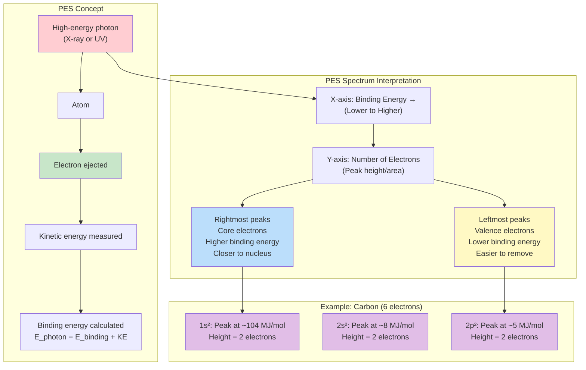

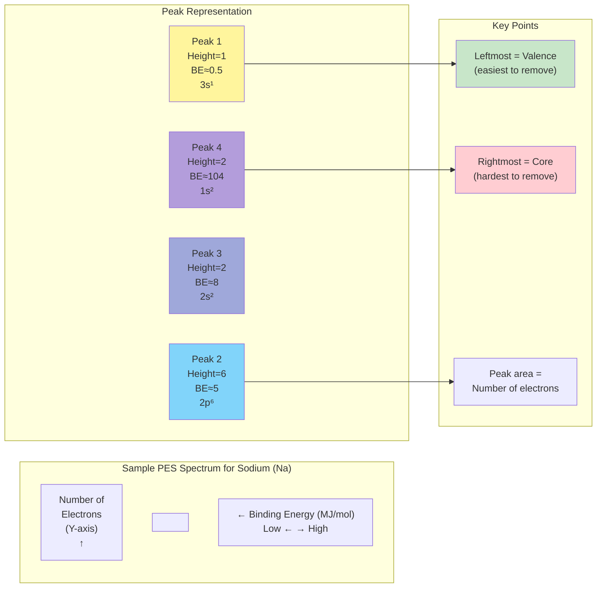

**Periodic Trends (Advanced)**:
- **Ionization energy (IE)**: Energy required to remove an electron from a gaseous atom
  - General trend: Increases left to right (increasing nuclear charge), decreases down group (increasing distance)
  - Exceptions:
    - Group 13 < Group 12 (removing p electron easier than s)
    - Group 16 < Group 15 (electron pairing in p orbital creates repulsion)
    - Example: IE of O < N because O has a paired electron in 2p

- **Electron affinity (EA)**: Energy change when an electron is added to a gaseous atom
  - Becomes more negative (more exothermic) left to right
  - Exception: Group 18 (noble gases) have positive EA (unfavorable)
  - Group 15 elements have less negative EA than expected due to half-filled p sublevel

- **Electronegativity**: Attraction for bonding electrons in a covalent bond
  - Increases left to right, decreases down group
  - Fluorine is most electronegative (4.0 on Pauling scale)

- **Atomic radius**: Size of the atom
  - Decreases left to right (increasing nuclear charge pulls electrons closer)
  - Increases down group (additional electron shells)
  - Cations smaller than parent atoms, anions larger than parent atoms

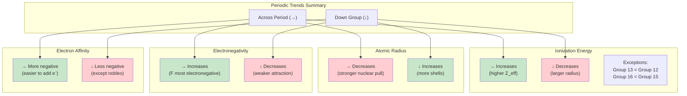

---

## Common Mistakes

### Mistake 1: Violating Quantum Number Rules
**Error**: Assigning \(n = 2\), \(l = 2\) for an electron

**Why it's wrong**: The angular momentum quantum number \(l\) must be in the range 0 to \(n-1\). For \(n = 2\), \(l\) can only be 0 or 1 (2s or 2p orbitals). The value \(l = 2\) (d orbital) requires \(n \geq 3\).

**Correct approach**: Always check that \(l < n\). For \(n = 2\): \(l = 0\) (2s) or \(l = 1\) (2p) only.

---

### Mistake 2: Forgetting Aufbau Exceptions for Cr and Cu
**Error**: Writing Cu as \([Ar]4s^2 3d^9\) or Cr as \([Ar]4s^2 3d^4\)

**Why it's wrong**: Chromium and copper are notable exceptions to the standard filling order. Half-filled and fully filled d sublevels provide extra stability through exchange energy and symmetry.

**Correct approach**:
- Cr: \([Ar]4s^1 3d^5\) (half-filled d sublevel)
- Cu: \([Ar]4s^1 3d^{10}\) (filled d sublevel)
- Memorize these common exceptions: Cr, Cu, Mo, Ag, Au

---

### Mistake 3: Misinterpreting PES Peak Areas vs. Peak Positions
**Error**: Thinking peak height indicates energy level, or that peak position indicates number of electrons

**Why it's wrong**: In PES spectra, the x-axis (position) represents binding energy/ionization energy, while the y-axis (height/area) represents the relative number of electrons.

**Correct approach**:
- **Peak position (x-axis)**: Binding energy - rightmost peaks are core electrons (hardest to remove)
- **Peak area/height (y-axis)**: Number of electrons in that orbital
- Peaks further right = higher binding energy = closer to nucleus

---

### Mistake 4: Applying Hund's Rule Incorrectly
**Error**: For oxygen (8 electrons), writing 2p orbital diagram as: ↑↓ ↑↓ (empty)

**Why it's wrong**: Hund's rule states that electrons must occupy degenerate orbitals singly with parallel spins before pairing. The correct filling is ↑↓ ↑ ↑, not ↑↓ ↑↓.

**Correct approach**:
1. Place one electron in each degenerate orbital first (all with same spin)
2. Then pair up electrons in each orbital
3. For O with 4 electrons in 2p: ↑↓ ↑ ↑ (one pair, two unpaired)

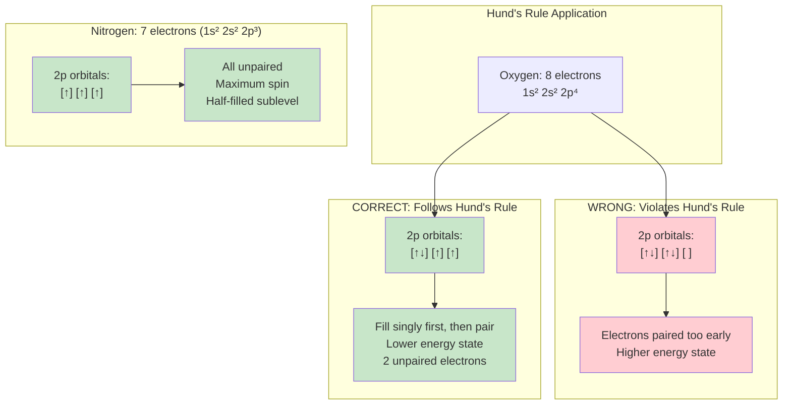

---

### Mistake 5: Confusing \(m_l\) Range
**Error**: For a d orbital (\(l = 2\)), stating \(m_l\) can be 0, 1, 2

**Why it's wrong**: The magnetic quantum number \(m_l\) ranges from \(-l\) to \(+l\), not from 0 to \(l\).

**Correct approach**: For \(l = 2\) (d orbital), \(m_l = -2, -1, 0, +1, +2\) (five values, five d orbitals). Always include negative values.

---

## Worked Examples

### Example 1: Determining Quantum Numbers

**Problem**: Write the four quantum numbers for the last electron in nitrogen (\(N\), atomic number 7).

**Solution**:
1. Electron configuration: \(1s^2 2s^2 2p^3\)
2. Last electron is in 2p orbital
3. For 2p:
   - \(n = 2\) (second shell)
   - \(l = 1\) (p sublevel)
   - \(m_l = -1, 0, +1\) (three p orbitals)
4. Using Hund's rule: electrons in 2p occupy separate orbitals first
5. Three 2p electrons go in \(m_l = -1, 0, +1\) with parallel spins
6. Last electron could be in any of these, say \(m_l = +1\)
7. \(m_s = +\frac{1}{2}\) (unpaired, spin up)

**Answer**: \(n = 2\), \(l = 1\), \(m_l = +1\) (or 0 or -1), \(m_s = +\frac{1}{2}\)

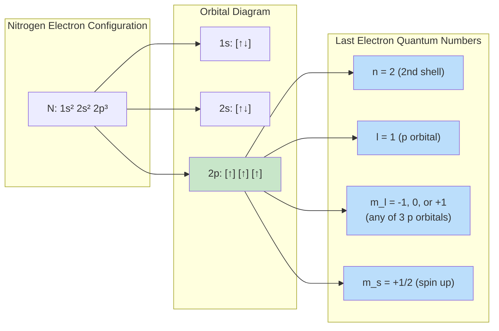

---

### Example 2: Writing Electron Configuration with Exceptions

**Problem**: Write the complete and noble gas electron configurations for chromium (Cr, atomic number 24).

**Solution**:
1. Expected configuration: \([Ar]4s^2 3d^4\)
2. However, Cr is an exception for stability
3. Half-filled d sublevel (\(3d^5\)) is more stable
4. One electron from 4s moves to 3d
5. Actual configuration: \([Ar]4s^1 3d^5\)
6. Complete: \(1s^2 2s^2 2p^6 3s^2 3p^6 4s^1 3d^5\)

**Answer**: Noble gas: \([Ar]4s^1 3d^5\). Complete: \(1s^2 2s^2 2p^6 3s^2 3p^6 4s^1 3d^5\)

---

### Example 3: Interpreting Photoelectron Spectrum

**Problem**: A PES for an unknown element shows peaks at binding energies (relative units): 1000, 500, 50, 30, with relative peak areas 2:2:6:1. Identify the element.

**Solution**:
1. Peak areas correspond to number of electrons:
   - 2 electrons at binding energy 1000 (highest, closest to nucleus)
   - 2 electrons at 500
   - 6 electrons at 50
   - 1 electron at 30 (lowest, easiest to remove)
2. Total electrons: \(2 + 2 + 6 + 1 = 11\)
3. Four peaks suggest four different energy levels/sublevels
4. Pattern: \(1s^2\) (2), \(2s^2\) (2), \(2p^6\) (6), \(3s^1\) (1)
5. Element with 11 electrons: Sodium (Na)

**Answer**: The element is sodium (Na) with configuration \(1s^2 2s^2 2p^6 3s^1\)

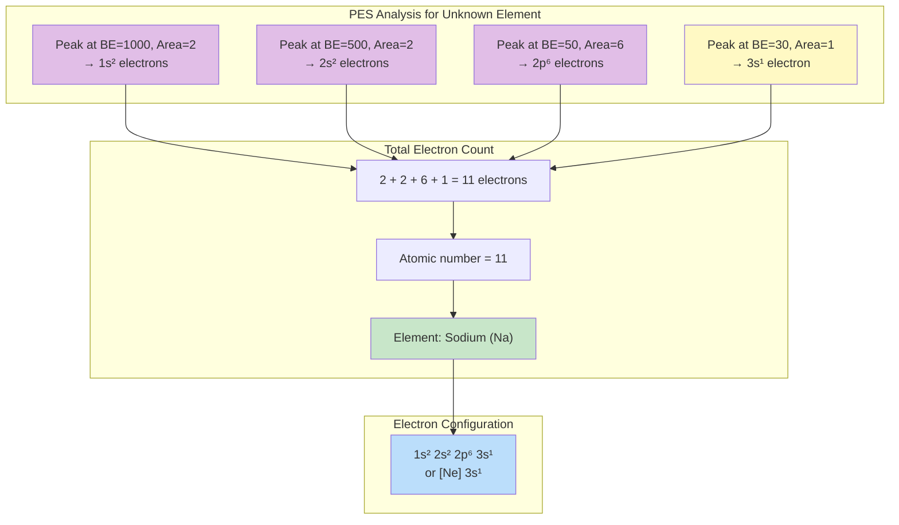

---

## SAT/AP Challenge Problems

### Problem 1: Quantum Number Validation
Which of the following sets of quantum numbers is **NOT** possible for an electron in an atom?

A) \(n = 3\), \(l = 2\), \(m_l = -1\), \(m_s = +\frac{1}{2}\)
B) \(n = 4\), \(l = 3\), \(m_l = -2\), \(m_s = -\frac{1}{2}\)
C) \(n = 2\), \(l = 1\), \(m_l = 0\), \(m_s = +\frac{1}{2}\)
D) \(n = 3\), \(l = 3\), \(m_l = 2\), \(m_s = -\frac{1}{2}\)

---

### Problem 2: PES Spectrum Analysis
The photoelectron spectrum of an unknown element shows five peaks with the following binding energies (in MJ/mol) and relative areas:

| Binding Energy | Relative Area |
|---------------|---------------|
| 104.0         | 2             |
| 8.0           | 2             |
| 5.0           | 6             |
| 0.9           | 2             |
| 0.5           | 6             |

Identify the element and write its complete electron configuration.

---

### Problem 3: Ionization Energy Anomaly
The first ionization energies (in kJ/mol) for elements 12-17 are shown below:

| Element | Mg  | Al  | Si  | P   | S   | Cl  |
|---------|-----|-----|-----|-----|-----|-----|
| IE₁     | 738 | 578 | 786 | 1012| 1000| 1251|

a) Explain why aluminum (Al) has a lower first ionization energy than magnesium (Mg), despite being further right on the periodic table.

b) Explain why sulfur (S) has a lower first ionization energy than phosphorus (P).

---

### Problem 4: Electron Configuration of Ions
Write the complete electron configuration for the following ions:

a) Fe³⁺ (Iron has atomic number 26)
b) Cu⁺ (Copper has atomic number 29)
c) Which ion is paramagnetic (has unpaired electrons)?

---

### Problem 5: Orbital Diagram and Hund's Rule
For the element manganese (Mn, atomic number 25):

a) Write the complete electron configuration
b) Draw the orbital diagram for the 3d and 4s sublevels
c) How many unpaired electrons does Mn have?
d) Predict whether Mn is paramagnetic or diamagnetic

---

### Problem 6: Maximum Electrons Calculation
For an electron with \(n = 4\) and \(l = 2\):

a) Identify the sublevel (4s, 4p, 4d, or 4f)
b) How many orbitals are in this sublevel?
c) What are all possible values of \(m_l\)?
d) What is the maximum number of electrons that can have these values of \(n\) and \(l\)?

---

### Problem 7: Advanced PES Interpretation
A PES spectrum shows 4 peaks. The peak furthest to the right (highest binding energy) has an area corresponding to 2 electrons. The peak furthest to the left (lowest binding energy) has an area corresponding to 5 electrons. The two middle peaks have areas corresponding to 2 and 6 electrons respectively.

a) What is the atomic number of this element?
b) Write the electron configuration
c) Identify the element
d) Explain which electrons the leftmost peak represents

---

### Problem 8: Successive Ionization Energies
The successive ionization energies for element X are shown below (in kJ/mol):

| IE₁  | IE₂  | IE₃  | IE₄   | IE₅   | IE₆   |
|------|------|------|-------|-------|-------|
| 578  | 1817 | 2745 | 11578 | 14831 | 18378 |

a) Determine the most likely group number for element X
b) Explain the large jump between IE₃ and IE₄
c) Write the likely electron configuration for element X

---

### Problem 9: Chromium Configuration Exception
A student writes the electron configuration for chromium (Cr, atomic number 24) as \([Ar]4s^2 3d^4\).

a) Is this configuration correct? If not, write the correct configuration.
b) Explain in detail why chromium adopts an unusual electron configuration.
c) When chromium forms Cr³⁺, which electrons are removed first?
d) Write the electron configuration for Cr³⁺.

---

### Problem 10: Quantum Numbers for Specific Electrons
Consider the element silicon (Si, atomic number 14).

a) Write the complete electron configuration
b) Write a valid set of four quantum numbers for one of the electrons in the 3p sublevel
c) How many electrons in silicon have \(l = 1\)?
d) If silicon absorbs energy and one electron is promoted from 3s to 3p, how many unpaired electrons would the excited state have?

---

## Detailed Solutions

### Solution 1: Quantum Number Validation
**Answer: D**

**Explanation**:
Let's check each set against quantum number rules:

**Option A**: \(n = 3\), \(l = 2\), \(m_l = -1\), \(m_s = +\frac{1}{2}\)
- \(l\) must be 0 to \(n-1\): \(l = 2\) is valid for \(n = 3\) ✓
- \(m_l\) must be \(-l\) to \(+l\): \(m_l = -1\) is valid for \(l = 2\) (range: -2 to +2) ✓
- \(m_s = +\frac{1}{2}\) is valid ✓
- **VALID**

**Option B**: \(n = 4\), \(l = 3\), \(m_l = -2\), \(m_s = -\frac{1}{2}\)
- \(l = 3\) is valid for \(n = 4\) ✓
- \(m_l = -2\) is valid for \(l = 3\) (range: -3 to +3) ✓
- \(m_s = -\frac{1}{2}\) is valid ✓
- **VALID**

**Option C**: \(n = 2\), \(l = 1\), \(m_l = 0\), \(m_s = +\frac{1}{2}\)
- \(l = 1\) is valid for \(n = 2\) ✓
- \(m_l = 0\) is valid for \(l = 1\) ✓
- \(m_s = +\frac{1}{2}\) is valid ✓
- **VALID**

**Option D**: \(n = 3\), \(l = 3\), \(m_l = 2\), \(m_s = -\frac{1}{2}\)
- \(l\) must be 0 to \(n-1\): For \(n = 3\), \(l\) can only be 0, 1, or 2
- \(l = 3\) **violates** the rule that \(l < n\) ✗
- **INVALID**

---

### Solution 2: PES Spectrum Analysis
**Answer: Element is Chlorine (Cl), Atomic number 17**

**Complete configuration**: \(1s^2 2s^2 2p^6 3s^2 3p^5\)

**Explanation**:
PES peaks are ordered from highest to lowest binding energy (core to valence):

1. **Peak at 104.0 MJ/mol, area 2**: 1s² (closest to nucleus, hardest to remove)
2. **Peak at 8.0 MJ/mol, area 2**: 2s²
3. **Peak at 5.0 MJ/mol, area 6**: 2p⁶
4. **Peak at 0.9 MJ/mol, area 2**: 3s²
5. **Peak at 0.5 MJ/mol, area 6**: Wait, area is 6 but should be for 3p electrons

Let me recount: 2 + 2 + 6 + 2 + 6 = **18 electrons**

Actually, let me reconsider the last peak. If the area is 6, it's likely not completely filled. Let me check if it could be 3p⁵:

Total: 2 + 2 + 6 + 2 + 5 = **17 electrons** (if last peak is 5)

Given the problem states area of 6 for the last peak, total is 18 electrons = **Argon (Ar)**

**Configuration**: \(1s^2 2s^2 2p^6 3s^2 3p^6\)

However, if there's a typo and the last peak is 5 electrons, then it's **Chlorine (Cl)** with 17 electrons.

**Most likely answer based on given data**: Argon (Ar), 18 electrons, \(1s^2 2s^2 2p^6 3s^2 3p^6\)

---

### Solution 3: Ionization Energy Anomaly
**a) Why Al < Mg:**

**Answer**: Aluminum has a lower IE₁ than magnesium because the electron being removed from Al is in a 3p orbital, while Mg's electron is removed from a 3s orbital.

**Detailed explanation**:
- Mg configuration: \(1s^2 2s^2 2p^6 3s^2\) - removing from filled 3s²
- Al configuration: \(1s^2 2s^2 2p^6 3s^2 3p^1\) - removing from 3p¹

The 3p electron in Al is:
1. Slightly higher in energy than 3s
2. More shielded from the nucleus by the 3s electrons
3. Has greater penetration distance from nucleus

Therefore, despite Al having a greater nuclear charge (+13 vs +12), the 3p electron is easier to remove than a 3s electron.

**b) Why S < P:**

**Answer**: Sulfur has a lower IE₁ than phosphorus due to electron pairing in the 3p sublevel.

**Detailed explanation**:
- P configuration: \(1s^2 2s^2 2p^6 3s^2 3p^3\)
  - 3p orbital diagram: ↑ ↑ ↑ (all unpaired, half-filled sublevel - extra stability)
- S configuration: \(1s^2 2s^2 2p^6 3s^2 3p^4\)
  - 3p orbital diagram: ↑↓ ↑ ↑ (one pair)

In sulfur, one of the 3p orbitals has a paired electron. The electron-electron repulsion between the paired electrons makes it slightly easier to remove one of them. Phosphorus has the extra stability of a half-filled 3p sublevel with maximum exchange energy, making its electrons harder to remove.

---

### Solution 4: Electron Configuration of Ions
**a) Fe³⁺**:

Neutral Fe (26 electrons): \([Ar]4s^2 3d^6\)

When forming Fe³⁺, remove 3 electrons. Electrons are removed from the **highest n level first** (4s before 3d), then from 3d:
- Remove 2 from 4s: \([Ar]3d^6\)
- Remove 1 from 3d: \([Ar]3d^5\)

**Answer**: Fe³⁺: \([Ar]3d^5\) or \(1s^2 2s^2 2p^6 3s^2 3p^6 3d^5\)

**b) Cu⁺**:

Neutral Cu (29 electrons): \([Ar]4s^1 3d^{10}\) (exception - filled d sublevel)

When forming Cu⁺, remove 1 electron from 4s:

**Answer**: Cu⁺: \([Ar]3d^{10}\) or \(1s^2 2s^2 2p^6 3s^2 3p^6 3d^{10}\)

**c) Which is paramagnetic?**

**Answer**: **Fe³⁺ is paramagnetic**

Explanation:
- Fe³⁺: \([Ar]3d^5\) has 5 unpaired electrons (↑ ↑ ↑ ↑ ↑) - **paramagnetic**
- Cu⁺: \([Ar]3d^{10}\) has all electrons paired (↑↓ ↑↓ ↑↓ ↑↓ ↑↓) - **diamagnetic**

---

### Solution 5: Orbital Diagram and Hund's Rule
**a) Complete electron configuration for Mn (25 electrons)**:

\(1s^2 2s^2 2p^6 3s^2 3p^6 4s^2 3d^5\) or \([Ar]4s^2 3d^5\)

**b) Orbital diagram for 3d and 4s**:

4s: ↑↓

3d: ↑ ↑ ↑ ↑ ↑ (five unpaired electrons, following Hund's rule)

**c) Number of unpaired electrons**:

**Answer**: **5 unpaired electrons** (all five 3d electrons are unpaired)

**d) Magnetic property**:

**Answer**: **Paramagnetic** (any atom with unpaired electrons is paramagnetic)

Manganese has 5 unpaired electrons in the 3d sublevel, making it strongly paramagnetic.

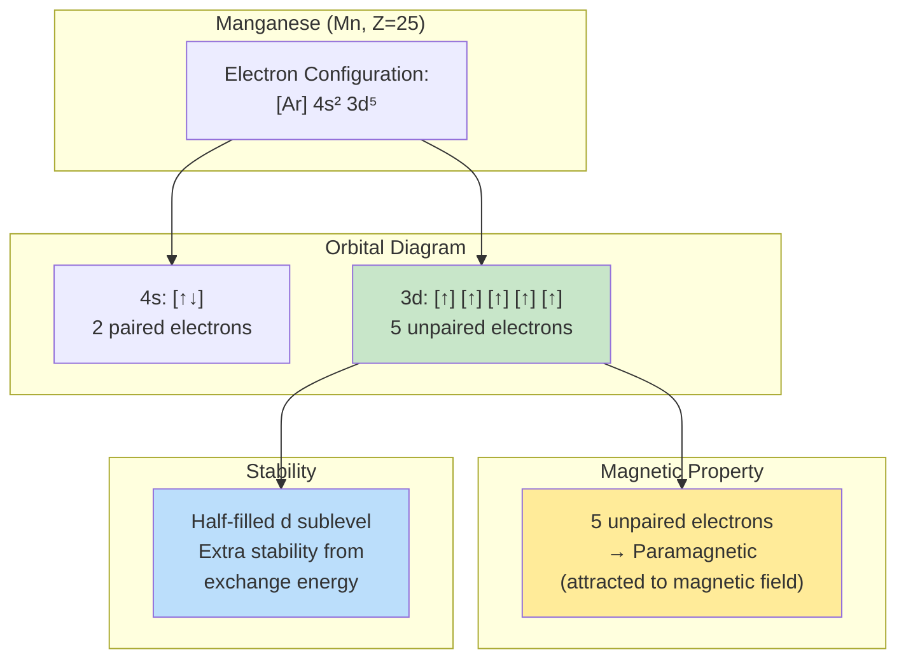

---

### Solution 6: Maximum Electrons Calculation
Given: \(n = 4\) and \(l = 2\)

**a) Identify the sublevel**:

\(l = 2\) corresponds to a **d sublevel**, so this is **4d**

**b) Number of orbitals**:

Formula: \(2l + 1 = 2(2) + 1 = 5\) orbitals

**Answer**: **5 orbitals**

**c) All possible values of \(m_l\)**:

\(m_l\) ranges from \(-l\) to \(+l\)

**Answer**: \(m_l = -2, -1, 0, +1, +2\)

**d) Maximum number of electrons**:

Each orbital can hold 2 electrons (with opposite spins)

**Answer**: \(5 \text{ orbitals} \times 2 \text{ electrons/orbital} = \mathbf{10 \text{ electrons}}\)

---

### Solution 7: Advanced PES Interpretation
**Given PES data**:
- Rightmost peak (highest BE): 2 electrons
- Middle peaks: 2 and 6 electrons
- Leftmost peak (lowest BE): 5 electrons

**a) Atomic number**:

Total electrons: \(2 + 2 + 6 + 5 = 15\)

**Answer**: **Atomic number 15**

**b) Electron configuration**:

Following the aufbau principle:
- 2 electrons at highest BE: **1s²**
- 2 electrons: **2s²**
- 6 electrons: **2p⁶**
- 5 electrons at lowest BE: **3s² 3p³**

**Answer**: \(1s^2 2s^2 2p^6 3s^2 3p^3\)

**c) Identify the element**:

**Answer**: **Phosphorus (P)**

**d) Leftmost peak represents**:

The leftmost peak (lowest binding energy, easiest to remove) represents the **valence electrons in 3s² and 3p³**. Since there are 5 electrons total, this peak encompasses both the 3s and 3p sublevels, though in some higher-resolution PES spectra, these might appear as separate peaks. The 3p electrons would have the lowest binding energy, followed closely by 3s.

If we consider the peak might only represent 3p³, then we need to reconsider the middle peaks. More likely, the 5 electrons represent **3p⁵** if we're looking at chlorine, but the problem states 2+2+6+5=15, which is phosphorus.

**Most accurate answer**: The leftmost peak represents primarily the **3p³ electrons**, which are the easiest to remove (valence electrons furthest from nucleus).

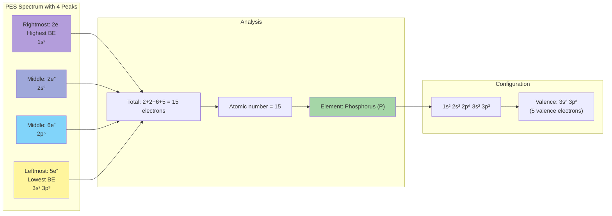

---

### Solution 8: Successive Ionization Energies
**Given data**: IE₁ = 578, IE₂ = 1817, IE₃ = 2745, IE₄ = 11578, IE₅ = 14831, IE₆ = 18378

**a) Most likely group number**:

Notice the **huge jump** between IE₃ (2745) and IE₄ (11578) - more than 4× increase!

This indicates that after removing 3 electrons, we've reached a stable, noble gas-like core. The first 3 electrons are valence electrons (relatively easy to remove), and the 4th electron comes from an inner shell.

**Answer**: **Group 13** (3 valence electrons)

**b) Explain the large jump between IE₃ and IE₄**:

After removing 3 electrons, the atom achieves a stable noble gas electron configuration. The 4th electron must be removed from a completely filled inner shell (likely 2p⁶), which requires much more energy because:

1. This electron is much closer to the nucleus
2. It experiences less shielding (fewer electron shells)
3. It's part of a very stable, filled sublevel
4. The effective nuclear charge is much higher for core electrons

**Answer**: The 4th electron is removed from a filled inner shell (2p⁶ of the neon core), requiring significantly more energy than removing valence electrons.

**c) Likely electron configuration**:

Element with 3 valence electrons and IE₁ = 578 kJ/mol matches **Aluminum (Al)**, atomic number 13.

**Answer**: \([Ne]3s^2 3p^1\) or \(1s^2 2s^2 2p^6 3s^2 3p^1\)

Removing 3 electrons gives: \([Ne]\) or \(1s^2 2s^2 2p^6\) (neon configuration)

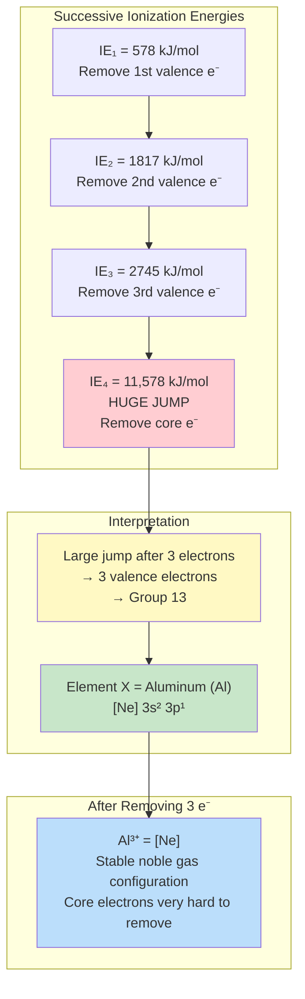

---

### Solution 9: Chromium Configuration Exception
**a) Is \([Ar]4s^2 3d^4\) correct?**

**Answer**: **No, this is incorrect.**

**Correct configuration**: \([Ar]4s^1 3d^5\)

**b) Explain why chromium adopts unusual configuration**:

Chromium is one of several transition metals with an exceptional electron configuration due to the extra stability of **half-filled** and **fully filled** d sublevels.

**Detailed explanation**:
1. **Expected configuration**: \([Ar]4s^2 3d^4\)
2. **Actual configuration**: \([Ar]4s^1 3d^5\)

One electron is "promoted" from 4s to 3d because:

- **Exchange energy**: When a sublevel is half-filled, there are maximum exchange interactions between electrons with parallel spins, which stabilizes the atom
- **Symmetry**: A half-filled d sublevel (\(d^5\)) with one electron in each of the five d orbitals (↑ ↑ ↑ ↑ ↑) has perfect symmetry
- **Electron repulsion**: Electrons in different orbitals experience less repulsion than paired electrons
- **Energy difference**: The 4s and 3d orbitals are very close in energy for transition metals, making this promotion energetically favorable

The extra stability gained from the half-filled \(3d^5\) configuration outweighs the small energy cost of promoting an electron from 4s to 3d.

**c) Which electrons are removed first when forming Cr³⁺?**

**Answer**: The **4s electron** is removed first, followed by **two 3d electrons**.

Even though the 3d electrons are "promoted" into the 3d sublevel in the neutral atom, when ionizing, electrons are always removed from the **highest n level first** (4s before 3d).

**d) Electron configuration for Cr³⁺**:

Neutral Cr: \([Ar]4s^1 3d^5\)
- Remove 1 electron from 4s: \([Ar]3d^5\)
- Remove 2 electrons from 3d: \([Ar]3d^3\)

**Answer**: Cr³⁺: \([Ar]3d^3\) or \(1s^2 2s^2 2p^6 3s^2 3p^6 3d^3\)

Orbital diagram: 3d: ↑ ↑ ↑ (three unpaired electrons - paramagnetic)

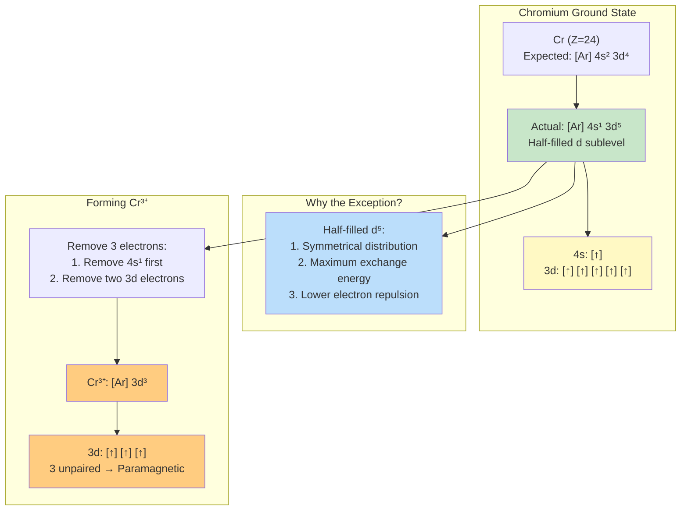

---

### Solution 10: Quantum Numbers for Specific Electrons
**Silicon (Si, atomic number 14)**

**a) Complete electron configuration**:

**Answer**: \(1s^2 2s^2 2p^6 3s^2 3p^2\) or \([Ne]3s^2 3p^2\)

**b) Valid set of quantum numbers for one electron in 3p**:

The 3p sublevel has:
- \(n = 3\)
- \(l = 1\) (p orbital)
- \(m_l = -1, 0, \text{or } +1\) (three p orbitals)
- \(m_s = +\frac{1}{2} \text{ or } -\frac{1}{2}\)

For Si with 3p²,  the orbital diagram following Hund's rule is: ↑ ↑ (empty)

**Valid example**: \(n = 3\), \(l = 1\), \(m_l = -1\), \(m_s = +\frac{1}{2}\)

**Another valid example**: \(n = 3\), \(l = 1\), \(m_l = 0\), \(m_s = +\frac{1}{2}\)

**c) How many electrons have \(l = 1\)?**

\(l = 1\) corresponds to **p orbitals**. Count all p electrons:
- 2p⁶: 6 electrons
- 3p²: 2 electrons

**Answer**: **8 electrons** have \(l = 1\)

**d) Unpaired electrons in excited state (3s → 3p promotion)**:

Ground state Si: \(1s^2 2s^2 2p^6 3s^2 3p^2\)
- 3s: ↑↓
- 3p: ↑ ↑ (empty)
- Unpaired: **2 electrons**

Excited state (promote one 3s electron to 3p): \(1s^2 2s^2 2p^6 3s^1 3p^3\)
- 3s: ↑
- 3p: ↑ ↑ ↑
- Unpaired: **4 electrons**

**Answer**: **4 unpaired electrons** in the excited state

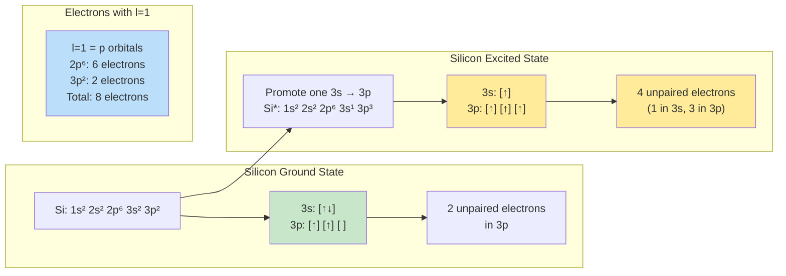

---

## Step-by-Step Checker

### Quantum Number Problem Checker

Use this systematic approach to verify quantum numbers:

**Step 1: Check Principal Quantum Number (\(n\))**
- [ ] Is \(n\) a positive integer? (\(n = 1, 2, 3, 4...\))
- [ ] Does \(n\) match the shell number in the electron configuration?

**Step 2: Check Angular Momentum Quantum Number (\(l\))**
- [ ] Is \(0 \leq l \leq n-1\)?
- [ ] Does \(l\) match the sublevel? (0=s, 1=p, 2=d, 3=f)
- [ ] Example: For \(n=3\), \(l\) can only be 0, 1, or 2

**Step 3: Check Magnetic Quantum Number (\(m_l\))**
- [ ] Is \(-l \leq m_l \leq +l\)?
- [ ] Is \(m_l\) an integer?
- [ ] Number of possible \(m_l\) values = \(2l + 1\) (number of orbitals)

**Step 4: Check Spin Quantum Number (\(m_s\))**
- [ ] Is \(m_s = +\frac{1}{2}\) or \(-\frac{1}{2}\)?
- [ ] No other values are allowed

**Step 5: Apply Pauli Exclusion Principle**
- [ ] If filling multiple electrons, ensure no two electrons have identical sets of all four quantum numbers

---

### PES Problem Checker

Use this approach to analyze photoelectron spectra:

**Step 1: Count Total Electrons**
- [ ] Add up all peak areas/heights
- [ ] Total = atomic number of the element

**Step 2: Assign Peaks to Orbitals**
- [ ] Rightmost peak (highest binding energy) = 1s² (2 electrons)
- [ ] Work left: 2s², 2p⁶, 3s², 3p⁶, etc.
- [ ] Leftmost peak (lowest binding energy) = valence electrons

**Step 3: Verify Peak Patterns**
- [ ] Do peak areas match expected electron counts? (2, 2, 6, 2, 6, 2, 10...)
- [ ] Are there the correct number of peaks for the element?
- [ ] Core electrons have higher binding energy than valence

**Step 4: Write Electron Configuration**
- [ ] Use peak assignments to write configuration
- [ ] Verify total electrons match atomic number

**Step 5: Identify the Element**
- [ ] Use periodic table to find element with that atomic number
- [ ] Confirm with known electron configuration

---

### Electron Configuration Checker

**Step 1: Count Total Electrons**
- [ ] Total electrons = atomic number (for neutral atoms)
- [ ] For ions: cations have fewer electrons, anions have more

**Step 2: Apply Aufbau Principle**
- [ ] Fill in order: 1s, 2s, 2p, 3s, 3p, 4s, 3d, 4p, 5s, 4d, 5p, 6s, 4f, 5d, 6p, 7s, 5f, 6d
- [ ] Use \(n + l\) rule: lower \(n + l\) fills first

**Step 3: Check for Exceptions**
- [ ] Is this Cr, Cu, Mo, Ag, or Au?
- [ ] Cr: \([Ar]4s^1 3d^5\) (not \(4s^2 3d^4\))
- [ ] Cu: \([Ar]4s^1 3d^{10}\) (not \(4s^2 3d^9\))

**Step 4: For Ions, Remove Electrons Correctly**
- [ ] Remove from highest \(n\) first (4s before 3d)
- [ ] Then remove from the sublevel being filled

**Step 5: Draw Orbital Diagram (if needed)**
- [ ] Apply Hund's rule: fill degenerate orbitals singly first
- [ ] All parallel spins before pairing
- [ ] Count unpaired electrons for magnetic properties
