# Advanced Kinetics

## Explanation

Advanced kinetics explores mathematical relationships between concentration and time, reaction mechanisms, and catalysis in depth. These topics are crucial for AP Chemistry success and require understanding both conceptual principles and mathematical problem-solving techniques.

### Key Concepts

**Integrated Rate Laws**:
While differential rate laws (Rate = \(k[A]^n\)) relate concentration to reaction rate, integrated rate laws connect concentration directly to time. These equations are derived by integrating the differential rate law and are essential for:
- Calculating concentrations at specific times
- Determining reaction order from experimental data
- Finding rate constants and half-lives

**Zero-Order Reactions**:
- Rate = \(k\) (independent of concentration)
- Integrated: \([A]_t = -kt + [A]_0\)
- Graph: [A] vs. \(t\) is linear, slope = \(-k\), y-intercept = \([A]_0\)
- Half-life: \(t_{1/2} = \frac{[A]_0}{2k}\) (depends on initial concentration)
- Units of \(k\): M/s or mol/(L·s)
- Common examples: Enzyme-catalyzed reactions at saturating substrate concentrations, surface-catalyzed reactions

**First-Order Reactions**:
- Rate = \(k[A]\)
- Integrated: \(\ln[A]_t = -kt + \ln[A]_0\)
- Alternative form: \([A]_t = [A]_0 e^{-kt}\)
- Graph: \(\ln[A]\) vs. \(t\) is linear, slope = \(-k\), y-intercept = \(\ln[A]_0\)
- Half-life: \(t_{1/2} = \frac{0.693}{k} = \frac{\ln 2}{k}\) (independent of concentration)
- Units of \(k\): s\(^{-1}\) or min\(^{-1}\)
- Common examples: Radioactive decay, many decomposition reactions

**Second-Order Reactions**:
- Rate = \(k[A]^2\) (or Rate = \(k[A][B]\) when [A] = [B])
- Integrated: \(\frac{1}{[A]_t} = kt + \frac{1}{[A]_0}\)
- Graph: \(\frac{1}{[A]}\) vs. \(t\) is linear, slope = \(k\), y-intercept = \(\frac{1}{[A]_0}\)
- Half-life: \(t_{1/2} = \frac{1}{k[A]_0}\) (depends on initial concentration, inversely proportional)
- Units of \(k\): M\(^{-1}\)s\(^{-1}\) or L/(mol·s)
- Common examples: Dimerization reactions, reactions between two different molecules

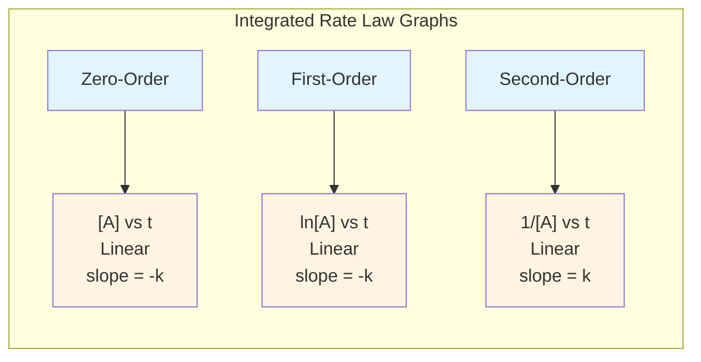

**Determining Order from Data**:
Method 1 - Graphical Analysis:
- Plot [A], \(\ln[A]\), or \(\frac{1}{[A]}\) vs. time
- Whichever gives straight line indicates order (0th, 1st, or 2nd respectively)
- The slope gives the rate constant (with appropriate sign)

Method 2 - Half-Life Analysis:
- Zero-order: Half-life decreases as reaction progresses (proportional to [A])
- First-order: Half-life is constant (independent of [A])
- Second-order: Half-life increases as reaction progresses (inversely proportional to [A])

```mermaid
graph TD
    A[Concentration vs Time Data] --> B{Plot which graph<br/>gives a straight line?}
    B -->|"[A] vs t<br/>is linear"| C[Zero-Order<br/>Rate = k]
    B -->|"ln[A] vs t<br/>is linear"| D[First-Order<br/>Rate = k[A]]
    B -->|"1/[A] vs t<br/>is linear"| E[Second-Order<br/>Rate = k[A]²]

    C --> C1["t₁/₂ = [A]₀/2k<br/>decreases over time"]
    D --> D1["t₁/₂ = 0.693/k<br/>constant"]
    E --> E1["t₁/₂ = 1/k[A]₀<br/>increases over time"]

    style A fill:#e8f4f8
    style B fill:#fff9e6
    style C fill:#d4edda
    style D fill:#d4edda
    style E fill:#d4edda
    style C1 fill:#cce5ff
    style D1 fill:#cce5ff
    style E1 fill:#cce5ff
```

**Reaction Mechanisms**:
A reaction mechanism is a series of elementary steps that describe the molecular-level pathway from reactants to products.

Key Components:
- **Elementary step**: A single molecular event (collision and reaction)
- **Rate-determining step (RDS)**: Slowest step, determines overall rate (like bottleneck in traffic)
- **Intermediate**: Species produced and consumed within mechanism (not in overall equation)
- **Catalyst**: Appears in mechanism but not in overall equation; speeds reaction by providing alternate pathway

Requirements for Valid Mechanism:
1. Elementary steps must add up to overall balanced equation
2. Predicted rate law must agree with experimental rate law
3. Mechanism must be chemically reasonable

**Molecularity**:
Number of molecules involved in elementary step:
- Unimolecular: One molecule (e.g., \(A \rightarrow\) products), Rate = \(k[A]\)
- Bimolecular: Two molecules (e.g., \(A + B \rightarrow\) products), Rate = \(k[A][B]\)
- Termolecular: Three molecules (rare, statistically unlikely)

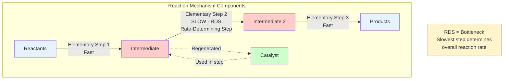

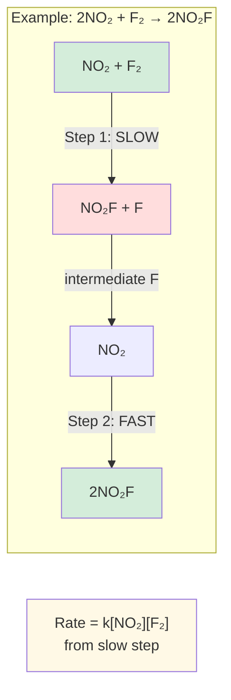

**Deriving Rate Laws from Mechanisms**:

Case 1 - First step is slow (RDS):
- Use first step directly for rate law
- Example: If Step 1 (slow): \(2NO_2 \rightarrow NO_3 + NO\), then Rate = \(k[NO_2]^2\)

Case 2 - First step is fast equilibrium followed by slow step:
- Write equilibrium expression for fast step
- Express intermediate concentration in terms of reactants
- Substitute into rate law from slow step
- Example:
  - Step 1 (fast): \(A + B \rightleftharpoons C\), \(K_{eq} = \frac{[C]}{[A][B]}\)
  - Step 2 (slow): \(C + D \rightarrow\) products, Rate = \(k_2[C][D]\)
  - From equilibrium: \([C] = K_{eq}[A][B]\)
  - Substituting: Rate = \(k_2K_{eq}[A][B][D] = k[A][B][D]\)

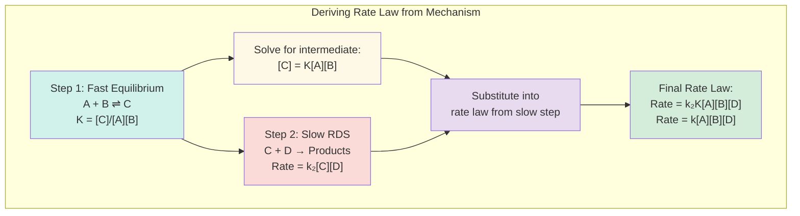

**Arrhenius Equation**:
Relates rate constant to temperature and activation energy, providing quantitative understanding of temperature dependence:

Exponential form:
\[k = Ae^{-E_a/RT}\]

Logarithmic form:
\[\ln k = \ln A - \frac{E_a}{RT}\]

Two-temperature form (most useful for calculations):
\[\ln\frac{k_2}{k_1} = \frac{E_a}{R}\left(\frac{1}{T_1} - \frac{1}{T_2}\right)\]

Variables:
- \(k\) = rate constant (varies with order)
- \(A\) = frequency factor or pre-exponential factor (collision frequency and proper orientation)
- \(E_a\) = activation energy (J/mol or kJ/mol)
- \(R = 8.314 \text{ J/(mol·K)}\) (gas constant)
- \(T\) = absolute temperature (K)

**Physical Meaning**:
- \(E_a\): Minimum energy required for reaction; higher \(E_a\) means slower reaction
- \(e^{-E_a/RT}\): Fraction of molecules with sufficient energy to react
- \(A\): Accounts for collision frequency and proper molecular orientation
- As \(T\) increases, \(-E_a/RT\) becomes less negative, so \(k\) increases exponentially

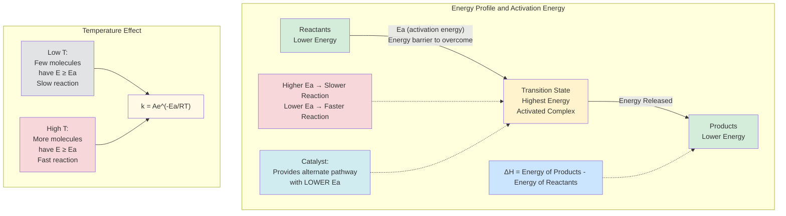

**Graphing Arrhenius**:
- Plot \(\ln k\) vs. \(\frac{1}{T}\) (linear relationship)
- Slope = \(-\frac{E_a}{R}\), therefore \(E_a = -\text{slope} \times R\)
- y-intercept = \(\ln A\), therefore \(A = e^{\text{intercept}}\)
- Steeper negative slope indicates higher activation energy

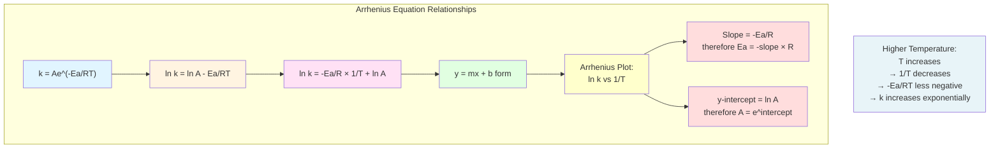

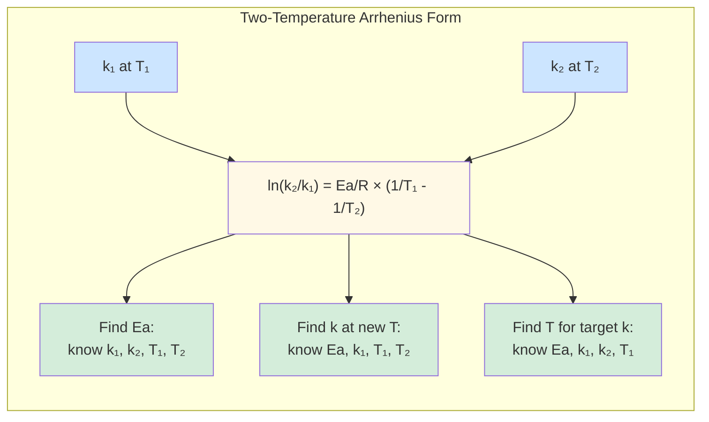

---

## Common Mistakes to Avoid

### 1. Confusing Differential and Integrated Rate Laws
**Mistake**: Using Rate = \(k[A]^2\) to calculate concentration at a specific time.

**Why it's wrong**: Differential rate laws relate concentration to rate, not to time. To find concentration at a given time, you must use integrated rate laws.

**Correct approach**: For second-order, use \(\frac{1}{[A]_t} = kt + \frac{1}{[A]_0}\).

### 2. Incorrect Order Determination from Graphs
**Mistake**: Seeing a plot of [A] vs. t that curves downward and concluding it must be first-order.

**Why it's wrong**: All orders (except zero) show decreasing [A] vs. t curves. You must plot the appropriate function to identify linearity.

**Correct approach**:
- Zero-order: [A] vs. t is linear
- First-order: \(\ln[A]\) vs. t is linear
- Second-order: \(\frac{1}{[A]}\) vs. t is linear
- Only a straight line definitively indicates the order.

### 3. Sign Errors in Arrhenius Calculations
**Mistake**: Getting activation energy as negative value, or sign errors when calculating \(\frac{1}{T_1} - \frac{1}{T_2}\).

**Why it's wrong**: \(E_a\) is always positive (energy barrier to overcome). The Arrhenius equation has \(-E_a/RT\), which makes the exponent negative.

**Correct approach**:
- Always check that \(E_a > 0\)
- When using two-temperature form, carefully calculate \(\frac{1}{T_1} - \frac{1}{T_2}\)
- If \(T_2 > T_1\), then \(\frac{1}{T_1} > \frac{1}{T_2}\), so the difference is positive
- Remember: slope of Arrhenius plot is negative: \(-\frac{E_a}{R}\)

### 4. Using Wrong Units for Rate Constant
**Mistake**: Forgetting that rate constant units change with reaction order, leading to unit inconsistencies.

**Why it's wrong**: Each order has specific units for \(k\) that make the rate law dimensionally consistent.

**Correct approach**:
- Zero-order: \(k\) has units of M/s
- First-order: \(k\) has units of s\(^{-1}\)
- Second-order: \(k\) has units of M\(^{-1}\)s\(^{-1}\)
- Always verify units match when using formulas

### 5. Incorrectly Eliminating Intermediates from Mechanisms
**Mistake**: When deriving rate law from mechanism with fast equilibrium, forgetting to use equilibrium expression or using wrong equilibrium constant.

**Why it's wrong**: Intermediates cannot appear in final rate law. Must use equilibrium from fast step to express intermediate in terms of reactants.

**Correct approach**:
1. Write rate law for slow step (may contain intermediate)
2. If intermediate present, write equilibrium expression for fast step
3. Solve for intermediate concentration in terms of reactants
4. Substitute back into rate law from slow step
5. Simplify to get final rate law with only reactants/products

---

## Worked Examples

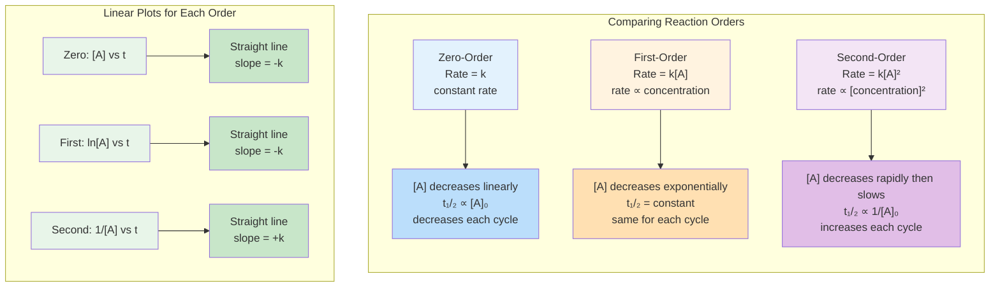

---

## Worked Examples

### Example 1: First-Order Kinetics

**Problem**: A first-order reaction has \(k = 0.0462 \text{ min}^{-1}\). If \([A]_0 = 0.800 \text{ M}\), what is [A] after 20.0 minutes? What is the half-life?

**Solution**:
1. First-order integrated law: \(\ln[A]_t = -kt + \ln[A]_0\)
2. Substitute: \(\ln[A]_t = -(0.0462)(20.0) + \ln(0.800)\)
3. \(\ln[A]_t = -0.924 + (-0.223) = -1.147\)
4. \([A]_t = e^{-1.147} = 0.317 \text{ M}\)
5. Half-life: \(t_{1/2} = \frac{0.693}{k} = \frac{0.693}{0.0462} = 15.0 \text{ min}\)

**Answer**: [A] = 0.317 M after 20 min; \(t_{1/2} = 15.0\) min

---

### Example 2: Determining Activation Energy

**Problem**: A reaction has \(k = 0.020 \text{ s}^{-1}\) at 300 K and \(k = 0.080 \text{ s}^{-1}\) at 320 K. Calculate the activation energy \(E_a\).

**Solution**:
1. Use two-temperature Arrhenius: \(\ln\frac{k_2}{k_1} = \frac{E_a}{R}\left(\frac{1}{T_1} - \frac{1}{T_2}\right)\)
2. \(k_1 = 0.020\), \(T_1 = 300\) K; \(k_2 = 0.080\), \(T_2 = 320\) K
3. \(\ln\frac{0.080}{0.020} = \frac{E_a}{8.314}\left(\frac{1}{300} - \frac{1}{320}\right)\)
4. \(\ln(4) = \frac{E_a}{8.314}\left(0.003333 - 0.003125\right)\)
5. \(1.386 = \frac{E_a}{8.314}(0.000208)\)
6. \(E_a = \frac{1.386 \times 8.314}{0.000208} = 55,400 \text{ J/mol} = 55.4 \text{ kJ/mol}\)

**Answer**: \(E_a = 55.4 \text{ kJ/mol}\)

---

### Example 3: Mechanism and Rate Law

**Problem**: Proposed mechanism:
- Step 1 (slow): \(2NO \rightarrow N_2O_2\) (Rate = \(k_1[NO]^2\))
- Step 2 (fast): \(N_2O_2 + H_2 \rightarrow N_2O + H_2O\)

Overall: \(2NO + H_2 \rightarrow N_2O + H_2O\)

What is the predicted rate law? Identify the intermediate?

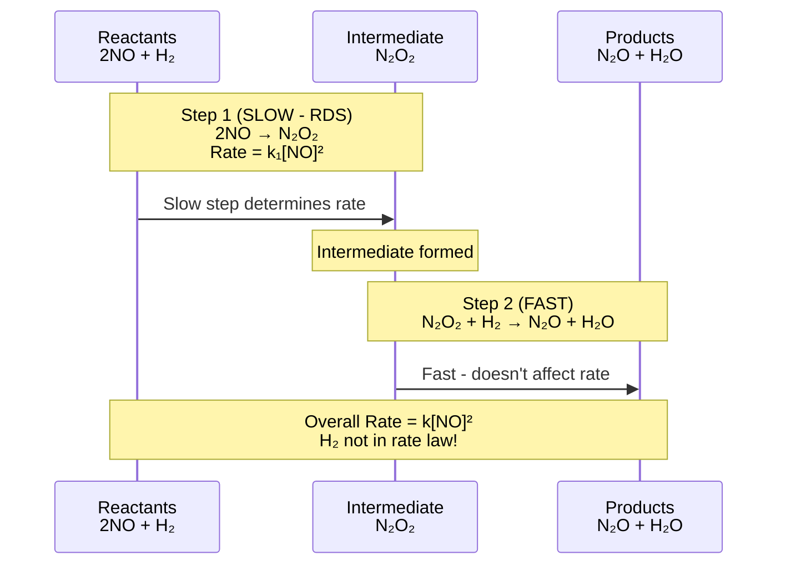

**Solution**:
1. Rate-determining step (slow step) determines rate law
2. Step 1 is slow: Rate = \(k_1[NO]^2\)
3. Since step 1 contains only reactants from overall equation, this is the rate law
4. Predicted rate law: **Rate = \(k[NO]^2\)**
5. \(N_2O_2\) is produced in step 1 and consumed in step 2 (not in overall equation)
6. \(N_2O_2\) is an **intermediate**

**Answer**: Rate = \(k[NO]^2\); intermediate = \(N_2O_2\)

---

## AP-Level Practice Problems

These challenging problems mirror the difficulty and style of AP Chemistry exam questions. Work through them systematically and check your approach against the detailed solutions.

### Problem 1: Integrated Rate Law Application
The decomposition of hydrogen peroxide follows first-order kinetics:
\[2H_2O_2(aq) \rightarrow 2H_2O(l) + O_2(g)\]

A solution initially contains 0.800 M H\(_2\)O\(_2\). After 600 seconds, the concentration drops to 0.200 M.

(a) Calculate the rate constant \(k\) for this reaction.
(b) Calculate the half-life of this reaction.
(c) How much time is required for the concentration to decrease to 0.100 M?
(d) What percentage of the original H\(_2\)O\(_2\) remains after 1200 seconds?

---

### Problem 2: Order Determination from Data
The decomposition of N\(_2\)O\(_5\) was studied, and the following data were collected:

| Time (s) | [N\(_2\)O\(_5\)] (M) |
|----------|---------------------|
| 0        | 0.1000              |
| 100      | 0.0707              |
| 200      | 0.0500              |
| 300      | 0.0354              |
| 400      | 0.0250              |

(a) Determine the order of the reaction by graphical analysis (describe which plot is linear).
(b) Calculate the rate constant with appropriate units.
(c) Calculate the half-life for this reaction.

---

### Problem 3: Second-Order Kinetics
The gas-phase decomposition of HI follows second-order kinetics:
\[2HI(g) \rightarrow H_2(g) + I_2(g)\]

At 500 K, the rate constant is \(k = 0.080 \text{ M}^{-1}\text{s}^{-1}\). The initial concentration is 0.500 M.

(a) Calculate the concentration of HI after 30.0 seconds.
(b) Calculate the time required for the concentration to drop to 0.100 M.
(c) Calculate the half-life at the initial concentration.
(d) Calculate the half-life when [HI] = 0.250 M. Compare this to your answer in part (c) and explain the difference.

---

### Problem 4: Arrhenius Equation - Two Temperatures
The rate constant for a reaction is \(1.85 \times 10^{-3} \text{ s}^{-1}\) at 298 K and \(7.40 \times 10^{-3} \text{ s}^{-1}\) at 318 K.

(a) Calculate the activation energy \(E_a\) in kJ/mol.
(b) Calculate the frequency factor \(A\).
(c) Predict the rate constant at 338 K.
(d) At what temperature would the rate constant be \(1.00 \times 10^{-2} \text{ s}^{-1}\)?

---

### Problem 5: Arrhenius Plot Interpretation
A student studies the rate of a reaction at various temperatures and obtains the following data:

| T (K) | k (s\(^{-1}\)) |
|-------|----------------|
| 300   | 0.00235        |
| 320   | 0.00895        |
| 340   | 0.0285         |
| 360   | 0.0795         |

(a) What should be plotted to obtain a straight line? What are the variables on each axis?
(b) Calculate \(\ln k\) and \(1/T\) for each data point.
(c) If the slope of the best-fit line is \(-8450 \text{ K}\), calculate \(E_a\) in kJ/mol.
(d) If the y-intercept is 22.5, calculate the frequency factor \(A\).

---

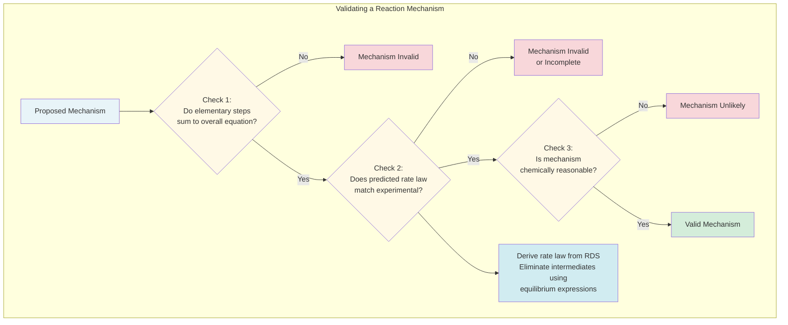

### Problem 6: Mechanism with Slow First Step
Consider the following proposed mechanism for the reaction \(2NO_2(g) + F_2(g) \rightarrow 2NO_2F(g)\):

Step 1 (slow): \(NO_2 + F_2 \rightarrow NO_2F + F\)
Step 2 (fast): \(NO_2 + F \rightarrow NO_2F\)

(a) Write the overall balanced equation and verify the mechanism is consistent.
(b) Identify any intermediates.
(c) Derive the rate law predicted by this mechanism.
(d) The experimental rate law is Rate = \(k[NO_2][F_2]\). Is this mechanism consistent with the experimental data?

---

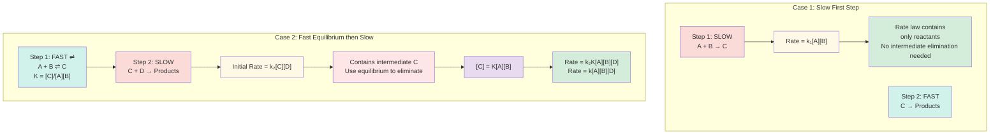

### Problem 7: Mechanism with Fast Equilibrium
The reaction \(2NO(g) + Br_2(g) \rightarrow 2NOBr(g)\) has the experimental rate law: Rate = \(k[NO]^2[Br_2]\).

A proposed mechanism is:
Step 1 (fast): \(NO + Br_2 \rightleftharpoons NOBr_2\) (equilibrium constant \(K\))
Step 2 (slow): \(NOBr_2 + NO \rightarrow 2NOBr\)

(a) Identify any intermediates in this mechanism.
(b) Write the rate law for the rate-determining step.
(c) Use the equilibrium expression from Step 1 to eliminate the intermediate.
(d) Derive the overall rate law. Does it match the experimental rate law?

---

### Problem 8: Complex Mechanism Analysis
The decomposition of ozone follows the mechanism:
Step 1 (fast): \(O_3 \rightleftharpoons O_2 + O\) (equilibrium constant \(K_1\))
Step 2 (slow): \(O + O_3 \rightarrow 2O_2\)

(a) Write the overall balanced equation.
(b) Identify the intermediate.
(c) Derive the rate law predicted by this mechanism.
(d) The experimental rate law is Rate = \(k\frac{[O_3]^2}{[O_2]}\). Show that your derived rate law matches this form.

---

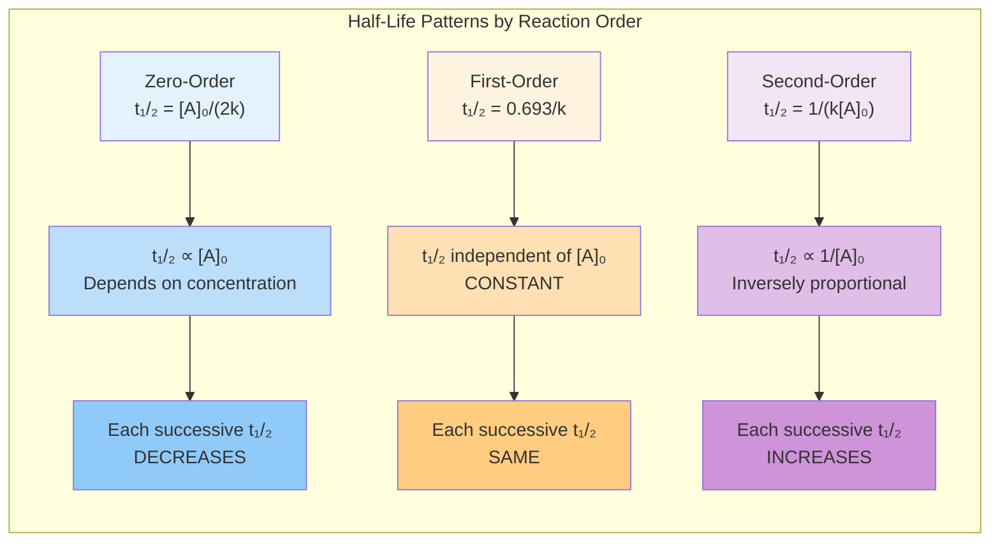

### Problem 9: Half-Life Analysis
A radioactive isotope undergoes first-order decay with a half-life of 14.3 days.

(a) Calculate the rate constant in units of day\(^{-1}\).
(b) If a sample initially contains 2.50 g of the isotope, how much remains after 50.0 days?
(c) How long will it take for 90% of the sample to decay?
(d) After how many half-lives will less than 1% of the original sample remain?

---

### Problem 10: Multi-Step Integrated Kinetics
A first-order reaction has a rate constant of \(0.0450 \text{ min}^{-1}\) at 25°C and an activation energy of 85.0 kJ/mol.

(a) Calculate the half-life at 25°C.
(b) Calculate the rate constant at 50°C.
(c) Calculate the half-life at 50°C.
(d) If the initial concentration is 0.600 M, calculate the concentration after 30.0 minutes at 25°C.
(e) At what temperature would the rate constant double compared to 25°C?

---

## Detailed Solutions

### Solution 1: Integrated Rate Law Application

**(a) Calculate the rate constant**

For first-order reaction: \(\ln[A]_t = -kt + \ln[A]_0\)

Rearrange: \(k = \frac{\ln[A]_0 - \ln[A]_t}{t} = \frac{\ln\frac{[A]_0}{[A]_t}}{t}\)

\[k = \frac{\ln\frac{0.800}{0.200}}{600} = \frac{\ln(4)}{600} = \frac{1.386}{600} = 2.31 \times 10^{-3} \text{ s}^{-1}\]

**Answer**: \(k = 2.31 \times 10^{-3} \text{ s}^{-1}\) or \(0.00231 \text{ s}^{-1}\)

**(b) Calculate the half-life**

For first-order: \(t_{1/2} = \frac{0.693}{k} = \frac{0.693}{2.31 \times 10^{-3}} = 300 \text{ s}\)

**Answer**: \(t_{1/2} = 300 \text{ s}\) or 5.00 minutes

**(c) Time to reach 0.100 M**

\(\ln[A]_t = -kt + \ln[A]_0\)

Rearrange: \(t = \frac{\ln[A]_0 - \ln[A]_t}{k} = \frac{\ln\frac{0.800}{0.100}}{2.31 \times 10^{-3}}\)

\[t = \frac{\ln(8)}{2.31 \times 10^{-3}} = \frac{2.079}{2.31 \times 10^{-3}} = 900 \text{ s}\]

**Answer**: 900 s (or 15.0 min, which is 3 half-lives: 0.800 → 0.400 → 0.200 → 0.100)

**(d) Percentage after 1200 seconds**

\(\ln[A]_t = -(2.31 \times 10^{-3})(1200) + \ln(0.800)\)

\(\ln[A]_t = -2.772 + (-0.223) = -2.995\)

\([A]_t = e^{-2.995} = 0.0500 \text{ M}\)

Percentage: \(\frac{0.0500}{0.800} \times 100\% = 6.25\%\)

**Answer**: 6.25% (Note: 1200 s = 4 half-lives, so \((\frac{1}{2})^4 = \frac{1}{16} = 0.0625 = 6.25\%\))

---

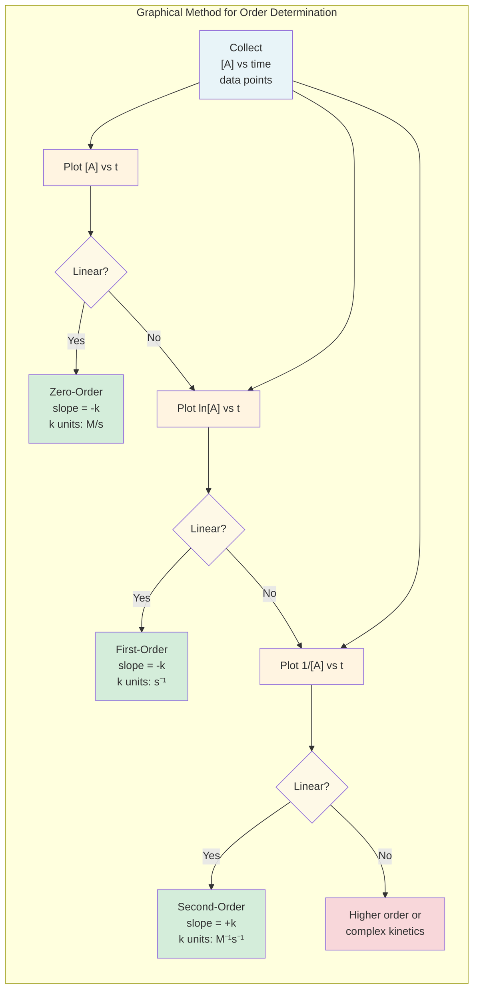

### Solution 2: Order Determination from Data

**(a) Determine reaction order**

Test zero-order: Plot [N\(_2\)O\(_5\)] vs. time - not linear (values don't decrease uniformly)

Test first-order: Plot \(\ln[N_2O_5]\) vs. time
- t = 0: \(\ln(0.1000) = -2.303\)
- t = 100: \(\ln(0.0707) = -2.650\)
- t = 200: \(\ln(0.0500) = -2.996\)
- t = 300: \(\ln(0.0354) = -3.341\)
- t = 400: \(\ln(0.0250) = -3.689\)

Check for linearity: Calculate \(\Delta(\ln[A])/\Delta t\):
- Slope ≈ \(\frac{-3.689 - (-2.303)}{400 - 0} = \frac{-1.386}{400} = -0.00347\) s\(^{-1}\)

The \(\ln[N_2O_5]\) vs. time plot is linear with constant slope.

**Answer**: First-order reaction (ln[N\(_2\)O\(_5\)] vs. time is linear)

**(b) Calculate rate constant**

From slope of \(\ln[A]\) vs. t plot: slope = \(-k\)

\(k = 0.00347 \text{ s}^{-1}\) or \(3.47 \times 10^{-3} \text{ s}^{-1}\)

**Answer**: \(k = 3.47 \times 10^{-3} \text{ s}^{-1}\)

**(c) Calculate half-life**

\(t_{1/2} = \frac{0.693}{k} = \frac{0.693}{3.47 \times 10^{-3}} = 200 \text{ s}\)

**Answer**: \(t_{1/2} = 200 \text{ s}\)

---

### Solution 3: Second-Order Kinetics

**(a) Concentration after 30.0 seconds**

Second-order integrated law: \(\frac{1}{[A]_t} = kt + \frac{1}{[A]_0}\)

\[\frac{1}{[HI]_t} = (0.080)(30.0) + \frac{1}{0.500} = 2.40 + 2.00 = 4.40 \text{ M}^{-1}\]

\[[HI]_t = \frac{1}{4.40} = 0.227 \text{ M}\]

**Answer**: [HI] = 0.227 M or 0.23 M

**(b) Time to reach 0.100 M**

\(\frac{1}{[A]_t} = kt + \frac{1}{[A]_0}\)

Rearrange: \(t = \frac{\frac{1}{[A]_t} - \frac{1}{[A]_0}}{k}\)

\[t = \frac{\frac{1}{0.100} - \frac{1}{0.500}}{0.080} = \frac{10.0 - 2.0}{0.080} = \frac{8.0}{0.080} = 100 \text{ s}\]

**Answer**: t = 100 s

**(c) Half-life at initial concentration**

\(t_{1/2} = \frac{1}{k[A]_0} = \frac{1}{(0.080)(0.500)} = \frac{1}{0.040} = 25.0 \text{ s}\)

**Answer**: \(t_{1/2} = 25.0 \text{ s}\)

**(d) Half-life at 0.250 M and comparison**

\(t_{1/2} = \frac{1}{k[A]_0} = \frac{1}{(0.080)(0.250)} = \frac{1}{0.020} = 50.0 \text{ s}\)

**Comparison**: The half-life doubled from 25.0 s to 50.0 s when concentration was halved. This is characteristic of second-order reactions where half-life is inversely proportional to concentration. As the reaction proceeds and [HI] decreases, successive half-lives become longer.

**Answer**: \(t_{1/2} = 50.0 \text{ s}\); half-life increases as concentration decreases for second-order reactions

---

### Solution 4: Arrhenius Equation - Two Temperatures

**(a) Calculate activation energy**

Use two-temperature Arrhenius equation:
\[\ln\frac{k_2}{k_1} = \frac{E_a}{R}\left(\frac{1}{T_1} - \frac{1}{T_2}\right)\]

\(k_1 = 1.85 \times 10^{-3}\) s\(^{-1}\) at \(T_1 = 298\) K
\(k_2 = 7.40 \times 10^{-3}\) s\(^{-1}\) at \(T_2 = 318\) K

\[\ln\frac{7.40 \times 10^{-3}}{1.85 \times 10^{-3}} = \frac{E_a}{8.314}\left(\frac{1}{298} - \frac{1}{318}\right)\]

\[\ln(4.00) = \frac{E_a}{8.314}(0.003356 - 0.003145)\]

\[1.386 = \frac{E_a}{8.314}(0.000211)\]

\[E_a = \frac{1.386 \times 8.314}{0.000211} = 54,600 \text{ J/mol} = 54.6 \text{ kJ/mol}\]

**Answer**: \(E_a = 54.6 \text{ kJ/mol}\)

**(b) Calculate frequency factor A**

Use \(\ln k = \ln A - \frac{E_a}{RT}\) with data at 298 K:

\[\ln(1.85 \times 10^{-3}) = \ln A - \frac{54,600}{8.314 \times 298}\]

\[-6.293 = \ln A - \frac{54,600}{2,478}\]

\[-6.293 = \ln A - 22.03\]

\[\ln A = 22.03 - 6.293 = 15.74\]

\[A = e^{15.74} = 6.85 \times 10^{6} \text{ s}^{-1}\]

**Answer**: \(A = 6.85 \times 10^{6} \text{ s}^{-1}\)

**(c) Predict rate constant at 338 K**

Use two-temperature form with \(T_1 = 298\) K, \(k_1 = 1.85 \times 10^{-3}\), \(T_2 = 338\) K:

\[\ln\frac{k_2}{1.85 \times 10^{-3}} = \frac{54,600}{8.314}\left(\frac{1}{298} - \frac{1}{338}\right)\]

\[\ln\frac{k_2}{1.85 \times 10^{-3}} = 6567(0.003356 - 0.002959)\]

\[\ln\frac{k_2}{1.85 \times 10^{-3}} = 6567(0.000397) = 2.607\]

\[\frac{k_2}{1.85 \times 10^{-3}} = e^{2.607} = 13.57\]

\[k_2 = 1.85 \times 10^{-3} \times 13.57 = 0.0251 \text{ s}^{-1}\]

**Answer**: \(k = 0.0251 \text{ s}^{-1}\) or \(2.51 \times 10^{-2} \text{ s}^{-1}\)

**(d) Temperature for k = 0.0100 s\(^{-1}\)**

\[\ln\frac{0.0100}{1.85 \times 10^{-3}} = \frac{54,600}{8.314}\left(\frac{1}{298} - \frac{1}{T_2}\right)\]

\[\ln(5.405) = 6567\left(\frac{1}{298} - \frac{1}{T_2}\right)\]

\[1.687 = 6567\left(\frac{1}{298} - \frac{1}{T_2}\right)\]

\[0.0002569 = \frac{1}{298} - \frac{1}{T_2}\]

\[\frac{1}{T_2} = 0.003356 - 0.0002569 = 0.003099\]

\[T_2 = \frac{1}{0.003099} = 323 \text{ K}\]

**Answer**: T = 323 K (50°C)

---

### Solution 5: Arrhenius Plot Interpretation

**(a) What to plot**

Plot \(\ln k\) (y-axis) vs. \(1/T\) (x-axis)

This gives a straight line with slope = \(-E_a/R\) and y-intercept = \(\ln A\)

**Answer**: Plot ln k vs. 1/T

**(b) Calculate data for plot**

| T (K) | k (s\(^{-1}\)) | ln k     | 1/T (K\(^{-1}\))    |
|-------|----------------|----------|---------------------|
| 300   | 0.00235        | -6.052   | 0.003333            |
| 320   | 0.00895        | -4.717   | 0.003125            |
| 340   | 0.0285         | -3.558   | 0.002941            |
| 360   | 0.0795         | -2.532   | 0.002778            |

**Answer**: See table above

**(c) Calculate E\(_a\) from slope**

Slope = \(-\frac{E_a}{R}\), therefore \(E_a = -\text{slope} \times R\)

\[E_a = -(-8450) \times 8.314 = 70,300 \text{ J/mol} = 70.3 \text{ kJ/mol}\]

**Answer**: \(E_a = 70.3 \text{ kJ/mol}\)

**(d) Calculate frequency factor**

y-intercept = \(\ln A = 22.5\)

\[A = e^{22.5} = 6.24 \times 10^{9} \text{ s}^{-1}\]

**Answer**: \(A = 6.24 \times 10^{9} \text{ s}^{-1}\)

---

### Solution 6: Mechanism with Slow First Step

**(a) Overall equation and verification**

Add steps:
- Step 1: \(NO_2 + F_2 \rightarrow NO_2F + F\)
- Step 2: \(NO_2 + F \rightarrow NO_2F\)
- Overall: \(2NO_2 + F_2 \rightarrow 2NO_2F\)

The F atom produced in Step 1 is consumed in Step 2, so it cancels out.

**Answer**: Overall: \(2NO_2 + F_2 \rightarrow 2NO_2F\); mechanism is consistent

**(b) Identify intermediates**

F atom is produced in Step 1 and consumed in Step 2; does not appear in overall equation.

**Answer**: F is an intermediate

**(c) Derive rate law**

Since Step 1 is slow (rate-determining), it determines the rate:

Rate = \(k_1[NO_2][F_2]\)

No intermediates appear in this rate law, so this is the final rate law.

**Answer**: Rate = \(k[NO_2][F_2]\)

**(d) Mechanism consistency**

Experimental rate law: Rate = \(k[NO_2][F_2]\)
Predicted rate law: Rate = \(k[NO_2][F_2]\)

The mechanism is consistent with experimental data.

**Answer**: Yes, the mechanism is consistent with the experimental rate law

---

### Solution 7: Mechanism with Fast Equilibrium

**(a) Identify intermediates**

NOBr\(_2\) is produced in Step 1 and consumed in Step 2; does not appear in overall equation.

**Answer**: NOBr\(_2\) is an intermediate

**(b) Rate law for rate-determining step**

Step 2 (slow): \(NOBr_2 + NO \rightarrow 2NOBr\)

Rate = \(k_2[NOBr_2][NO]\)

**Answer**: Rate = \(k_2[NOBr_2][NO]\)

**(c) Eliminate intermediate using equilibrium**

Step 1 is fast equilibrium: \(NO + Br_2 \rightleftharpoons NOBr_2\)

Equilibrium expression: \(K = \frac{[NOBr_2]}{[NO][Br_2]}\)

Solve for intermediate: \([NOBr_2] = K[NO][Br_2]\)

**Answer**: \([NOBr_2] = K[NO][Br_2]\)

**(d) Derive overall rate law**

Substitute into rate law from Step 2:

Rate = \(k_2[NOBr_2][NO] = k_2(K[NO][Br_2])[NO]\)

Rate = \(k_2K[NO]^2[Br_2]\)

Let \(k = k_2K\), then: Rate = \(k[NO]^2[Br_2]\)

This matches the experimental rate law exactly.

**Answer**: Rate = \(k[NO]^2[Br_2]\); yes, it matches the experimental rate law

---

### Solution 8: Complex Mechanism Analysis

**(a) Overall equation**

Add steps:
- Step 1: \(O_3 \rightleftharpoons O_2 + O\)
- Step 2: \(O + O_3 \rightarrow 2O_2\)
- Overall: \(2O_3 \rightarrow 3O_2\)

**Answer**: \(2O_3 \rightarrow 3O_2\)

**(b) Identify intermediate**

O atom is produced in Step 1 and consumed in Step 2.

**Answer**: O is the intermediate

**(c) Derive rate law**

Step 2 (slow) is RDS: Rate = \(k_2[O][O_3]\)

Step 1 is fast equilibrium: \(K_1 = \frac{[O_2][O]}{[O_3]}\)

Solve for intermediate: \([O] = \frac{K_1[O_3]}{[O_2]}\)

Substitute: Rate = \(k_2\left(\frac{K_1[O_3]}{[O_2]}\right)[O_3] = k_2K_1\frac{[O_3]^2}{[O_2]}\)

**Answer**: Rate = \(k\frac{[O_3]^2}{[O_2]}\) where \(k = k_2K_1\)

**(d) Match to experimental rate law**

Derived: Rate = \(k\frac{[O_3]^2}{[O_2]}\)

Experimental: Rate = \(k\frac{[O_3]^2}{[O_2]}\)

They match exactly, confirming the mechanism is consistent.

**Answer**: The derived rate law matches the experimental form exactly

---

### Solution 9: Half-Life Analysis

**(a) Calculate rate constant**

\(t_{1/2} = \frac{0.693}{k}\)

\[k = \frac{0.693}{14.3 \text{ days}} = 0.0485 \text{ day}^{-1}\]

**Answer**: \(k = 0.0485 \text{ day}^{-1}\)

**(b) Amount after 50.0 days**

First-order: \([A]_t = [A]_0 e^{-kt}\)

\[[A]_t = 2.50 \times e^{-(0.0485)(50.0)} = 2.50 \times e^{-2.425} = 2.50 \times 0.0883 = 0.221 \text{ g}\]

**Answer**: 0.221 g or 0.22 g

**(c) Time for 90% decay**

If 90% decays, 10% remains: \([A]_t = 0.10[A]_0\)

\(\ln[A]_t = -kt + \ln[A]_0\)

\[\ln(0.10[A]_0) = -kt + \ln[A]_0\]

\[\ln(0.10) = -kt\]

\[t = \frac{-\ln(0.10)}{k} = \frac{-(-2.303)}{0.0485} = \frac{2.303}{0.0485} = 47.5 \text{ days}\]

Alternative: \(t = 3.32 \times t_{1/2} = 3.32 \times 14.3 = 47.5 \text{ days}\)

**Answer**: 47.5 days (or 3.32 half-lives)

**(d) Half-lives for less than 1% remaining**

After each half-life, fraction remaining = \((\frac{1}{2})^n\)

For less than 1%: \((\frac{1}{2})^n < 0.01\)

- After 6 half-lives: \((\frac{1}{2})^6 = \frac{1}{64} = 0.0156 = 1.56\%\) (too much)
- After 7 half-lives: \((\frac{1}{2})^7 = \frac{1}{128} = 0.00781 = 0.781\%\) (less than 1%)

**Answer**: After 7 half-lives, less than 1% remains

---

### Solution 10: Multi-Step Integrated Kinetics

**(a) Half-life at 25°C**

\(t_{1/2} = \frac{0.693}{k} = \frac{0.693}{0.0450} = 15.4 \text{ min}\)

**Answer**: \(t_{1/2} = 15.4 \text{ min}\)

**(b) Rate constant at 50°C**

\(T_1 = 25°C = 298\) K, \(k_1 = 0.0450\) min\(^{-1}\)
\(T_2 = 50°C = 323\) K, \(E_a = 85.0\) kJ/mol = 85,000 J/mol

\[\ln\frac{k_2}{0.0450} = \frac{85,000}{8.314}\left(\frac{1}{298} - \frac{1}{323}\right)\]

\[\ln\frac{k_2}{0.0450} = 10,224(0.003356 - 0.003096)\]

\[\ln\frac{k_2}{0.0450} = 10,224(0.000260) = 2.658\]

\[\frac{k_2}{0.0450} = e^{2.658} = 14.28\]

\[k_2 = 0.0450 \times 14.28 = 0.643 \text{ min}^{-1}\]

**Answer**: \(k = 0.643 \text{ min}^{-1}\) at 50°C

**(c) Half-life at 50°C**

\(t_{1/2} = \frac{0.693}{0.643} = 1.08 \text{ min}\)

**Answer**: \(t_{1/2} = 1.08 \text{ min}\)

**(d) Concentration after 30.0 minutes at 25°C**

\(\ln[A]_t = -kt + \ln[A]_0\)

\[\ln[A]_t = -(0.0450)(30.0) + \ln(0.600)\]

\[\ln[A]_t = -1.35 + (-0.511) = -1.861\]

\[[A]_t = e^{-1.861} = 0.155 \text{ M}\]

**Answer**: [A] = 0.155 M

**(e) Temperature for doubled rate constant**

Want \(k_2 = 2k_1 = 2(0.0450) = 0.0900\) min\(^{-1}\)

\[\ln\frac{0.0900}{0.0450} = \frac{85,000}{8.314}\left(\frac{1}{298} - \frac{1}{T_2}\right)\]

\[\ln(2) = 10,224\left(\frac{1}{298} - \frac{1}{T_2}\right)\]

\[0.693 = 10,224\left(\frac{1}{298} - \frac{1}{T_2}\right)\]

\[0.0000678 = \frac{1}{298} - \frac{1}{T_2}\]

\[\frac{1}{T_2} = 0.003356 - 0.0000678 = 0.003288\]

\[T_2 = 304 \text{ K} = 31°C\]

**Answer**: T = 304 K (31°C)

---

## Step-by-Step Checker

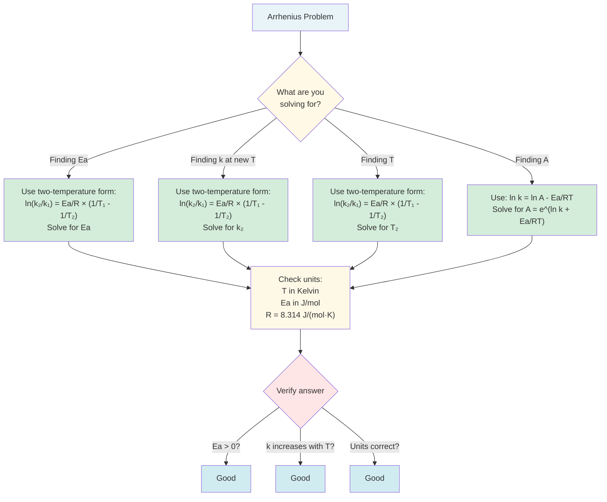

### Arrhenius Equation Problem Template

Use this systematic approach for any Arrhenius equation problem:

**Given Information:**
- Temperature 1: T\(_1\) = _____ K
- Rate constant 1: k\(_1\) = _____
- Temperature 2: T\(_2\) = _____ K
- Rate constant 2: k\(_2\) = _____
- Activation energy: E\(_a\) = _____ J/mol
- Gas constant: R = 8.314 J/(mol·K)

**Step 1: Identify what you're solving for**
- [ ] Finding E\(_a\)
- [ ] Finding k at new temperature
- [ ] Finding temperature for given k
- [ ] Finding frequency factor A

**Step 2: Choose correct equation form**

For E\(_a\) or k at two temperatures:
\[\ln\frac{k_2}{k_1} = \frac{E_a}{R}\left(\frac{1}{T_1} - \frac{1}{T_2}\right)\]

For frequency factor:
\[\ln k = \ln A - \frac{E_a}{RT}\]

**Step 3: Check units**
- [ ] Temperature in Kelvin (add 273 if given in °C)
- [ ] E\(_a\) in J/mol (multiply by 1000 if given in kJ/mol)
- [ ] R = 8.314 J/(mol·K)

**Step 4: Calculate 1/T values**
- 1/T\(_1\) = _____
- 1/T\(_2\) = _____
- Difference: 1/T\(_1\) - 1/T\(_2\) = _____

**Step 5: Calculate ln(k) values if needed**
- ln k\(_1\) = _____
- ln k\(_2\) = _____
- Difference: ln(k\(_2\)/k\(_1\)) = _____

**Step 6: Solve algebraically**
- Substitute values
- Isolate unknown
- Calculate result

**Step 7: Check your answer**
- [ ] E\(_a\) is positive
- [ ] Higher temperature gives higher k
- [ ] Units are correct
- [ ] Answer is reasonable magnitude

---

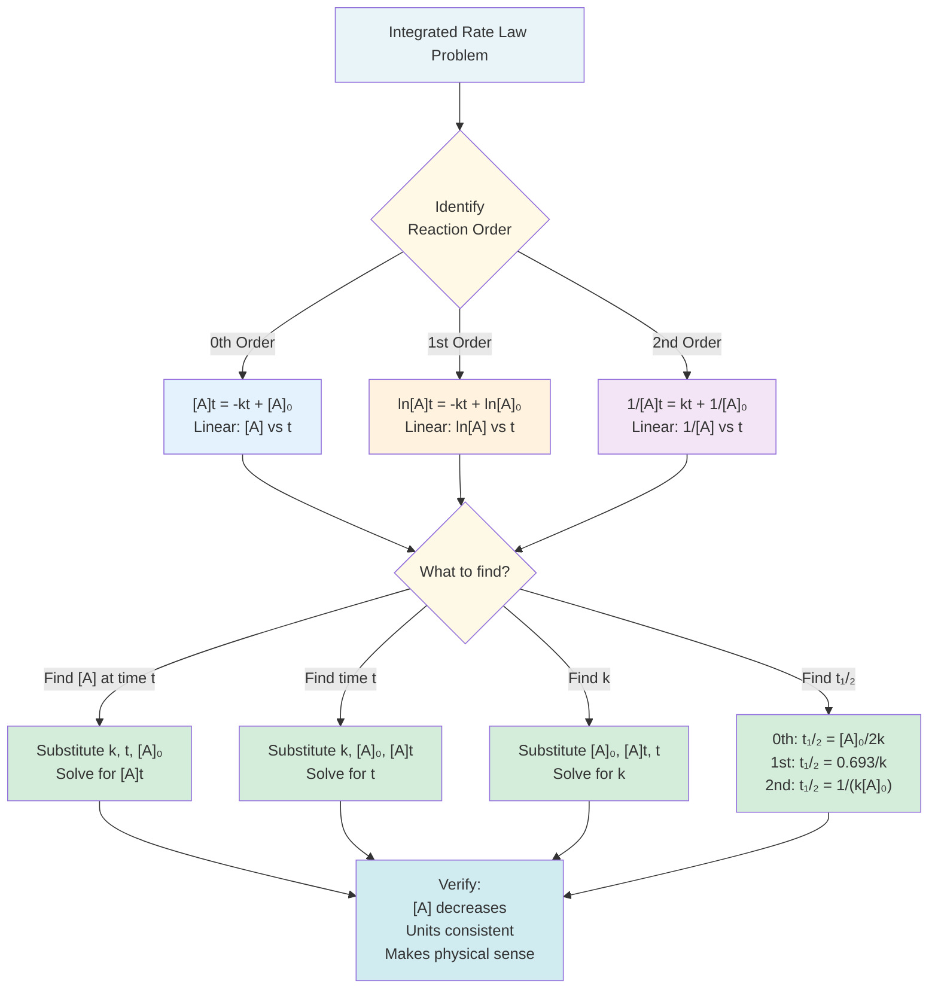

### Integrated Rate Law Problem Template

Use this systematic approach for integrated rate law problems:

**Step 1: Identify reaction order**
- [ ] Zero-order (use: [A]\(_t\) = -kt + [A]\(_0\))
- [ ] First-order (use: ln[A]\(_t\) = -kt + ln[A]\(_0\))
- [ ] Second-order (use: 1/[A]\(_t\) = kt + 1/[A]\(_0\))

**Step 2: List known values**
- Initial concentration: [A]\(_0\) = _____ M
- Final concentration: [A]\(_t\) = _____ M (if finding k or t)
- Rate constant: k = _____ (with correct units)
- Time: t = _____ s

**Step 3: Determine what you're solving for**
- [ ] Finding concentration at time t
- [ ] Finding time for given concentration
- [ ] Finding rate constant k
- [ ] Finding half-life

**Step 4: Apply integrated rate law**

For zero-order:
\[[A]_t = -kt + [A]_0\]

For first-order:
\[\ln[A]_t = -kt + \ln[A]_0\]
or
\[k = \frac{\ln[A]_0 - \ln[A]_t}{t} = \frac{1}{t}\ln\frac{[A]_0}{[A]_t}\]

For second-order:
\[\frac{1}{[A]_t} = kt + \frac{1}{[A]_0}\]

**Step 5: Calculate half-life if needed**
- Zero-order: t\(_{1/2}\) = [A]\(_0\)/(2k)
- First-order: t\(_{1/2}\) = 0.693/k
- Second-order: t\(_{1/2}\) = 1/(k[A]\(_0\))

**Step 6: Verify answer**
- [ ] Concentration decreases over time
- [ ] Units are consistent
- [ ] For first-order: fraction remaining after n half-lives = (1/2)\(^n\)
- [ ] Answer makes physical sense
