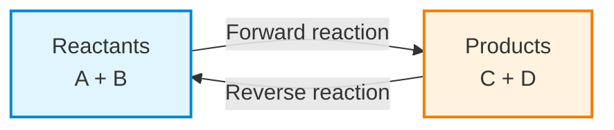
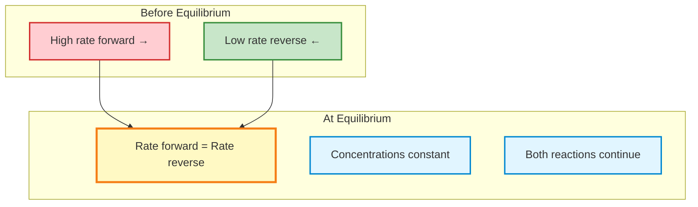
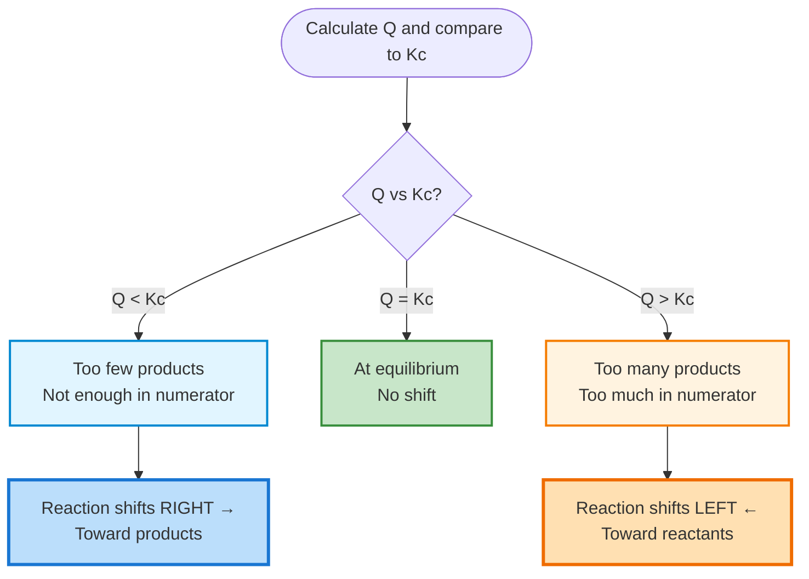
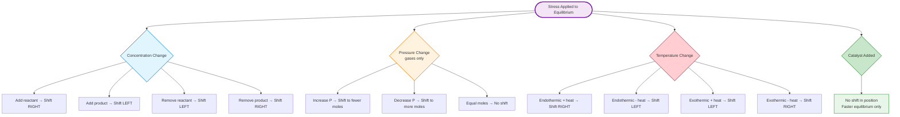
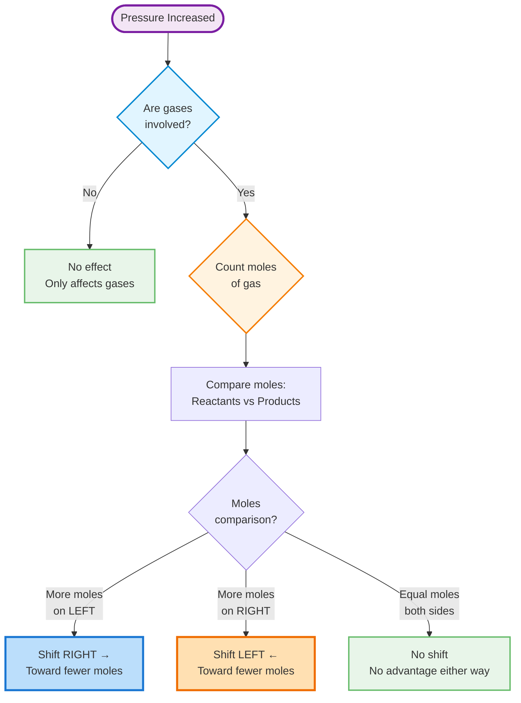
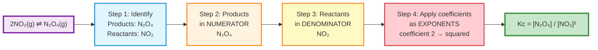
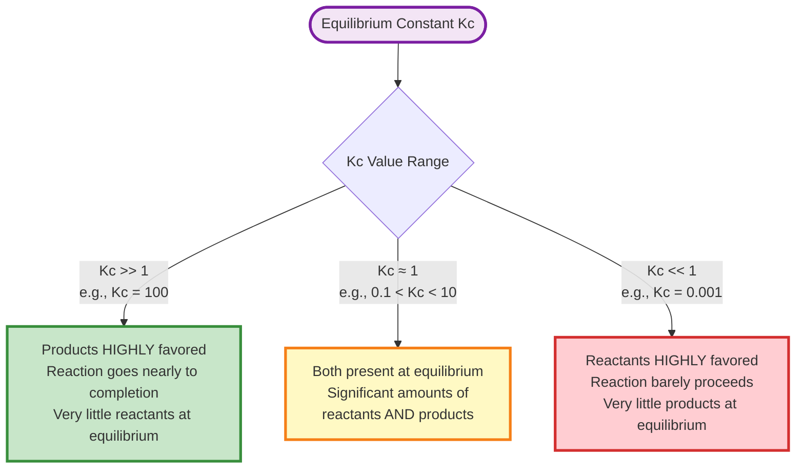
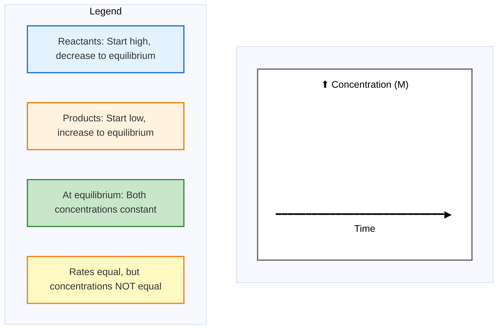
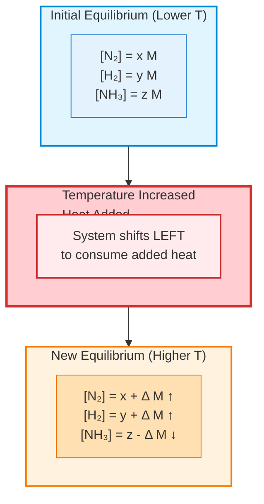

# Chemical Equilibrium

## Video Resources

<div class="video-container" markdown="1">

**Equilibrium Playlist** - Dynamic equilibrium, Le Chatelier's principle, Q vs K

<iframe width="100%" height="400" src="https://www.youtube.com/embed/videoseries?list=PL2ub1_oKCn7qmUZ80MJDPaRTdgJm8ZenX" frameborder="0" allow="accelerometer; autoplay; clipboard-write; encrypted-media; gyroscope; picture-in-picture" allowfullscreen></iframe>

**Dynamic Equilibrium Introduction**

<iframe width="100%" height="400" src="https://www.youtube.com/embed/zaHM74k9Z1w" frameborder="0" allow="accelerometer; autoplay; clipboard-write; encrypted-media; gyroscope; picture-in-picture" allowfullscreen></iframe>


</div>

---

## Explanation

Chemical equilibrium occurs in reversible reactions when the forward and reverse reaction rates are equal. Understanding equilibrium is crucial for predicting reaction behavior and optimizing conditions.

### Key Concepts

**Reversible Reactions**:
- Can proceed in both forward and reverse directions
- Indicated by double arrow: \(A + B \rightleftharpoons C + D\)
- At equilibrium: rate forward = rate reverse
- Concentrations remain constant (but reactions continue)



**Dynamic Equilibrium Visualization:**



**Equilibrium Constant (\(K_c\))** - Step-by-Step:
- For \(aA + bB \rightleftharpoons cC + dD\):
\[K_c = \frac{[C]^c[D]^d}{[A]^a[B]^b}\]

**How to Calculate \(K_c\):**
1. **Write the balanced equation** and identify products (right side) and reactants (left side)
2. **Set up the expression**: Products go in the numerator, reactants in the denominator
3. **Apply stoichiometric coefficients as exponents** - This is critical! A coefficient of 2 means squared, 3 means cubed, etc.
4. **Substitute equilibrium concentrations** (in mol/L or M)
5. **Calculate the value** - Keep significant figures appropriate to the data

**Important Notes:**
- \([~]\) indicates concentration in mol/L (M)
- Pure solids and liquids are omitted from expression (they have constant "concentration")
- \(K_c > 1\): products favored at equilibrium
- \(K_c < 1\): reactants favored at equilibrium
- \(K_c\) depends only on temperature

**Reaction Quotient (\(Q\))** - Step-by-Step:
The reaction quotient helps predict which direction a reaction will shift to reach equilibrium.

**How to Use \(Q\):**
1. **Write the same expression as \(K_c\)** - Same form: \(Q = \frac{[C]^c[D]^d}{[A]^a[B]^b}\)
2. **Substitute current concentrations** (not necessarily equilibrium values)
3. **Calculate \(Q\)** using the current concentrations
4. **Compare \(Q\) to \(K_c\)**:
   - If \(Q < K_c\): Too few products, reaction shifts **right** (toward products)
   - If \(Q > K_c\): Too many products, reaction shifts **left** (toward reactants)
   - If \(Q = K_c\): System is at equilibrium (no shift)

**Memory Aid:** Think of \(K_c\) as the "target" and \(Q\) as "where you are now." The reaction shifts to make \(Q\) equal to \(K_c\).



**Le Chatelier's Principle** - Step-by-Step:
When a stress is applied to a system at equilibrium, the system shifts to relieve the stress.

**How to Apply Le Chatelier's Principle:**

1. **Identify the stress** applied to the system
2. **Determine the direction** that relieves the stress
3. **Predict the shift** in equilibrium position

**Common Stresses:**

- **Concentration change**:
  - Adding a substance: Reaction shifts to consume it
  - Removing a substance: Reaction shifts to produce it
  - Example: Adding reactant shifts right; removing product shifts right

- **Pressure change** (for gases only):
  - Count moles of gas on each side
  - Increasing pressure: Shifts toward side with fewer moles of gas
  - Decreasing pressure: Shifts toward side with more moles of gas
  - If equal moles on both sides: No shift

- **Temperature change**:
  - Treat heat as a reactant (endothermic) or product (exothermic)
  - Exothermic reaction (\(\Delta H < 0\)): Heat is a product
    - Increasing T: Shifts left (toward reactants)
    - Decreasing T: Shifts right (toward products)
  - Endothermic reaction (\(\Delta H > 0\)): Heat is a reactant
    - Increasing T: Shifts right (toward products)
    - Decreasing T: Shifts left (toward reactants)
  - Note: Temperature changes also change the value of \(K_c\)

- **Catalyst**:
  - Speeds up both forward and reverse rates equally
  - No shift in equilibrium position
  - Reaches equilibrium faster, but same final concentrations

**Le Chatelier's Principle - Visual Summary:**



---

## Common Mistakes to Avoid

### Mistake 1: Forgetting to Apply Stoichiometric Coefficients as Exponents
**Wrong:** For \(2NO_{2(g)} \rightleftharpoons N_2O_{4(g)}\), writing \(K_c = \frac{[N_2O_4]}{[NO_2]}\)

**Right:** \(K_c = \frac{[N_2O_4]}{[NO_2]^2}\)

**Why:** The coefficient 2 in front of \(NO_2\) must be applied as an exponent. This is one of the most common calculation errors.

### Mistake 2: Confusing \(Q\) and \(K_c\)
**Wrong:** Using equilibrium concentrations to calculate \(Q\), or thinking \(Q\) is always constant

**Right:** \(K_c\) uses equilibrium concentrations and is constant at a given temperature. \(Q\) uses current concentrations and changes as the reaction proceeds until \(Q = K_c\).

**Why:** \(Q\) is a "snapshot" of the reaction at any moment; \(K_c\) is the final equilibrium ratio.

### Mistake 3: Including Solids and Liquids in the Equilibrium Expression
**Wrong:** For \(CaCO_{3(s)} \rightleftharpoons CaO_{(s)} + CO_{2(g)}\), writing \(K_c = \frac{[CaO][CO_2]}{[CaCO_3]}\)

**Right:** \(K_c = [CO_2]\)

**Why:** Pure solids and pure liquids have constant "concentrations" (density) and are omitted from equilibrium expressions. Only gases and aqueous solutions are included.

### Mistake 4: Wrong Direction Predictions with Le Chatelier
**Wrong:** Thinking that adding a catalyst shifts equilibrium toward products

**Right:** Catalysts do not shift equilibrium position at all; they only help reach equilibrium faster.

**Why:** A catalyst equally speeds up forward and reverse reactions, so the equilibrium ratio stays the same.

### Mistake 5: Pressure Effects on All Reactions
**Wrong:** Assuming pressure changes always affect equilibrium

**Right:** Pressure changes only affect gas-phase equilibria, and only when there's a difference in moles of gas between products and reactants.

**Why:** If the reaction has equal moles of gas on both sides (e.g., \(H_{2(g)} + I_{2(g)} \rightleftharpoons 2HI_{(g)}\), 2 moles = 2 moles), pressure changes cause no shift. Also, pressure doesn't significantly affect solids, liquids, or aqueous solutions.

**Pressure Change Effects - Decision Tree:**



---

## Worked Examples

### Example 1: Writing Equilibrium Expressions

**Problem**: Write the equilibrium constant expression (\(K_c\)) for:
\[2NO_{2(g)} \rightleftharpoons N_2O_{4(g)}\]

**Solution**:
1. General form: \(K_c = \frac{\text{[products]}}{\text{[reactants]}}\) with stoichiometric coefficients as exponents
2. Products: \([N_2O_4]^1\)
3. Reactants: \([NO_2]^2\)
4. \(K_c = \frac{[N_2O_4]}{[NO_2]^2}\)

**Answer**: \(K_c = \frac{[N_2O_4]}{[NO_2]^2}\)

**Visual Guide - Writing Equilibrium Expressions:**



---

### Example 2: Calculating Equilibrium Constant (with Step Checker)

**Problem**: At equilibrium, \([H_2] = 0.20 \text{ M}\), \([I_2] = 0.20 \text{ M}\), and \([HI] = 1.2 \text{ M}\) for the reaction:
\[H_{2(g)} + I_{2(g)} \rightleftharpoons 2HI_{(g)}\]

Calculate \(K_c\).

**Solution with Step Checker**:

??? check "Step 1: Write the balanced equation and identify products/reactants"
    **Equation:** \(H_{2(g)} + I_{2(g)} \rightleftharpoons 2HI_{(g)}\)

    - **Reactants:** \(H_2\) and \(I_2\) (left side)
    - **Products:** \(HI\) (right side)

    Check: Are the products and reactants correctly identified? Yes

??? check "Step 2: Write the \(K_c\) expression with correct exponents"
    General form: \(K_c = \frac{[\text{products}]^{\text{coefficients}}}{[\text{reactants}]^{\text{coefficients}}}\)

    \(K_c = \frac{[HI]^2}{[H_2]^1[I_2]^1}\) or simply \(K_c = \frac{[HI]^2}{[H_2][I_2]}\)

    Check: Is the coefficient 2 from \(2HI\) applied as an exponent? Yes

??? check "Step 3: Substitute the equilibrium concentrations"
    Given: \([H_2] = 0.20 \text{ M}\), \([I_2] = 0.20 \text{ M}\), \([HI] = 1.2 \text{ M}\)

    \(K_c = \frac{(1.2)^2}{(0.20)(0.20)}\)

    Check: Are all concentrations equilibrium values? Yes

??? check "Step 4: Calculate the numerator"
    \([HI]^2 = (1.2)^2 = 1.44\)

    Check: Did you square 1.2, not just multiply by 2? Yes

??? check "Step 5: Calculate the denominator"
    \([H_2][I_2] = (0.20)(0.20) = 0.040\)

    Check: Did you multiply the concentrations? Yes

??? check "Step 6: Divide to get \(K_c\)"
    \(K_c = \frac{1.44}{0.040} = 36\)

    Check: Is \(K_c\) unitless (units cancel)? Yes

    Check: Does \(K_c > 1\) (products favored)? Yes, which makes sense since \([HI]\) is much larger than \([H_2]\) and \([I_2]\)

**Answer**: \(K_c = 36\) (unitless)

**Understanding Kc Values:**



---

### Example 3: Applying Le Chatelier's Principle

**Problem**: For the exothermic reaction:
\[N_{2(g)} + 3H_{2(g)} \rightleftharpoons 2NH_{3(g)} \quad \Delta H = -92 \text{ kJ}\]

Predict the effect on equilibrium of:
(a) Adding more \(N_2\)
(b) Removing \(NH_3\)
(c) Increasing temperature
(d) Increasing pressure

**Solution**:
1. (a) Adding \(N_2\) (reactant): System shifts **right** to consume added \(N_2\), producing more \(NH_3\)
2. (b) Removing \(NH_3\) (product): System shifts **right** to replace removed \(NH_3\), consuming reactants
3. (c) Increasing temperature: For exothermic reaction, heat is a product. Adding heat (increasing T) shifts **left** toward reactants
4. (d) Increasing pressure: Left side has 4 moles gas (\(1 + 3\)), right side has 2 moles. System shifts **right** toward fewer moles to reduce pressure

**Answer**: (a) shifts right; (b) shifts right; (c) shifts left; (d) shifts right

**Concentration vs Time Graph for Reaching Equilibrium:**



**Note:** In a typical concentration vs time graph:
- Reactant concentrations decrease from initial values and level off at equilibrium
- Product concentrations increase from zero (or initial values) and level off at equilibrium
- Once equilibrium is reached, all concentrations remain constant (horizontal lines)
- The point where lines become horizontal indicates equilibrium has been reached

**Equilibrium Position Shift - Example with Temperature:**

For the exothermic reaction: \(N_{2(g)} + 3H_{2(g)} \rightleftharpoons 2NH_{3(g)} + \text{heat}\)



---

## SAT Chemistry Practice Problems

These SAT-style multiple-choice questions test your understanding of chemical equilibrium concepts.

### Question 1
For the reaction \(N_2O_{4(g)} \rightleftharpoons 2NO_{2(g)}\), the equilibrium constant \(K_c = 0.36\) at 25°C. What is the correct equilibrium expression?

A) \(K_c = \frac{[NO_2]}{[N_2O_4]}\)

B) \(K_c = \frac{[N_2O_4]}{[NO_2]^2}\)

C) \(K_c = \frac{[NO_2]^2}{[N_2O_4]}\)

D) \(K_c = \frac{2[NO_2]}{[N_2O_4]}\)

E) \(K_c = \frac{[N_2O_4]}{2[NO_2]}\)

---

### Question 2
For the equilibrium \(2SO_{2(g)} + O_{2(g)} \rightleftharpoons 2SO_{3(g)}\), which statement is TRUE when the system reaches equilibrium?

A) The concentrations of \(SO_2\), \(O_2\), and \(SO_3\) are equal

B) The forward and reverse reaction rates are equal

C) The forward and reverse reactions have stopped

D) The concentration of \(SO_3\) is twice that of \(SO_2\)

E) The value of \(K_c\) equals 1.0

---

### Question 3
Given the reaction \(H_{2(g)} + I_{2(g)} \rightleftharpoons 2HI_{(g)}\) with \(K_c = 50\) at 450°C. At a certain moment, \([H_2] = 0.10\) M, \([I_2] = 0.20\) M, and \([HI] = 0.50\) M. What is the value of \(Q\)?

A) 2.5

B) 10

C) 12.5

D) 25

E) 50

---

### Question 4
Using the information from Question 3, in which direction will the reaction proceed?

A) The reaction is at equilibrium and will not shift

B) The reaction will shift to the right (toward products)

C) The reaction will shift to the left (toward reactants)

D) The reaction will shift in both directions equally

E) Cannot be determined without temperature information

---

### Question 5
For the exothermic reaction \(2SO_{2(g)} + O_{2(g)} \rightleftharpoons 2SO_{3(g)} + \text{heat}\), which change would shift the equilibrium toward the products?

A) Increasing the temperature

B) Decreasing the pressure

C) Adding a catalyst

D) Removing \(SO_3\) as it forms

E) Decreasing the concentration of \(SO_2\)

---

### Question 6
Consider the reaction \(CaCO_{3(s)} \rightleftharpoons CaO_{(s)} + CO_{2(g)}\) at equilibrium in a closed container. Which change will NOT affect the position of equilibrium?

A) Adding more \(CaCO_3(s)\)

B) Removing some \(CO_2(g)\)

C) Increasing the temperature

D) Decreasing the volume of the container

E) Adding \(CaO_{(s)}\)

---

### Question 7
For the reaction \(N_{2(g)} + 3H_{2(g)} \rightleftharpoons 2NH_{3(g)}\), if the pressure is increased at constant temperature, the equilibrium will shift:

A) To the right, because there are fewer moles of gas on the product side

B) To the left, because there are more moles of gas on the reactant side

C) To the right, because there are more moles of gas on the reactant side

D) Neither direction, because pressure doesn't affect equilibrium

E) To the left, because \(N_2\) has a higher molar mass

---

### Question 8
At a certain temperature, the equilibrium constant for the reaction \(A + B \rightleftharpoons C + D\) is \(K_c = 2.5 \times 10^{-5}\). Which statement is correct?

A) At equilibrium, products are highly favored

B) At equilibrium, reactants are highly favored

C) At equilibrium, \([A] = [B] = [C] = [D]\)

D) The reaction goes to completion

E) The reverse reaction does not occur

---

### Question 9
For the endothermic reaction \(N_2O_{4(g)} + \text{heat} \rightleftharpoons 2NO_{2(g)}\), a flask at equilibrium is heated. What happens to the equilibrium constant \(K_c\) and the concentration of \(NO_2\)?

A) \(K_c\) increases, \([NO_2]\) increases

B) \(K_c\) decreases, \([NO_2]\) increases

C) \(K_c\) increases, \([NO_2]\) decreases

D) \(K_c\) remains constant, \([NO_2]\) increases

E) \(K_c\) remains constant, \([NO_2]\) remains constant

---

### Question 10
At equilibrium for the reaction \(PCl_{5(g)} \rightleftharpoons PCl_{3(g)} + Cl_{2(g)}\), it is found that \([PCl_5] = 0.050\) M, \([PCl_3] = 0.150\) M, and \([Cl_2] = 0.150\) M. What is the value of \(K_c\)?

A) 0.15

B) 0.22

C) 0.45

D) 2.25

E) 4.50

---

## SAT Practice Answer Key

??? note "Question 1 - Answer: C"
    **Correct Answer: C** - \(K_c = \frac{[NO_2]^2}{[N_2O_4]}\)

    **Explanation:**
    The equilibrium constant expression places products in the numerator and reactants in the denominator, with stoichiometric coefficients as exponents. For this reaction:
    - Product: \(NO_2\) with coefficient 2, so \([NO_2]^2\)
    - Reactant: \(N_2O_4\) with coefficient 1, so \([N_2O_4]\)
    - Therefore: \(K_c = \frac{[NO_2]^2}{[N_2O_4]}\)

    **Why other answers are wrong:**
    - A: Missing the exponent 2 on \([NO_2]\)
    - B: Has products and reactants inverted
    - D & E: Incorrectly multiply by the coefficient instead of using it as an exponent

---

??? note "Question 2 - Answer: B"
    **Correct Answer: B** - The forward and reverse reaction rates are equal

    **Explanation:**
    At equilibrium, the defining characteristic is that the rate of the forward reaction equals the rate of the reverse reaction. This is why concentrations remain constant even though both reactions continue to occur.

    **Why other answers are wrong:**
    - A: Concentrations at equilibrium are NOT necessarily equal; they are constant, but their values depend on \(K_c\)
    - C: Reactions do NOT stop at equilibrium; they continue at equal rates in both directions (dynamic equilibrium)
    - D: The ratio of concentrations depends on \(K_c\), not on stoichiometric coefficients
    - E: \(K_c\) can be any positive value; it equals 1.0 only for specific reactions

---

??? note "Question 3 - Answer: C"
    **Correct Answer: C** - \(Q = 12.5\)

    **Explanation:**
    The reaction quotient uses the same expression as \(K_c\) but with current (non-equilibrium) concentrations:

    \(Q = \frac{[HI]^2}{[H_2][I_2]}\)

    Substituting the given values:
    \(Q = \frac{(0.50)^2}{(0.10)(0.20)} = \frac{0.25}{0.02} = 12.5\)

    **Step-by-step:**
    1. Square \([HI]\): \((0.50)^2 = 0.25\)
    2. Multiply \([H_2]\) and \([I_2]\): \((0.10)(0.20) = 0.02\)
    3. Divide: \(0.25 / 0.02 = 12.5\)

---

??? note "Question 4 - Answer: B"
    **Correct Answer: B** - The reaction will shift to the right (toward products)

    **Explanation:**
    From Question 3: \(Q = 12.5\) and \(K_c = 50\)

    Since \(Q < K_c\) (12.5 < 50), the reaction quotient is smaller than the equilibrium constant. This means there are too few products relative to equilibrium, so the reaction will shift RIGHT (toward products) to increase \([HI]\) until \(Q = K_c\).

    **Memory tip:** If \(Q < K_c\), think "not enough products yet" so the reaction moves forward (right).

    **Why other answers are wrong:**
    - A: \(Q \neq K_c\), so not at equilibrium
    - C: Would be correct if \(Q > K_c\)
    - D: The reaction shifts in ONE net direction
    - E: Temperature is not needed; we compare \(Q\) to \(K_c\)

    **Visualizing Q vs Kc:**

    ```mermaid
    flowchart LR
        subgraph Left["Q = 12.5"]
        L1[Current state:<br/>Not enough products]
        end

        subgraph Middle["Reaction Progress"]
        M1[System shifts RIGHT →<br/>Making more products<br/>Consuming reactants]
        end

        subgraph Right["Kc = 50"]
        R1[Target equilibrium:<br/>More products needed]
        end

        Left --> Middle
        Middle --> Right

        style Left fill:#ffcdd2,stroke:#d32f2f,stroke-width:2px
        style Middle fill:#fff9c4,stroke:#f57f17,stroke-width:3px
        style Right fill:#c8e6c9,stroke:#388e3c,stroke-width:2px
    ```

---

??? note "Question 5 - Answer: D"
    **Correct Answer: D** - Removing \(SO_3\) as it forms

    **Explanation:**
    According to Le Chatelier's Principle, removing a product causes the equilibrium to shift right to replace it, producing more products.

    **Analysis of each option:**
    - A: Increasing temperature shifts LEFT for exothermic reactions (heat is a product)
    - B: Decreasing pressure shifts LEFT toward more moles of gas (3 moles on left vs 2 on right)
    - C: Catalysts do NOT shift equilibrium position
    - D: CORRECT - Removing product shifts right toward products
    - E: Decreasing \([SO_2]\) (reactant) shifts LEFT away from products

---

??? note "Question 6 - Answer: A (and E)"
    **Correct Answer: A** - Adding more \(CaCO_3(s)\)

    **Also correct: E** - Adding \(CaO_{(s)}\)

    **Explanation:**
    Pure solids do NOT appear in equilibrium expressions, so changing their amounts does NOT affect the equilibrium position. The equilibrium expression for this reaction is simply:
    \(K_c = [CO_2]\)

    Only the concentration of \(CO_2(g)\) matters for the equilibrium position.

    **Why other answers affect equilibrium:**
    - B: Removing \(CO_2(g)\) shifts right (it IS in the equilibrium expression)
    - C: Temperature changes always affect equilibrium and change \(K_c\)
    - D: Decreasing volume increases pressure, increasing \([CO_2]\), which shifts left

---

??? note "Question 7 - Answer: A"
    **Correct Answer: A** - To the right, because there are fewer moles of gas on the product side

    **Explanation:**
    Count moles of gas on each side:
    - Left (reactants): 1 mole \(N_2\) + 3 moles \(H_2\) = 4 moles total
    - Right (products): 2 moles \(NH_3\) = 2 moles total

    When pressure increases, the equilibrium shifts toward the side with fewer moles of gas to reduce pressure. Since the product side has fewer moles (2 < 4), the equilibrium shifts RIGHT.

    **Why other answers are wrong:**
    - B: Direction is wrong (would shift right, not left)
    - C: Says "more moles on reactant side" but conclusion is right—inconsistent logic in answer
    - D: Pressure DOES affect equilibrium when moles differ
    - E: Molar mass is irrelevant; only number of moles matters

---

??? note "Question 8 - Answer: B"
    **Correct Answer: B** - At equilibrium, reactants are highly favored

    **Explanation:**
    \(K_c = 2.5 \times 10^{-5} = 0.000025\)

    Since \(K_c \ll 1\) (much less than 1), the denominator (reactants) is much larger than the numerator (products) at equilibrium. This means reactants are highly favored.

    **Why other answers are wrong:**
    - A: Products would be favored if \(K_c \gg 1\)
    - C: Concentrations are NOT equal; they depend on \(K_c\)
    - D: The reaction reaches equilibrium; it doesn't go to completion
    - E: The reverse reaction does occur (that's why equilibrium is reached)

---

??? note "Question 9 - Answer: A"
    **Correct Answer: A** - \(K_c\) increases, \([NO_2]\) increases

    **Explanation:**
    For an endothermic reaction, heat is a reactant. Increasing temperature:
    1. Shifts the equilibrium RIGHT (toward products) to consume the added heat
    2. This increases \([NO_2]\) (product)
    3. Temperature change also changes \(K_c\). For endothermic reactions, increasing temperature increases \(K_c\)

    **Key concept:** Temperature is the ONLY factor that changes \(K_c\). For endothermic reactions, \(K_c\) increases with temperature; for exothermic reactions, \(K_c\) decreases with temperature.

    **Why other answers are wrong:**
    - B: \(K_c\) doesn't decrease for endothermic when heated
    - C: \([NO_2]\) increases, not decreases
    - D & E: \(K_c\) does NOT remain constant when temperature changes

    **Temperature Effects on Kc:**

    ```mermaid
    flowchart TD
        Start([Temperature Change])

        Start --> Type{Reaction Type?}

        Type -->|Endothermic<br/>Heat is REACTANT| Endo[Heat + Reactants ⇌ Products]

        Type -->|Exothermic<br/>Heat is PRODUCT| Exo[Reactants ⇌ Products + Heat]

        Endo --> EndoTemp{Temperature<br/>Change?}
        Exo --> ExoTemp{Temperature<br/>Change?}

        EndoTemp -->|Increase T<br/>Add heat| EndoUp[Shifts RIGHT<br/>Kc INCREASES<br/>More products favored]

        EndoTemp -->|Decrease T<br/>Remove heat| EndoDown[Shifts LEFT<br/>Kc DECREASES<br/>More reactants favored]

        ExoTemp -->|Increase T<br/>Add heat| ExoUp[Shifts LEFT<br/>Kc DECREASES<br/>More reactants favored]

        ExoTemp -->|Decrease T<br/>Remove heat| ExoDown[Shifts RIGHT<br/>Kc INCREASES<br/>More products favored]

        style Start fill:#f3e5f5,stroke:#7b1fa2,stroke-width:3px
        style Endo fill:#e3f2fd,stroke:#1976d2,stroke-width:2px
        style Exo fill:#ffebee,stroke:#c62828,stroke-width:2px
        style EndoUp fill:#c8e6c9,stroke:#388e3c,stroke-width:2px
        style EndoDown fill:#ffcdd2,stroke:#d32f2f,stroke-width:2px
        style ExoUp fill:#ffcdd2,stroke:#d32f2f,stroke-width:2px
        style ExoDown fill:#c8e6c9,stroke:#388e3c,stroke-width:2px
    ```

---

??? note "Question 10 - Answer: C"
    **Correct Answer: C** - \(K_c = 0.45\)

    **Explanation:**
    Step 1: Write the equilibrium expression:
    \(K_c = \frac{[PCl_3][Cl_2]}{[PCl_5]}\)

    Step 2: Substitute the equilibrium concentrations:
    \(K_c = \frac{(0.150)(0.150)}{0.050}\)

    Step 3: Calculate:
    - Numerator: \((0.150)(0.150) = 0.0225\)
    - Denominator: \(0.050\)
    - \(K_c = \frac{0.0225}{0.050} = 0.45\)

    **Why other answers are wrong:**
    - A: This is the value of \([PCl_3]\), not \(K_c\)
    - B: Calculation error
    - D: This would be if you divided denominator by numerator (inverted)
    - E: Calculation error

---

---

## Comprehensive Equilibrium Process Overview

**From Start to Equilibrium - Complete Picture:**

```mermaid
flowchart TD
    Start([Reaction Begins<br/>Reactants Mixed])

    Start --> Initial[Initial State:<br/>High reactant concentration<br/>Low/zero product concentration<br/>Fast forward rate<br/>Slow/zero reverse rate]

    Initial --> Progress[Reaction Progresses:<br/>Reactants decrease<br/>Products increase<br/>Forward rate slows<br/>Reverse rate speeds up]

    Progress --> Check{Are forward and<br/>reverse rates equal?}

    Check -->|No| Progress

    Check -->|Yes| Equilibrium[EQUILIBRIUM REACHED<br/>Rate forward = Rate reverse<br/>Concentrations constant<br/>Both reactions continue]

    Equilibrium --> External{External<br/>Stress Applied?}

    External -->|No| Maintain[Equilibrium Maintained<br/>Concentrations stay constant]

    External -->|Yes - Add/Remove<br/>substance| Shift1[Le Chatelier:<br/>Shift to oppose change]

    External -->|Yes - Pressure<br/>change| Shift2[Le Chatelier:<br/>Shift toward fewer/more moles]

    External -->|Yes - Temperature<br/>change| Shift3[Le Chatelier:<br/>Shift to absorb/release heat<br/>Kc value changes]

    External -->|Yes - Catalyst<br/>added| Shift4[No shift in position<br/>Reaches equilibrium faster<br/>Same Kc, same final []]

    Shift1 --> NewEq[New Equilibrium<br/>Established]
    Shift2 --> NewEq
    Shift3 --> NewEq
    Shift4 --> Equilibrium
    Maintain --> Equilibrium

    style Start fill:#f3e5f5,stroke:#7b1fa2,stroke-width:3px
    style Initial fill:#ffcdd2,stroke:#d32f2f,stroke-width:2px
    style Progress fill:#fff9c4,stroke:#f57f17,stroke-width:2px
    style Equilibrium fill:#c8e6c9,stroke:#388e3c,stroke-width:3px
    style Maintain fill:#e8f5e9,stroke:#66bb6a,stroke-width:2px
    style Shift1 fill:#e3f2fd,stroke:#1976d2,stroke-width:2px
    style Shift2 fill:#e1f5ff,stroke:#0288d1,stroke-width:2px
    style Shift3 fill:#fff3e0,stroke:#f57c00,stroke-width:2px
    style Shift4 fill:#f3e5f5,stroke:#9c27b0,stroke-width:2px
    style NewEq fill:#c8e6c9,stroke:#388e3c,stroke-width:2px
```

---

## Practice Problems

1. What does it mean when a reaction is at equilibrium? Are the concentrations equal?

2. Write the \(K_c\) expression for: \(2SO_{2(g)} + O_{2(g)} \rightleftharpoons 2SO_{3(g)}\)

3. For the reaction \(A + B \rightleftharpoons C\), if \(K_c = 100\), are products or reactants favored?

4. Given: \(PCl_{5(g)} \rightleftharpoons PCl_{3(g)} + Cl_{2(g)}\) with \(K_c = 0.050\). At equilibrium, \([PCl_5] = 0.10 \text{ M}\) and \([Cl_2] = 0.15 \text{ M}\). Calculate \([PCl_3]\).

5. For \(N_2O_{4(g)} \rightleftharpoons 2NO_{2(g)}\), current concentrations are \([N_2O_4] = 0.50 \text{ M}\) and \([NO_2] = 0.20 \text{ M}\). If \(K_c = 0.10\), calculate \(Q\) and predict the direction of shift.

6. For the endothermic reaction \(CaCO_{3(s)} \rightleftharpoons CaO_{(s)} + CO_{2(g)}\), what happens to equilibrium if:
   (a) Temperature increases?
   (b) \(CO_2\) is removed?

7. For \(H_{2(g)} + I_{2(g)} \rightleftharpoons 2HI_{(g)}\), a catalyst is added. How does this affect the equilibrium position?

8. For \(2NO_{2(g)} \rightleftharpoons N_2O_{4(g)}\) (exothermic), the mixture is brown due to \(NO_2\). If cooled, will the color darken or lighten? Explain.

9. If \(K_c = 4.0 \times 10^{-3}\) for a reaction at 500 K, are products or reactants favored? If temperature increases and \(K_c\) increases, is the reaction endothermic or exothermic?

10. For \(A_{(g)} + B_{(g)} \rightleftharpoons 2C_{(g)}\), how does increasing pressure affect equilibrium?

---

## Answer Key

??? note "Click to reveal detailed answers"

    **Problem 1: What does it mean when a reaction is at equilibrium?**

    **Answer:** At equilibrium, the **forward and reverse reaction rates are equal**, so concentrations remain constant. Concentrations are **not necessarily equal** to each other, just constant.

    **Detailed Explanation:** This is a crucial concept that students often misunderstand. Equilibrium does NOT mean:
    - Equal concentrations of reactants and products
    - That reactions have stopped

    Equilibrium DOES mean:
    - Rate of forward reaction = Rate of reverse reaction
    - Concentrations stay constant over time
    - Reactions continue in both directions (dynamic equilibrium)

    Example: In \(N_2O_4 \rightleftharpoons 2NO_2\), at equilibrium there might be 0.8 M \(N_2O_4\) and 0.3 M \(NO_2\). These are not equal, but they stay constant because molecules are being converted at equal rates in both directions.

    ---

    **Problem 2: Write the \(K_c\) expression**

    **Answer:** \(K_c = \frac{[SO_3]^2}{[SO_2]^2[O_2]}\)

    **Detailed Explanation:**
    For the reaction \(2SO_{2(g)} + O_{2(g)} \rightleftharpoons 2SO_{3(g)}\):

    Step 1: Products go in numerator: \([SO_3]\)

    Step 2: Apply coefficient as exponent: \([SO_3]^2\)

    Step 3: Reactants go in denominator: \([SO_2]\) and \([O_2]\)

    Step 4: Apply coefficients as exponents: \([SO_2]^2\) and \([O_2]^1\)

    Step 5: Combine: \(K_c = \frac{[SO_3]^2}{[SO_2]^2[O_2]}\)

    Common mistake: Writing \(\frac{2[SO_3]}{2[SO_2][O_2]}\) - coefficients are exponents, not multipliers!

    ---

    **Problem 3: Are products or reactants favored?**

    **Answer:** **Products favored**

    **Detailed Explanation:**
    Given \(K_c = 100\) for \(A + B \rightleftharpoons C\):

    \(K_c = \frac{[C]}{[A][B]} = 100\)

    Since \(K_c > 1\), the numerator (products) must be larger than the denominator (reactants) at equilibrium. Specifically, \([C]\) is 100 times larger than the product \([A][B]\).

    General rules:
    - \(K_c \gg 1\) (much greater than 1): Products strongly favored
    - \(K_c \approx 1\): Neither side strongly favored
    - \(K_c \ll 1\) (much less than 1): Reactants strongly favored

    ---

    **Problem 4: Calculate \([PCl_3]\)**

    **Answer:** \([PCl_3] = 0.033\) M

    **Detailed Explanation:**
    Given: \(PCl_{5(g)} \rightleftharpoons PCl_{3(g)} + Cl_{2(g)}\) with \(K_c = 0.050\)

    At equilibrium: \([PCl_5] = 0.10\) M and \([Cl_2] = 0.15\) M

    Step 1: Write expression: \(K_c = \frac{[PCl_3][Cl_2]}{[PCl_5]}\)

    Step 2: Rearrange to solve for \([PCl_3]\):
    \([PCl_3] = \frac{K_c \times [PCl_5]}{[Cl_2]}\)

    Step 3: Substitute values:
    \([PCl_3] = \frac{(0.050)(0.10)}{0.15} = \frac{0.005}{0.15} = 0.033\) M

    Step 4: Check reasonableness: Since \(K_c < 1\), reactants are favored, so \([PCl_5]\) should be larger than products. Indeed, 0.10 M > 0.033 M. This confirms our answer makes sense.

    ---

    **Problem 5: Calculate \(Q\) and predict direction**

    **Answer:** \(Q = 0.08\); reaction **shifts right** toward products

    **Detailed Explanation:**
    For \(N_2O_{4(g)} \rightleftharpoons 2NO_{2(g)}\) with \(K_c = 0.10\):

    Current concentrations: \([N_2O_4] = 0.50\) M, \([NO_2] = 0.20\) M

    Step 1: Calculate \(Q\) using current concentrations:
    \(Q = \frac{[NO_2]^2}{[N_2O_4]} = \frac{(0.20)^2}{0.50} = \frac{0.04}{0.50} = 0.08\)

    Step 2: Compare \(Q\) to \(K_c\):
    - \(Q = 0.08\)
    - \(K_c = 0.10\)
    - \(Q < K_c\)

    Step 3: Predict direction: Since \(Q < K_c\), the reaction quotient is too small (not enough products). The reaction will shift **right** (toward products) to increase \([NO_2]\) and decrease \([N_2O_4]\) until \(Q = K_c = 0.10\).

    Memory trick: Think of \(K_c\) as the "goal" and \(Q\) as "current status." The reaction moves to make \(Q\) reach \(K_c\).

    ---

    **Problem 6: Predict equilibrium shifts**

    **Answer:** (a) Shifts **right**; (b) Shifts **right**

    **Detailed Explanation:**
    For endothermic reaction \(CaCO_{3(s)} \rightleftharpoons CaO_{(s)} + CO_{2(g)}\):

    We can rewrite this as: \(CaCO_{3(s)} + \text{heat} \rightleftharpoons CaO_{(s)} + CO_{2(g)}\)

    (a) **Temperature increases:**
    - For endothermic reactions, heat is a reactant
    - Adding heat (increasing T) is like adding a reactant
    - By Le Chatelier's Principle, system shifts **right** to consume the added heat
    - Result: More \(CO_2\) produced, decomposition increases

    (b) **\(CO_2\) is removed:**
    - \(CO_2\) is a product
    - Removing a product creates a "deficit"
    - System shifts **right** to replace the removed \(CO_2\)
    - Result: More \(CaCO_3\) decomposes

    Note: Adding or removing solids (\(CaCO_3\) or \(CaO\)) would NOT shift equilibrium because solids don't appear in the equilibrium expression: \(K_c = [CO_2]\)

    ---

    **Problem 7: Effect of catalyst**

    **Answer:** **No effect** on equilibrium position

    **Detailed Explanation:**
    For \(H_{2(g)} + I_{2(g)} \rightleftharpoons 2HI_{(g)}\), adding a catalyst:

    What a catalyst DOES:
    - Lowers activation energy for BOTH forward and reverse reactions equally
    - Increases rate of BOTH forward and reverse reactions by the same factor
    - Helps system reach equilibrium faster

    What a catalyst DOES NOT do:
    - Change the equilibrium position
    - Change concentrations at equilibrium
    - Change the value of \(K_c\)

    Why: At equilibrium, rate(forward) = rate(reverse). If a catalyst multiplies both rates by the same factor, they remain equal. The ratio of concentrations (\(K_c\)) stays the same.

    Analogy: A catalyst is like widening a road in both directions equally. Traffic flows faster, but the destination (equilibrium) doesn't change.

    ---

    **Problem 8: Color change prediction**

    **Answer:** Color will **lighten**

    **Detailed Explanation:**
    For \(2NO_{2(g)} \rightleftharpoons N_2O_{4(g)}\) (exothermic):

    Key facts:
    - \(NO_2\) is brown
    - \(N_2O_4\) is colorless
    - Reaction is exothermic (releases heat)

    Rewrite with heat: \(2NO_{2(g)} \rightleftharpoons N_2O_{4(g)} + \text{heat}\)

    When cooled (heat removed):
    - Removing heat (a product) creates a deficit
    - System shifts **right** to replace the heat
    - More \(N_2O_4\) (colorless) forms
    - Less \(NO_2\) (brown) remains
    - Color **lightens**

    This is a classic demonstration of Le Chatelier's Principle: a tube of \(NO_2/N_2O_4\) mixture turns darker when heated (more brown \(NO_2\)) and lighter when cooled (more colorless \(N_2O_4\)).

    ---

    **Problem 9: Interpret \(K_c\) and temperature effect**

    **Answer:** **Reactants favored**; reaction is **endothermic**

    **Detailed Explanation:**

    Part 1: Given \(K_c = 4.0 \times 10^{-3} = 0.0040\) at 500 K

    Since \(K_c \ll 1\) (much less than 1), the denominator (reactants) is much larger than the numerator (products) at equilibrium. Therefore, **reactants are strongly favored**.

    Part 2: If temperature increases and \(K_c\) increases, is the reaction endothermic or exothermic?

    For an endothermic reaction: \(\text{Reactants} + \text{heat} \rightleftharpoons \text{Products}\)
    - Heat is a reactant
    - Increasing T shifts right (toward products)
    - This increases the products/reactants ratio
    - Therefore \(K_c\) increases

    For an exothermic reaction: \(\text{Reactants} \rightleftharpoons \text{Products} + \text{heat}\)
    - Heat is a product
    - Increasing T shifts left (toward reactants)
    - This decreases the products/reactants ratio
    - Therefore \(K_c\) decreases

    Since \(K_c\) increases with temperature, the reaction must be **endothermic**.

    Key principle: Temperature is the ONLY factor that changes \(K_c\).

    ---

    **Problem 10: Pressure effect on equilibrium**

    **Answer:** **No effect**

    **Detailed Explanation:**
    For \(A_{(g)} + B_{(g)} \rightleftharpoons 2C_{(g)}\):

    Step 1: Count moles of gas on each side
    - Left (reactants): 1 mole A + 1 mole B = 2 moles total
    - Right (products): 2 moles C = 2 moles total

    Step 2: Compare moles
    - 2 moles = 2 moles (equal)

    Step 3: Apply Le Chatelier's Principle
    - Pressure changes shift equilibrium toward the side with fewer moles
    - But here, both sides have the same number of moles
    - Therefore, changing pressure has **no effect** on equilibrium position

    Why: When pressure increases, both sides are "squeezed" equally. Since they have equal moles of gas, there's no advantage to shifting either direction.

    Important: This applies only to gas-phase equilibria. Pressure changes don't significantly affect solids, liquids, or aqueous solutions.

    ---
