# Chemical Bonding

## Video Resources

<div class="video-container" markdown="1">

**Chemical Bonding Playlist** - Complete coverage of ionic, covalent, metallic bonds, Lewis structures, and polarity

<iframe width="100%" height="400" src="https://www.youtube.com/embed/videoseries?list=PLSQl0a2vh4HAYCvTHhMGsNvLS-btVPXRw" frameborder="0" allow="accelerometer; autoplay; clipboard-write; encrypted-media; gyroscope; picture-in-picture" allowfullscreen></iframe>


</div>

---

## Explanation

Chemical bonds form when atoms share or transfer electrons to achieve stable electron configurations. Understanding bonding helps explain the properties of compounds.

### Key Concepts

**Types of Bonds**:

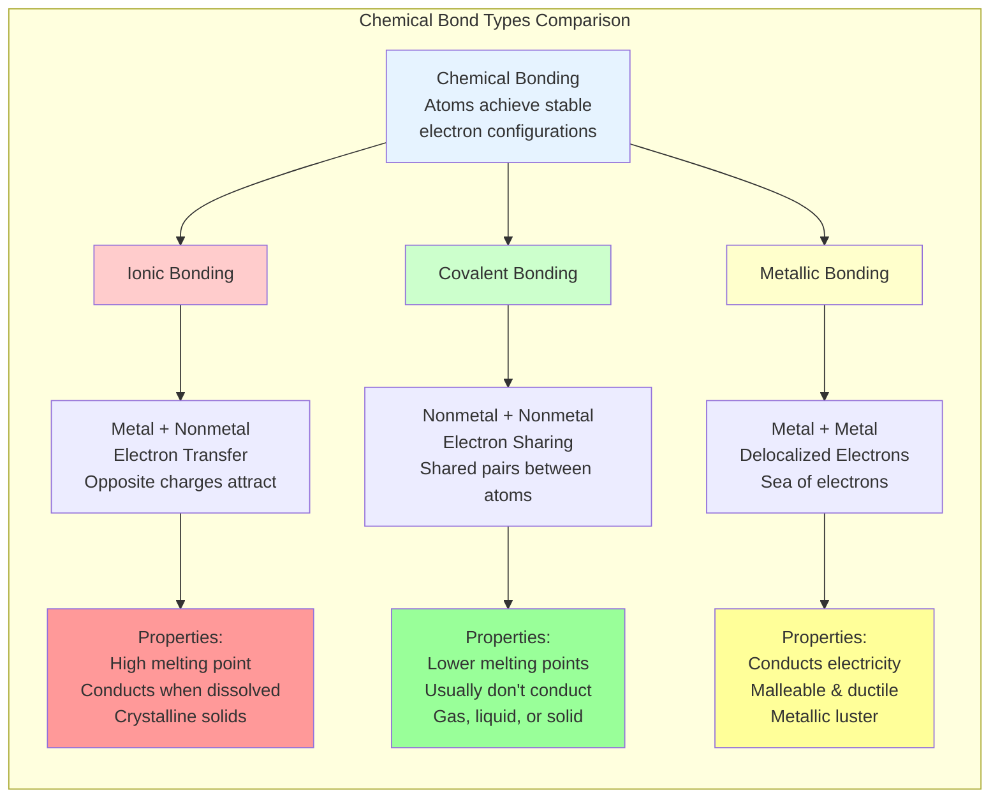

**Ionic Bonds**:
- Form between metals and nonmetals
- Electrons are **transferred** from metal to nonmetal
- Metal becomes a positive cation; nonmetal becomes a negative anion
- Electrostatic attraction between opposite charges holds ions together
- Example: \(NaCl\) (sodium chloride)
- Properties: High melting points, conduct electricity when dissolved or molten, form crystalline solids

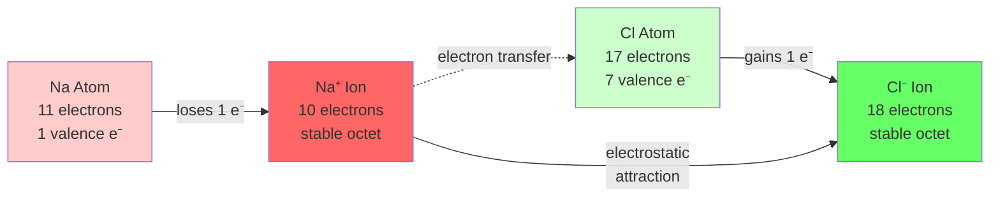

**Covalent Bonds**:
- Form between nonmetals
- Electrons are **shared** between atoms
- Single bond: 1 pair shared; Double bond: 2 pairs shared; Triple bond: 3 pairs shared
- Example: \(H_2O\) (water), \(O_2\) (oxygen gas)
- Properties: Lower melting points than ionic, usually don't conduct electricity, can be solid, liquid, or gas

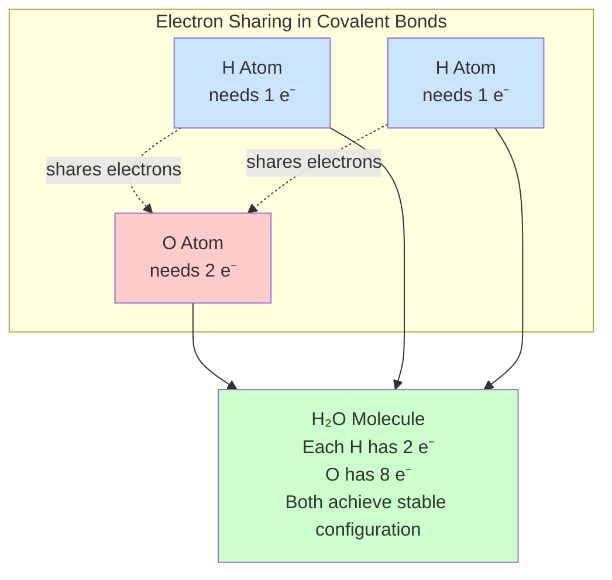

**Metallic Bonds**:
- Form between metal atoms
- Electrons are **delocalized** (mobile "sea of electrons")
- Allows metals to conduct electricity and be malleable/ductile
- Example: Copper (Cu), iron (Fe)

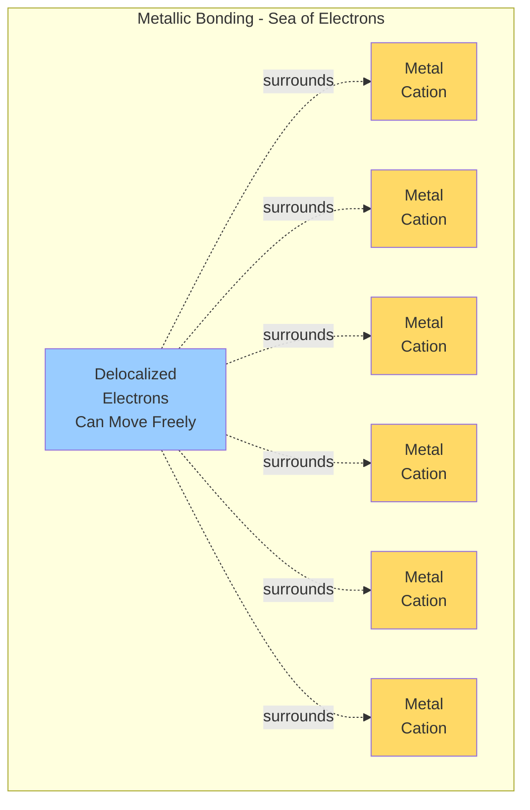

**Lewis Dot Structures**:
- Show valence electrons as dots around element symbols
- Help predict bonding and molecular structure
- Example: \(H \cdot\) has 1 dot, \(\ddot{O}\!\!:\) has 6 dots

**Octet Rule**: Atoms tend to gain, lose, or share electrons to achieve 8 valence electrons (stable configuration like noble gases). Exception: Hydrogen aims for 2 electrons.

---

## Step-by-Step Bonding Concepts

### Understanding Ionic Bond Formation

**Step 1: Identify the Metal and Nonmetal**
- Metals are on the left side of the periodic table (Groups 1-13)
- Nonmetals are on the right side (Groups 14-18, excluding noble gases)
- Metals tend to lose electrons; nonmetals tend to gain electrons

**Step 2: Determine Electron Transfer**
- Find the number of valence electrons for each atom
- Metals lose valence electrons to achieve the nearest noble gas configuration
- Nonmetals gain electrons to complete their valence shell (8 electrons)

**Step 3: Predict Ion Charges**
- Group 1 metals form +1 ions (lose 1 electron)
- Group 2 metals form +2 ions (lose 2 electrons)
- Group 17 nonmetals form -1 ions (gain 1 electron)
- Group 16 nonmetals form -2 ions (gain 2 electrons)

**Step 4: Write the Ionic Formula**
- Balance charges so the compound is electrically neutral
- Use subscripts to indicate the number of each ion needed
- Example: \(Ca^{2+}\) and \(Cl^-\) combine to form \(CaCl_2\)

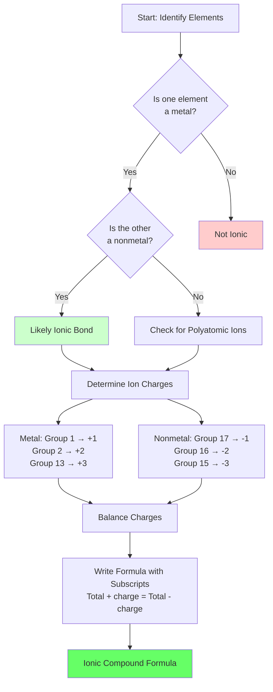

---

### Drawing Lewis Structures Step-by-Step

**Step 1: Count Total Valence Electrons**
- Use the periodic table to find valence electrons for each atom
- Add them all together
- For ions: add electrons for negative charges, subtract for positive charges

**Step 2: Identify the Central Atom**
- Usually the least electronegative atom (not including hydrogen)
- Hydrogen is always on the outside
- Carbon is often central in organic molecules

**Step 3: Connect Atoms with Single Bonds**
- Draw a single bond (2 electrons) between the central atom and each surrounding atom
- Subtract bonding electrons from your total

**Step 4: Complete Octets on Outer Atoms**
- Add lone pairs to outer atoms to give them 8 electrons each (2 for hydrogen)
- Subtract these electrons from your remaining total

**Step 5: Place Remaining Electrons on Central Atom**
- If electrons remain, place them on the central atom as lone pairs

**Step 6: Form Multiple Bonds if Needed**
- If the central atom has fewer than 8 electrons, form double or triple bonds
- Move lone pairs from outer atoms to create bonding pairs
- Check that all atoms satisfy the octet rule (or duet for H)

**Example Walkthrough: \(CO_2\)**
1. Total valence electrons: C (4) + O (6) + O (6) = 16 electrons
2. Central atom: Carbon (less electronegative than oxygen)
3. Connect atoms: O-C-O uses 4 electrons, 12 remain
4. Complete octets on oxygens: 12 electrons used (6 on each O), 0 remain
5. Check central atom: C only has 4 electrons (needs 8)
6. Form double bonds: Move lone pairs from each O to form O=C=O
7. Final check: Each atom has 8 electrons

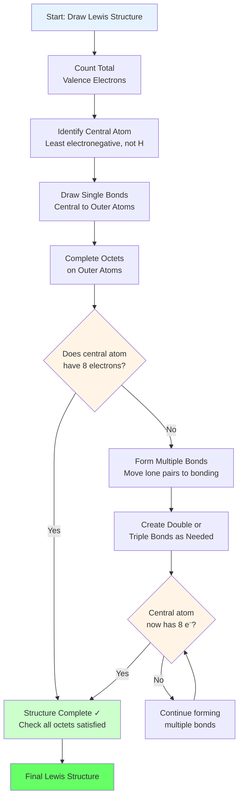

---

### Understanding Covalent Bond Formation

**Step 1: Recognize Nonmetal-Nonmetal Interactions**
- Both atoms want to gain electrons
- Neither can easily give up electrons
- Solution: Share electrons to satisfy both atoms

**Step 2: Determine Number of Bonds Needed**
- Count how many more electrons each atom needs for an octet
- Each bond represents 2 shared electrons
- Example: H needs 1 electron, O needs 2 electrons

**Step 3: Share Electrons Appropriately**
- Single bond: 1 pair shared (2 electrons)
- Double bond: 2 pairs shared (4 electrons)
- Triple bond: 3 pairs shared (6 electrons)

**Step 4: Account for Lone Pairs**
- Electrons not involved in bonding remain as lone pairs
- These still count toward the octet
- Lone pairs affect molecular shape and polarity

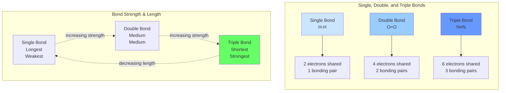

---

## Common Mistakes in Chemical Bonding

### Mistake 1: Confusing Ionic and Covalent Compounds

**The Error**: Thinking that compounds like \(NH_3\) are ionic because they contain different elements.

**Why It's Wrong**: Bonding type depends on electronegativity difference and element classification (metal vs. nonmetal), not just on having different elements.

**How to Avoid It**:
- Always identify whether elements are metals or nonmetals first
- Metal + Nonmetal = Ionic
- Nonmetal + Nonmetal = Covalent
- Remember: Hydrogen acts as a nonmetal in bonding

**Correct Thinking**: \(NH_3\) is covalent because both N and H are nonmetals that share electrons.

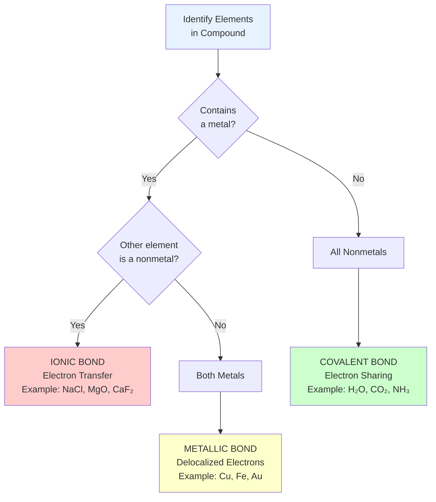

---

### Mistake 2: Incorrect Valence Electron Counting

**The Error**: Using the atomic number or total electrons instead of valence electrons.

**Why It's Wrong**: Only valence electrons (outer shell) participate in bonding. Inner electrons are held too tightly by the nucleus.

**How to Avoid It**:
- For main group elements, valence electrons = group number (for Groups 1-2 and 13-18)
- Group 1 = 1 valence electron, Group 2 = 2, Group 13 = 3, Group 14 = 4, etc.
- For transition metals, focus on Groups 1-2 and 13-18 for now

**Correct Thinking**: Oxygen (Group 16) has 6 valence electrons, not 8 total electrons.

---

### Mistake 3: Forgetting Lone Pairs in Lewis Structures

**The Error**: Only showing bonding electrons and omitting lone pairs on atoms.

**Why It's Wrong**: Lone pairs count toward the octet rule and significantly affect molecular geometry and properties.

**How to Avoid It**:
- After drawing bonds, count electrons on each atom
- If an atom has fewer than 8 electrons (2 for H), add lone pairs
- Double-check that all valence electrons are shown

**Correct Thinking**: Water (\(H_2O\)) has two O-H bonds AND two lone pairs on oxygen, giving oxygen 8 total electrons.

---

### Mistake 4: Incorrect Ion Charge Predictions

**The Error**: Assuming all metals form +1 ions or that charge equals the number of valence electrons.

**Why It's Wrong**: Different groups of metals form different charges based on how many electrons they lose to achieve a stable configuration.

**How to Avoid It**:
- Group 1 metals: +1 (lose 1 electron)
- Group 2 metals: +2 (lose 2 electrons)
- Group 13 metals: +3 (lose 3 electrons)
- For nonmetals: charge = valence electrons - 8

**Correct Thinking**: Magnesium (Group 2) forms \(Mg^{2+}\), not \(Mg^+\), because it has 2 valence electrons to lose.

---

### Mistake 5: Not Balancing Charges in Ionic Compounds

**The Error**: Writing ionic formulas like \(CaCl\) or \(Na_2O_2\) without considering charge balance.

**Why It's Wrong**: Ionic compounds must be electrically neutral overall. The total positive charge must equal the total negative charge.

**How to Avoid It**:
- Identify the charge on each ion
- Use subscripts to balance charges
- Use the crisscross method: the charge number of one ion becomes the subscript of the other
- Simplify subscripts to lowest terms

**Correct Thinking**: \(Ca^{2+}\) and \(Cl^-\) form \(CaCl_2\) (not \(CaCl\)) because you need two \(Cl^-\) ions to balance one \(Ca^{2+}\) ion.

---

## Worked Examples

### Example 1: Predicting Bond Type

**Problem**: Predict whether the following compounds have ionic or covalent bonds:
(a) \(MgO\) (magnesium oxide)
(b) \(CO_2\) (carbon dioxide)
(c) \(KBr\) (potassium bromide)

**Solution**:
1. Ionic bonds form between metals and nonmetals; covalent bonds form between nonmetals
2. (a) \(MgO\): Mg is a metal (Group 2), O is a nonmetal (Group 16) → **ionic**
3. (b) \(CO_2\): C is a nonmetal, O is a nonmetal → **covalent**
4. (c) \(KBr\): K is a metal (Group 1), Br is a nonmetal (Group 17) → **ionic**

**Answer**: (a) ionic, (b) covalent, (c) ionic

---

### Example 2: Drawing Lewis Structures

**Problem**: Draw the Lewis dot structure for water (\(H_2O\)). Show how the octet rule is satisfied for oxygen.

**Solution**:
1. Count valence electrons: H has 1 (× 2 = 2), O has 6. Total = 8 electrons
2. O is the central atom (less electronegative than would be expected, but H can only form 1 bond)
3. Connect each H to O with a single bond (uses 4 electrons)
4. Place remaining 4 electrons as 2 lone pairs on O
5. Lewis structure:
   ```
      H-O-H  with two lone pairs on O
      or:  H:O:H
           ..
   ```
6. O has 2 bonding pairs + 2 lone pairs = 8 electrons (octet satisfied)
7. Each H has 2 electrons (duet satisfied)

**Answer**: Water has two O-H single bonds with two lone pairs on oxygen. Oxygen satisfies the octet rule with 8 electrons total.

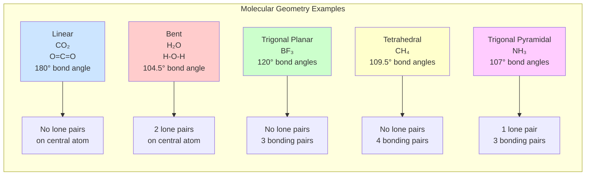

---

### Example 3: Ionic Compound Formation

**Problem**: When sodium (Na) reacts with chlorine (Cl) to form \(NaCl\), describe the electron transfer. What are the charges of the resulting ions?

**Solution**:
1. Na (Group 1): 11 electrons, configuration 2, 8, 1
2. Cl (Group 17): 17 electrons, configuration 2, 8, 7
3. Na loses 1 electron to achieve stable octet: \(Na \rightarrow Na^+ + e^-\)
4. Resulting \(Na^+\): 10 electrons, configuration 2, 8
5. Cl gains 1 electron to achieve stable octet: \(Cl + e^- \rightarrow Cl^-\)
6. Resulting \(Cl^-\): 18 electrons, configuration 2, 8, 8
7. Ionic compound forms: \(Na^+ Cl^-\) (neutral overall)

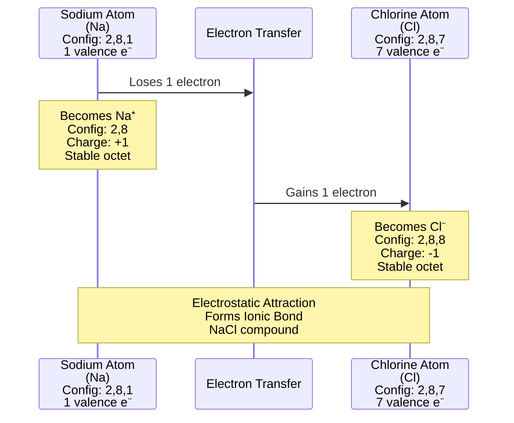

**Answer**: Na loses 1 electron to form \(Na^+\) (charge: +1). Cl gains 1 electron to form \(Cl^-\) (charge: -1). The ionic bond forms between \(Na^+\) and \(Cl^-\).

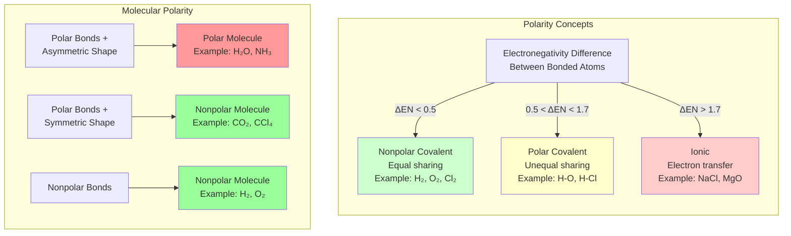

---

## SAT-Aligned Practice Problems

### Set 1: Fundamental Concepts (Questions 1-10)

1. Which of the following best describes the bonding in sodium chloride (\(NaCl\))?
   - A) Electrons are shared equally between sodium and chlorine atoms
   - B) Sodium transfers one electron to chlorine, forming oppositely charged ions
   - C) Both atoms contribute electrons to a delocalized electron sea
   - D) Sodium and chlorine share electrons unequally in a polar covalent bond

2. A student draws the Lewis structure for \(CH_4\) (methane). How many total valence electrons should be shown in the correct structure?
   - A) 4
   - B) 6
   - C) 8
   - D) 10

3. Which compound has the strongest ionic character in its bonding?
   - A) \(H_2O\)
   - B) \(NH_3\)
   - C) \(CaO\)
   - D) \(CO_2\)

4. An element in Group 17 of the periodic table forms an ion. What is the most likely charge of this ion?
   - A) +1
   - B) +7
   - C) -1
   - D) -7

5. Which of the following statements about metallic bonding is correct?
   - A) Electrons are transferred from one metal atom to another
   - B) Electrons are shared between specific pairs of metal atoms
   - C) Electrons are delocalized and can move freely throughout the metal structure
   - D) Electrons are localized in fixed positions between metal atoms

6. A molecule of nitrogen gas (\(N_2\)) contains a triple bond. How many electrons are shared between the two nitrogen atoms?
   - A) 2
   - B) 3
   - C) 6
   - D) 8

7. Which property is characteristic of ionic compounds but NOT typical of covalent compounds?
   - A) Forming molecules with discrete units
   - B) Conducting electricity when dissolved in water
   - C) Having low melting points
   - D) Existing as gases at room temperature

8. The Lewis structure for water (\(H_2O\)) shows two O-H bonds and two lone pairs on oxygen. How many total electrons does the oxygen atom have in this structure?
   - A) 4
   - B) 6
   - C) 8
   - D) 10

9. When aluminum (Group 13) forms an ionic compound with oxygen (Group 16), what is the most likely formula?
   - A) \(AlO\)
   - B) \(Al_2O\)
   - C) \(AlO_3\)
   - D) \(Al_2O_3\)

10. Which pair of elements is most likely to form a covalent bond?
    - A) Sodium and chlorine
    - B) Carbon and oxygen
    - C) Magnesium and sulfur
    - D) Potassium and bromine

---

## Step Checker: Lewis Structure Problems

Use this systematic approach to verify your Lewis structures or solve bonding problems step-by-step.

### Lewis Structure Checklist

**Problem**: Draw the Lewis structure for _______________

**Step 1: Count Valence Electrons**
- [ ] Identified the group number for each element
- [ ] Calculated valence electrons for each atom
- [ ] Added all valence electrons together
- [ ] Adjusted for charge if drawing an ion
- **Total valence electrons: _______**

**Step 2: Determine Central Atom**
- [ ] Identified the least electronegative atom (not H)
- [ ] Placed it in the center
- **Central atom: _______**

**Step 3: Draw Single Bonds**
- [ ] Connected central atom to each outer atom with a single bond
- [ ] Each bond uses 2 electrons
- **Electrons used in bonding: _______**
- **Electrons remaining: _______**

**Step 4: Complete Octets on Outer Atoms**
- [ ] Added lone pairs to outer atoms (except H needs only 2)
- [ ] Each lone pair uses 2 electrons
- **Electrons used for lone pairs: _______**
- **Electrons remaining: _______**

**Step 5: Place Remaining Electrons on Central Atom**
- [ ] Added any leftover electrons to central atom as lone pairs
- **All valence electrons now placed: Yes / No**

**Step 6: Check for Octet Rule Satisfaction**
- [ ] Counted electrons around central atom
- [ ] If central atom has fewer than 8, proceed to Step 7
- [ ] If central atom has 8 or more, structure is complete
- **Central atom electron count: _______**

**Step 7: Form Multiple Bonds if Needed**
- [ ] Moved lone pairs from outer atoms to form double/triple bonds
- [ ] Rechecked that all atoms have complete octets (or duets for H)
- **Final structure satisfies octet rule: Yes / No**

---

### Ionic Formula Checklist

**Problem**: Predict the formula for the ionic compound formed between _______ and _______

**Step 1: Classify Elements**
- [ ] Identified which element is the metal
- [ ] Identified which element is the nonmetal
- **Metal: _______ (Group _____)**
- **Nonmetal: _______ (Group _____)**

**Step 2: Predict Ion Charges**
- [ ] Determined charge on metal cation (usually = group number for Groups 1-2)
- [ ] Determined charge on nonmetal anion (charge = valence electrons - 8)
- **Metal ion: _______**
- **Nonmetal ion: _______**

**Step 3: Balance Charges**
- [ ] Found the least common multiple of the charges
- [ ] Determined subscripts needed to balance charges
- [ ] Verified that total positive charge = total negative charge
- **Ionic formula: _______**

**Step 4: Verify**
- [ ] Checked that subscripts are in lowest whole number ratio
- [ ] Confirmed compound is electrically neutral
- **Formula is correct: Yes / No**

---

## Practice Problems

1. Identify whether each compound is ionic or covalent: (a) \(CaF_2\), (b) \(N_2\), (c) \(H_2S\), (d) \(LiCl\).

2. Explain why ionic compounds have high melting points.

3. How many valence electrons does carbon have? How many bonds does carbon typically form?

4. Draw the Lewis dot structure for \(Cl_2\) (chlorine gas). How many electrons does each Cl atom have in this molecule?

5. When magnesium (\(Mg\), Group 2) forms an ionic compound, what charge does the magnesium ion have? Why?

6. What type of bonding is present in a copper wire? Explain why copper conducts electricity.

7. Predict the formula of the ionic compound formed between calcium (\(Ca^{2+}\)) and bromine (\(Br^-\)).

8. Why do nonmetals form covalent bonds with each other rather than ionic bonds?

9. Draw the Lewis structure for ammonia (\(NH_3\)). Does nitrogen satisfy the octet rule?

10. Compare the melting points of \(NaCl\) (ionic) and \(H_2O\) (covalent). Which is higher and why?

---

## Answer Key

### SAT-Aligned Problems: Detailed Solutions

??? note "Click to reveal SAT problem answers and explanations"
    **Question 1: Answer B**

    **Explanation**: Sodium chloride is an ionic compound. Sodium (a metal) has 1 valence electron that it loses to become \(Na^+\). Chlorine (a nonmetal) has 7 valence electrons and gains 1 electron to become \(Cl^-\). The electron is transferred, not shared. The electrostatic attraction between \(Na^+\) and \(Cl^-\) forms the ionic bond.

    **Why other answers are wrong**:
    - A: This describes covalent bonding, not ionic
    - C: This describes metallic bonding
    - D: This describes polar covalent bonding

    ---

    **Question 2: Answer C**

    **Explanation**: Methane (\(CH_4\)) has 1 carbon atom (4 valence electrons) and 4 hydrogen atoms (1 valence electron each). Total valence electrons = 4 + 4(1) = 8 electrons. The Lewis structure shows 4 C-H single bonds, using all 8 valence electrons.

    **Step-by-step calculation**:
    - Carbon (Group 14): 4 valence electrons
    - Hydrogen (Group 1): 1 valence electron × 4 atoms = 4 electrons
    - Total: 4 + 4 = 8 valence electrons

    ---

    **Question 3: Answer C**

    **Explanation**: Calcium oxide (\(CaO\)) has the strongest ionic character because it forms between a metal (calcium) and a nonmetal (oxygen) with a large electronegativity difference. The other compounds are all covalent molecules formed between nonmetals.

    **Comparison**:
    - \(CaO\): Metal + Nonmetal = Ionic (strongest ionic character)
    - \(H_2O\), \(NH_3\), \(CO_2\): Nonmetal + Nonmetal = Covalent (no ionic character)

    ---

    **Question 4: Answer C**

    **Explanation**: Group 17 elements (halogens) have 7 valence electrons and need 1 more electron to complete their octet. When they gain 1 electron, they form ions with a -1 charge. Examples: \(F^-\), \(Cl^-\), \(Br^-\), \(I^-\).

    **Why not other answers**:
    - Nonmetals gain electrons, so they form negative ions (not positive)
    - The charge reflects electrons gained/lost, not the total number of valence electrons

    ---

    **Question 5: Answer C**

    **Explanation**: Metallic bonding involves delocalized electrons that are not bound to any specific atom. These electrons form a "sea of electrons" that can move freely throughout the metal structure, which explains why metals conduct electricity and are malleable.

    **Key concept**: The mobility of electrons in metallic bonding is what distinguishes it from ionic (electron transfer) and covalent (electron sharing between specific atoms) bonding.

    ---

    **Question 6: Answer C**

    **Explanation**: A triple bond consists of 3 bonding pairs. Since each bonding pair contains 2 electrons, a triple bond involves 3 × 2 = 6 electrons shared between the two nitrogen atoms.

    **Bonding breakdown**:
    - Single bond: 2 electrons (1 pair)
    - Double bond: 4 electrons (2 pairs)
    - Triple bond: 6 electrons (3 pairs)

    In \(N≡N\), the triple bond ensures each nitrogen achieves an octet (6 bonding electrons + 2 lone pair electrons = 8 electrons).

    ---

    **Question 7: Answer B**

    **Explanation**: Ionic compounds conduct electricity when dissolved in water because the ions separate and become mobile charge carriers. The dissolved ions can move through the solution and carry electric current. Covalent compounds typically do not conduct electricity because they don't form ions.

    **Comparison of properties**:
    - Ionic: High melting points, conduct when dissolved/molten, form crystalline solids
    - Covalent: Lower melting points, usually don't conduct electricity, can be gases/liquids/solids

    ---

    **Question 8: Answer C**

    **Explanation**: In water, oxygen forms 2 single bonds (2 bonding pairs = 4 electrons) and has 2 lone pairs (4 electrons). Total electrons around oxygen = 4 + 4 = 8 electrons, satisfying the octet rule.

    **Electron count breakdown**:
    - 2 O-H bonds: 2 bonding pairs = 4 electrons
    - 2 lone pairs on O: 4 electrons
    - Total: 8 electrons (octet satisfied)

    ---

    **Question 9: Answer D**

    **Explanation**: Aluminum (Group 13) forms \(Al^{3+}\) ions by losing 3 electrons. Oxygen (Group 16) forms \(O^{2-}\) ions by gaining 2 electrons. To balance charges, we need 2 aluminum ions (total charge: +6) and 3 oxide ions (total charge: -6), giving the formula \(Al_2O_3\).

    **Charge balancing**:
    - \(Al^{3+}\): Needs 3 oxide ions worth of negative charge
    - \(O^{2-}\): Needs 2 aluminum ions worth of positive charge
    - Least common multiple of 3 and 2 is 6
    - Formula: \(Al_2O_3\) (charges: 2(+3) + 3(-2) = +6 - 6 = 0)

    ---

    **Question 10: Answer B**

    **Explanation**: Carbon and oxygen are both nonmetals. Covalent bonds form between nonmetals because they share electrons rather than transferring them. All other pairs consist of a metal and a nonmetal, which would form ionic bonds.

    **Element classification**:
    - A: Na (metal) + Cl (nonmetal) = Ionic
    - B: C (nonmetal) + O (nonmetal) = Covalent ✓
    - C: Mg (metal) + S (nonmetal) = Ionic
    - D: K (metal) + Br (nonmetal) = Ionic

---

### Practice Problems: Answer Key

??? note "Click to reveal practice problem answers"
    1. (a) **ionic** (Ca is metal, F is nonmetal), (b) **covalent** (both nonmetals), (c) **covalent** (both nonmetals), (d) **ionic** (Li is metal, Cl is nonmetal)

    2. Ionic compounds have **strong electrostatic forces** between oppositely charged ions arranged in a crystal lattice. Large amounts of energy are needed to break these forces, resulting in high melting points.

    3. Carbon has **4 valence electrons** and typically forms **4 covalent bonds** to achieve an octet.

    4. \(Cl-Cl\) with 3 lone pairs on each Cl atom. Each Cl has **8 electrons** (1 bonding pair + 3 lone pairs = 8 electrons, satisfying the octet rule).

    5. \(Mg^{2+}\) (charge: +2). Magnesium has 2 valence electrons and loses both to achieve a stable octet (configuration 2, 8).

    6. **Metallic bonding**. Copper conducts electricity because the electrons are delocalized and can move freely through the metal structure.

    7. \(CaBr_2\). Calcium forms \(Ca^{2+}\) and bromine forms \(Br^-\). To balance charges, you need 2 bromide ions for each calcium ion.

    8. Nonmetals have **high electronegativity** and tend to gain electrons. When two nonmetals react, neither can easily give up electrons, so they **share electrons** instead, forming covalent bonds.

    9. N is central, bonded to 3 H atoms, with 1 lone pair on N. N has 3 bonding pairs + 1 lone pair = 8 electrons. **Yes, nitrogen satisfies the octet rule**.

    10. \(NaCl\) has a **much higher melting point** (801°C vs 0°C). Ionic bonds are much stronger than the intermolecular forces between covalent molecules, requiring more energy to break.
