# Periodic Table

## Video Resources

<div class="video-container" markdown="1">
**Periodic Table Overview**

<iframe width="100%" height="400" src="https://www.youtube.com/embed/t_f8bB1kf6M" frameborder="0" allow="accelerometer; autoplay; clipboard-write; encrypted-media; gyroscope; picture-in-picture" allowfullscreen></iframe>

**Atomic Models & Periodicity Playlist** - Includes detailed periodic table trends

<iframe width="100%" height="400" src="https://www.youtube.com/embed/videoseries?list=PLSQl0a2vh4HBLR7jdrTrb81DNX6MaICRO" frameborder="0" allow="accelerometer; autoplay; clipboard-write; encrypted-media; gyroscope; picture-in-picture" allowfullscreen></iframe>

---

## Explanation

The periodic table organizes all known elements by atomic number and groups elements with similar properties together. This organization reveals patterns in atomic structure and chemical behavior that allow us to predict how elements will interact.

### Key Concepts

**Organization**:
- **Periods**: Horizontal rows numbered 1-7. Period number = number of electron shells.
  - Example: Period 3 contains Na, Mg, Al, Si, P, S, Cl, Ar - all have 3 electron shells
  - As you move across a period, elements gain one proton and one electron

- **Groups**: Vertical columns numbered 1-18. Elements in the same group have similar chemical properties.
  - Elements in the same group have the same number of valence electrons
  - For main group elements (Groups 1, 2, 13-18), valence electrons = ones digit of group number
  - Example: Group 15 elements all have 5 valence electrons

- **Elements are arranged by increasing atomic number** (number of protons).
  - Atomic number determines element identity
  - Atomic number = number of protons = number of electrons (in neutral atoms)

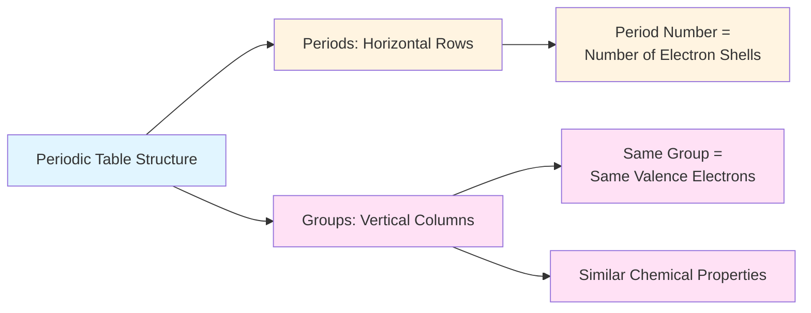

**Important Groups**:
- **Group 1**: Alkali metals (Li, Na, K, Rb, Cs, Fr) - highly reactive metals, 1 valence electron
  - Reactivity increases down the group (Fr is most reactive)
  - Form +1 ions by losing their single valence electron
  - React vigorously with water to produce hydrogen gas

- **Group 2**: Alkaline earth metals (Be, Mg, Ca, Sr, Ba, Ra) - reactive metals, 2 valence electrons
  - Less reactive than Group 1, but still quite reactive
  - Form +2 ions by losing both valence electrons
  - Reactivity increases down the group

- **Group 17**: Halogens (F, Cl, Br, I, At) - highly reactive nonmetals, 7 valence electrons
  - Need only 1 electron to complete their outer shell
  - Form -1 ions by gaining one electron
  - Reactivity decreases down the group (F is most reactive)
  - Exist as diatomic molecules in nature (F₂, Cl₂, Br₂, I₂)

- **Group 18**: Noble gases (He, Ne, Ar, Kr, Xe, Rn) - unreactive gases, full outer shell
  - Have complete valence shells (8 electrons, except He with 2)
  - Extremely stable and unreactive due to complete outer shell
  - Rarely form compounds under normal conditions

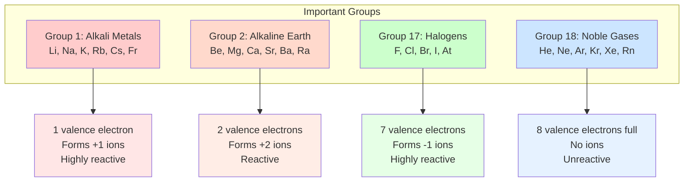

**Metals, Nonmetals, and Metalloids**:
- **Metals**: Left and center of periodic table - shiny, conductive, malleable
  - Good conductors of heat and electricity
  - Tend to lose electrons and form positive ions (cations)
  - Solid at room temperature (except mercury)

- **Nonmetals**: Upper right of periodic table - dull, poor conductors, brittle when solid
  - Poor conductors of heat and electricity (insulators)
  - Tend to gain electrons and form negative ions (anions)
  - Can be solid, liquid, or gas at room temperature

- **Metalloids**: Staircase line between metals and nonmetals - properties intermediate
  - Include B, Si, Ge, As, Sb, Te, At
  - Have properties of both metals and nonmetals
  - Semiconductors - useful in electronics

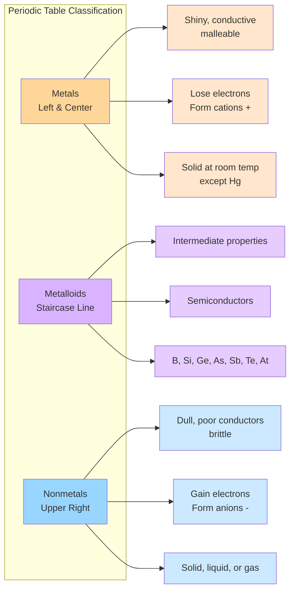

**Periodic Trends**:

Understanding these trends requires thinking about the forces between electrons and the nucleus.

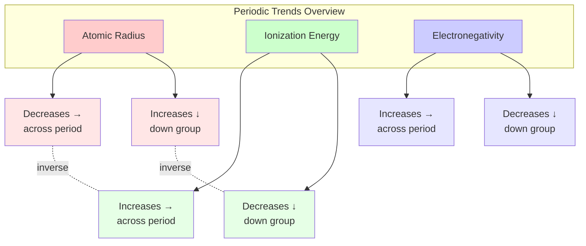

- **Atomic radius**: The distance from the nucleus to the outermost electrons
  - **Decreases left to right across a period**: More protons pull electrons closer
    - Same number of shells, but increasing nuclear charge
    - Electrons in the same shell don't shield each other effectively
    - Visual: Imagine the nucleus pulling harder on the same electron cloud

  - **Increases top to bottom down a group**: More electron shells mean larger atoms
    - Each new period adds a complete new shell
    - Inner shells shield outer electrons from nuclear charge
    - Visual: Like adding rings to a target - each ring makes it larger

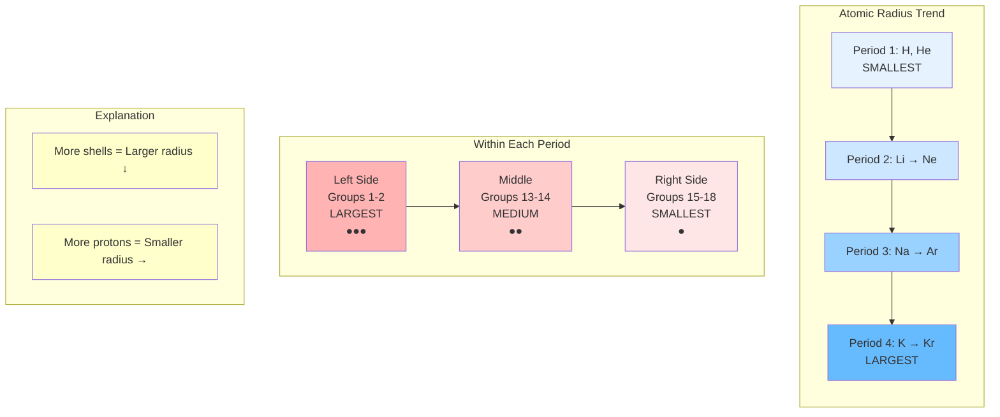

- **Ionization energy**: Energy required to remove an electron from a gaseous atom
  - **Increases left to right across a period**: Electrons held more tightly
    - Smaller atomic radius means electrons are closer to nucleus
    - Stronger attraction requires more energy to remove electron
    - Metals (left) have low ionization energy; nonmetals (right) have high

  - **Decreases top to bottom down a group**: Outer electrons are farther from nucleus
    - Increased distance weakens the attraction
    - Shielding by inner electrons reduces effective nuclear charge
    - Easier to remove electrons from larger atoms

**Understanding Shielding Effect**:

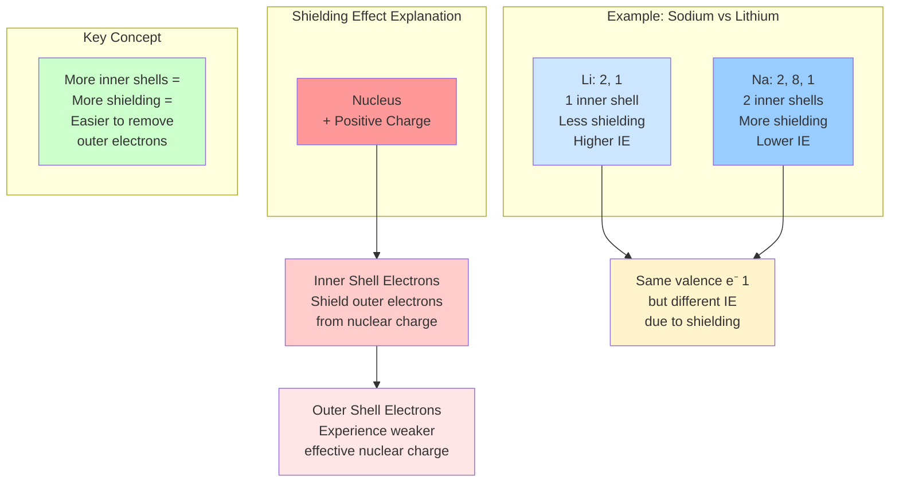

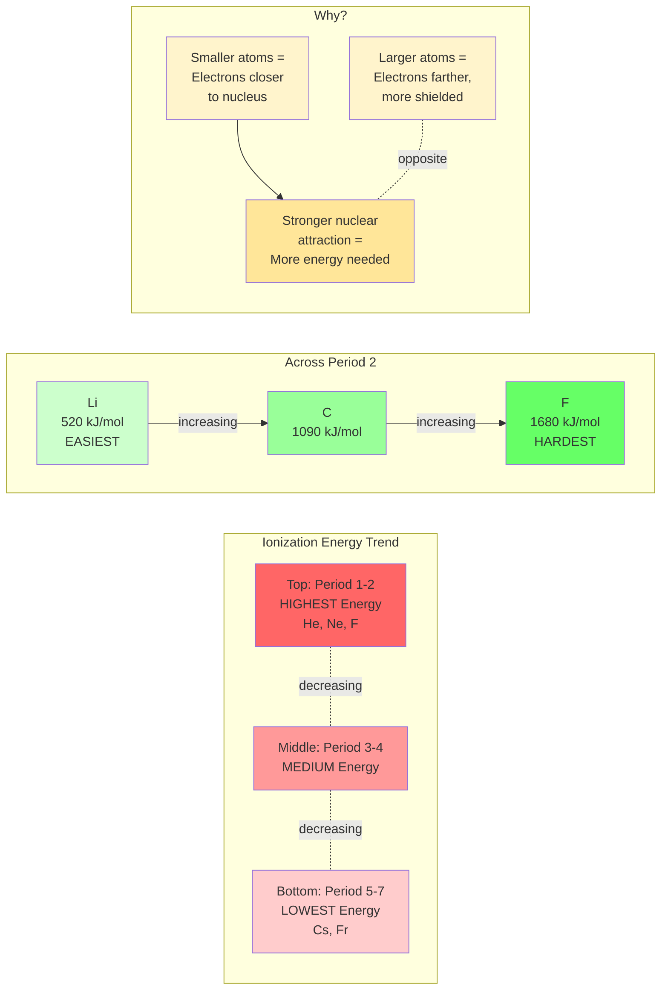

- **Electronegativity**: Attraction for electrons in a chemical bond
  - **Increases left to right across a period**: Smaller atoms attract electrons more strongly
    - More protons create stronger pull on bonding electrons
    - Smaller radius means bonding electrons are closer to nucleus
    - Fluorine is the most electronegative element

  - **Decreases top to bottom down a group**: Bonding electrons are farther from nucleus
    - Increased distance weakens attraction
    - Shielding reduces effective nuclear pull on bonding electrons
    - Upper right corner (F, O, N, Cl) are most electronegative

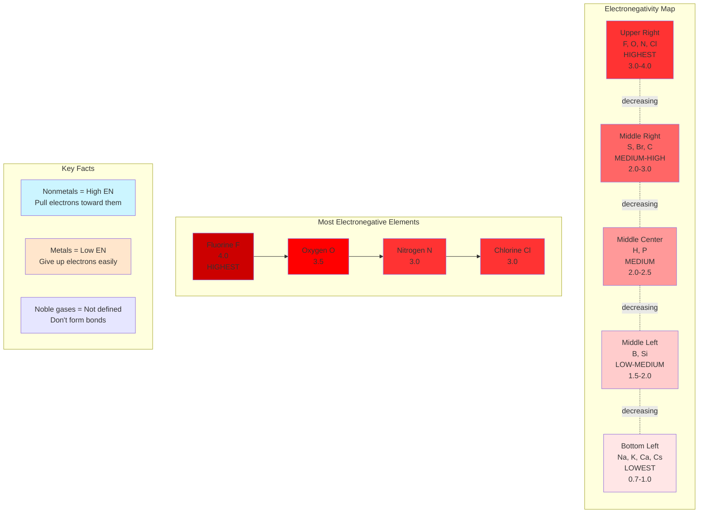

**Visual Thinking Process for Trends**:

When comparing any two elements:
1. Locate both elements on the periodic table
2. If in the same period, the one on the right has: smaller radius, higher ionization energy, higher electronegativity
3. If in the same group, the one lower down has: larger radius, lower ionization energy, lower electronegativity
4. If diagonal, combine both rules: horizontal effect usually dominates for radius and ionization energy

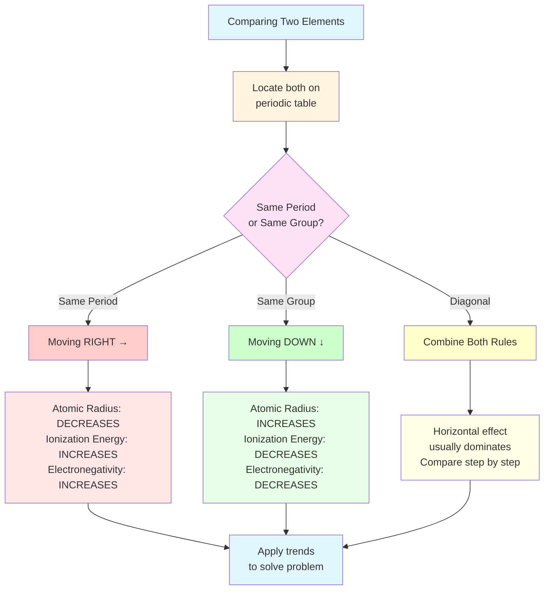

```mermaid
graph TB
    subgraph "Complete Periodic Table Summary"
        direction TB
        PT[PERIODIC TABLE]
    end

    PT --> Structure
    PT --> Trends
    PT --> Groups

    subgraph Structure
        S1[Periods = Rows<br/>Period # = # of shells]
        S2[Groups = Columns<br/>Same valence e⁻]
        S3[Metals | Metalloids | Nonmetals]
    end

    subgraph Trends
        direction LR
        T1[Across Period →<br/>Radius ↓<br/>IE ↑<br/>EN ↑]
        T2[Down Group ↓<br/>Radius ↑<br/>IE ↓<br/>EN ↓]
    end

    subgraph Groups
        G1[Group 1: Alkali<br/>1 valence e⁻<br/>+1 ions<br/>Very reactive]
        G2[Group 2: Alkaline Earth<br/>2 valence e⁻<br/>+2 ions<br/>Reactive]
        G17[Group 17: Halogens<br/>7 valence e⁻<br/>-1 ions<br/>Very reactive]
        G18[Group 18: Noble<br/>8 valence e⁻<br/>No ions<br/>Unreactive]
    end

    style PT fill:#ff9999
    style S1 fill:#cce6ff
    style S2 fill:#cce6ff
    style S3 fill:#cce6ff
    style T1 fill:#ccffcc
    style T2 fill:#ccffcc
    style G1 fill:#ffcccc
    style G2 fill:#ffd9cc
    style G17 fill:#ccffcc
    style G18 fill:#cce5ff
```

---

## Worked Examples

### Example 1: Using Period and Group Information

**Problem**: Element X is in Period 3, Group 15. How many electron shells does it have? How many valence electrons? Identify the element.

**Step-by-Step Solution**:

**Step 1: Determine electron shells from period number**
- Period number directly tells us the number of electron shells
- Element X is in Period 3
- Therefore, Element X has **3 electron shells**

**Step 2: Determine valence electrons from group number**
- For main group elements (Groups 1, 2, 13-18), valence electrons = ones digit of group number
- Group 15: ones digit is 5
- Therefore, Element X has **5 valence electrons**

**Step 3: Identify the element**
- Look at the periodic table: Period 3, Group 15
- The element at this position is **phosphorus (P)**
- Atomic number: 15 (meaning 15 protons, 15 electrons)

**Step 4: Verify with electron configuration**
- Total electrons: 15
- Shell distribution: 2 electrons in shell 1, 8 in shell 2, 5 in shell 3
- Configuration notation: 2, 8, 5
- This confirms 3 shells and 5 valence electrons

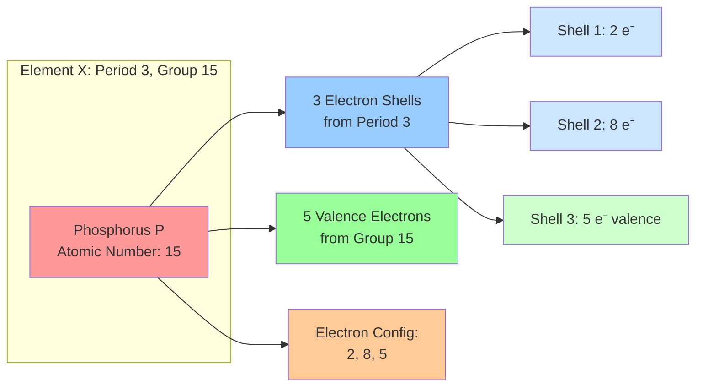

**Answer**: 3 electron shells, 5 valence electrons, element is phosphorus (P).

---

### Example 2: Comparing Atomic Radius

**Problem**: Arrange these elements in order of increasing atomic radius: Na, Cl, Mg. Explain your reasoning.

**Step-by-Step Solution**:

**Step 1: Locate elements on periodic table**
- Na (Sodium): Period 3, Group 1
- Mg (Magnesium): Period 3, Group 2
- Cl (Chlorine): Period 3, Group 17

**Visual thinking**: Draw a mental picture
```
Period 3:  Na    Mg    Al    Si    P    S    Cl    Ar
          [1]   [2]                           [17]
          ←――――――――― Moving right ―――――――――→
```

**Step 2: Apply periodic trend rules**
- All three elements are in the same period (Period 3)
- When comparing elements in the same period: atomic radius **decreases left to right**
- Why? Same number of shells, but increasing nuclear charge pulls electrons closer

**Step 3: Order elements by position**
- Left to right in Period 3: Na (leftmost), then Mg, then Cl (rightmost)
- Therefore, atomic radius: Na (largest) > Mg (medium) > Cl (smallest)

**Step 4: Express as increasing order**
- Increasing means smallest to largest
- Order: Cl < Mg < Na

**Visual reasoning**: Think of it as the nucleus getting stronger
- Na: 11 protons pulling on 3 shells
- Mg: 12 protons pulling on 3 shells (pulls tighter)
- Cl: 17 protons pulling on 3 shells (pulls even tighter)

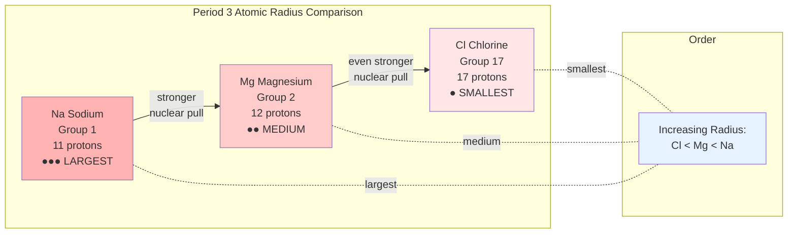

**Answer**: Cl < Mg < Na (increasing atomic radius). Sodium has the largest radius because it's furthest left in Period 3, with the weakest nuclear pull on its outer electrons.

---

### Example 3: Predicting Chemical Properties

**Problem**: Potassium (K) and sodium (Na) are both in Group 1. Based on their position, predict two chemical properties they share.

**Step-by-Step Solution**:

**Step 1: Identify group membership**
- Both K and Na are in Group 1 (alkali metals)
- Group 1 is the leftmost column of the periodic table

**Step 2: Recall key principle**
- Elements in the same group have similar chemical properties
- Why? They have the same number of valence electrons
- Chemical properties depend mainly on valence electrons

**Step 3: Determine valence electron configuration**
- Group 1 elements have **1 valence electron**
- Na electron configuration: 2, 8, 1 (1 valence electron)
- K electron configuration: 2, 8, 8, 1 (1 valence electron)

**Step 4: Predict chemical behavior based on valence electrons**

Property 1: **Ion formation**
- With only 1 valence electron, it's easy to lose it
- Losing 1 electron gives a stable, full outer shell
- Both form +1 ions: Na⁺ and K⁺

Property 2: **Reactivity**
- Both are highly reactive metals
- React vigorously with water: 2Na + 2H₂O → 2NaOH + H₂
- React with halogens to form salts: 2K + Cl₂ → 2KCl
- Must be stored in oil to prevent reaction with air

Property 3: **Physical properties**
- Both are soft metals (can be cut with a knife)
- Both have low melting points (for metals)
- Both are shiny and silvery in appearance

**Visual thinking**: The single valence electron is like a loose thread - easy to pull away, making these elements reactive.

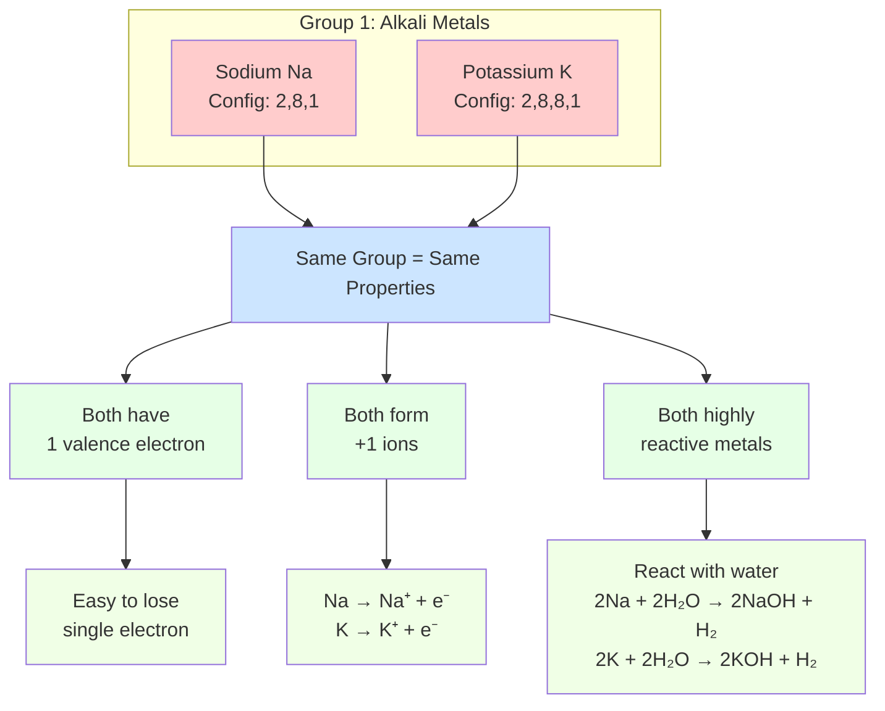

**Answer**: K and Na both (1) have 1 valence electron and form +1 ions, and (2) are highly reactive metals that react vigorously with water to produce hydrogen gas and hydroxide compounds.

---

### Example 4: Comparing Ionization Energy with Visual Reasoning

**Problem**: Which element has the highest ionization energy: Li, C, or F? Explain your reasoning.

**Step-by-Step Solution**:

**Step 1: Locate elements on periodic table**
- Li (Lithium): Period 2, Group 1
- C (Carbon): Period 2, Group 14
- F (Fluorine): Period 2, Group 17

**Visual layout**:
```
Period 2:  Li    Be    B    C    N    O    F    Ne
          [1]              [14]              [17]
          ←――――― Ionization energy increases ―――→
```

**Step 2: Apply horizontal trend**
- All three are in Period 2
- Ionization energy **increases left to right** across a period
- Order: Li < C < F

**Step 3: Explain why with atomic structure**

**Lithium (Li)**:
- Electron configuration: 2, 1
- Only 3 protons pulling on the outermost electron
- Valence electron is farther from nucleus (larger atomic radius)
- **Easiest to remove** - lowest ionization energy

**Carbon (C)**:
- Electron configuration: 2, 4
- 6 protons pulling on outer electrons
- Smaller atomic radius than Li (electrons held closer)
- **Moderate difficulty to remove** - medium ionization energy

**Fluorine (F)**:
- Electron configuration: 2, 7
- 9 protons pulling on outer electrons
- Smallest atomic radius of the three (electrons held very close)
- **Hardest to remove** - highest ionization energy

**Visual thinking**: Imagine trying to pull an electron away
- Li: Like pulling a ball from a weak magnet
- C: Like pulling from a medium magnet
- F: Like pulling from a very strong magnet

**Step 4: Quantify if needed**
- Approximate ionization energies:
  - Li: ~520 kJ/mol
  - C: ~1090 kJ/mol
  - F: ~1680 kJ/mol

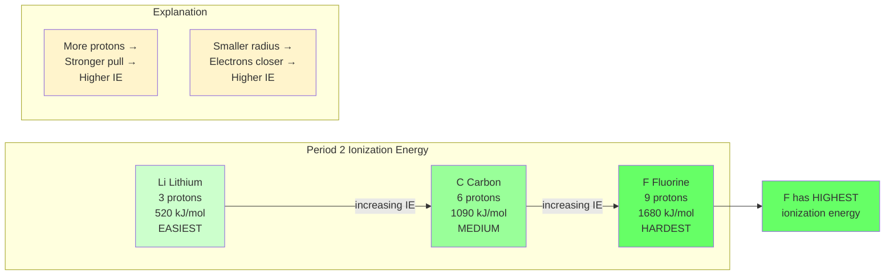

**Answer**: Fluorine (F) has the highest ionization energy. It's furthest right in Period 2, meaning it has the most protons (9) pulling on the same electron shell, creating the strongest attraction that requires the most energy to overcome.

---

## Common Mistakes to Avoid

Before you start practicing, be aware of these frequent errors that students make when working with the periodic table:

### Mistake 1: Confusing Periods and Groups

**Common Error**: Saying an element in Group 3 has 3 valence electrons when it's actually in Group 13.

**Why it happens**: The periodic table has two numbering systems. Older tables use 1-8 with A and B designations. Modern IUPAC tables use 1-18.

**How to avoid it**:
- Always check which numbering system your periodic table uses
- For Groups 13-18 in modern notation: valence electrons = ones digit (Group 15 → 5 valence electrons)
- For Groups 1-2: valence electrons = group number directly
- The transition metals (Groups 3-12) don't follow simple valence electron patterns at this level

**Example**:
- WRONG: "Group 13 has 13 valence electrons"
- RIGHT: "Group 13 has 3 valence electrons (ones digit = 3)"

---

### Mistake 2: Reversing Atomic Radius and Ionization Energy Trends

**Common Error**: Thinking atomic radius and ionization energy follow the same trend.

**Why it happens**: Students memorize trends without understanding the underlying cause.

**How to avoid it**:
- Remember: **atomic radius and ionization energy are inversely related**
- Smaller atoms = harder to remove electrons = higher ionization energy
- Larger atoms = easier to remove electrons = lower ionization energy
- **Across a period**: radius decreases, ionization energy increases
- **Down a group**: radius increases, ionization energy decreases

**Visual aid**:
```
Atomic Radius:        ↓ across period, ↑ down group
Ionization Energy:    ↑ across period, ↓ down group
                      ↑ opposite ↑
```

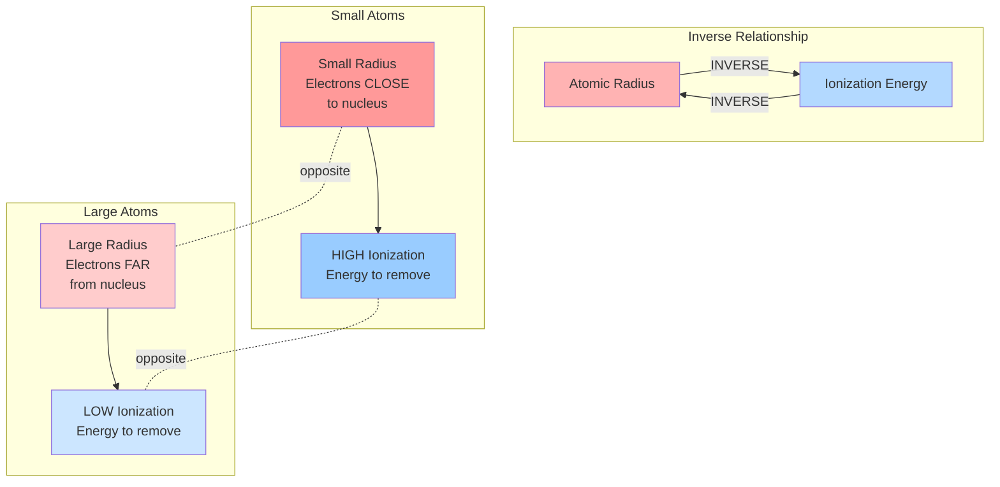

**Example**:
- WRONG: "Na has a smaller radius than Cl, so Na has higher ionization energy"
- RIGHT: "Na has a larger radius than Cl, so Na has lower ionization energy (easier to remove electron)"

---

### Mistake 3: Forgetting About Noble Gas Exceptions

**Common Error**: Expecting noble gases to follow reactivity trends of other groups.

**Why it happens**: Students apply general rules to all elements without noting exceptions.

**How to avoid it**:
- Noble gases (Group 18) are special: they already have full valence shells
- Full shells = maximum stability = minimal reactivity
- Don't compare noble gas reactivity to other elements
- Noble gases rarely appear in questions about reactivity or ion formation

**Example**:
- WRONG: "Fluorine and Neon are next to each other, so they have similar reactivity"
- RIGHT: "Fluorine is extremely reactive (needs 1 electron), while Neon is unreactive (already has full shell)"

---

### Mistake 4: Misidentifying Valence Electrons from Atomic Number

**Common Error**: Thinking the atomic number tells you valence electrons directly.

**Why it happens**: Confusing total electrons with valence electrons.

**How to avoid it**:
- **Atomic number** = total number of protons (and electrons in neutral atom)
- **Valence electrons** = electrons in outermost shell only
- Use the **group number** (not atomic number) to find valence electrons
- For main group elements: Group 1 → 1 valence e⁻, Group 2 → 2 valence e⁻, Groups 13-18 → ones digit

**Example**:
- WRONG: "Chlorine has atomic number 17, so it has 17 valence electrons"
- RIGHT: "Chlorine is in Group 17, so it has 7 valence electrons (ones digit). Atomic number 17 means 17 total electrons, distributed as 2, 8, 7"

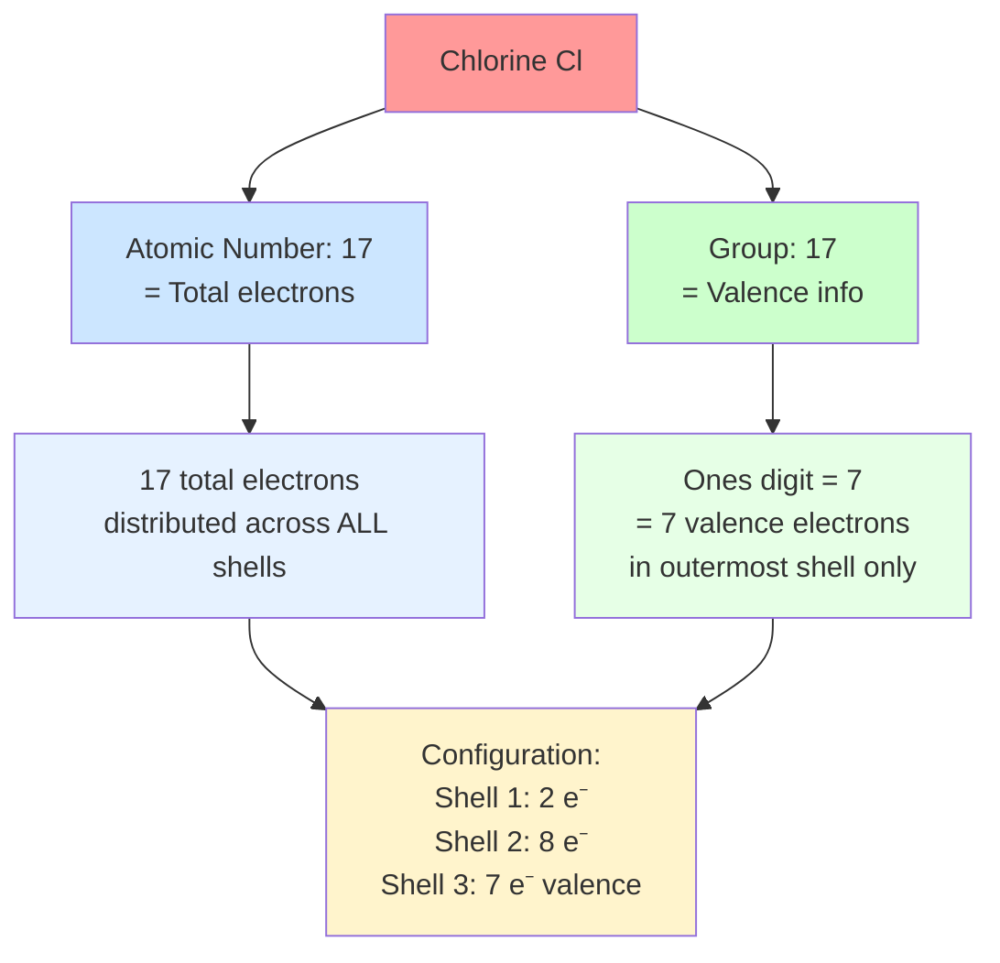

---

### Mistake 5: Comparing Elements in Different Periods AND Groups Without a Strategy

**Common Error**: Trying to compare atomic radius or ionization energy for elements like Li and Cl without a systematic approach.

**Why it happens**: Trends work clearly within periods or groups, but diagonal comparisons need both trends.

**How to avoid it**:
- When elements are diagonal (different period AND different group):
  1. Identify which trend would increase the property
  2. Identify which trend would decrease the property
  3. Determine which effect is stronger
- Generally: **horizontal trends dominate over vertical trends** for radius and ionization energy
- If unsure, compare through an intermediate element

**Example**: Compare Li and Cl for atomic radius
- Li is in Period 2, Group 1
- Cl is in Period 3, Group 17
- Going from Li to Cl: Move DOWN (increases radius) and RIGHT (decreases radius)
- Which is stronger? Moving RIGHT across 16 groups > moving DOWN 1 period
- Horizontal effect dominates: Cl has smaller radius despite being in a lower period

**Strategy**:
```
Li → Na → Mg → ... → Cl
(down)   (right across period)
```
- Li to Na (down): radius increases
- Na to Cl (right): radius decreases strongly
- Net result: Cl smaller than Li, but not by as much as if they were in the same period

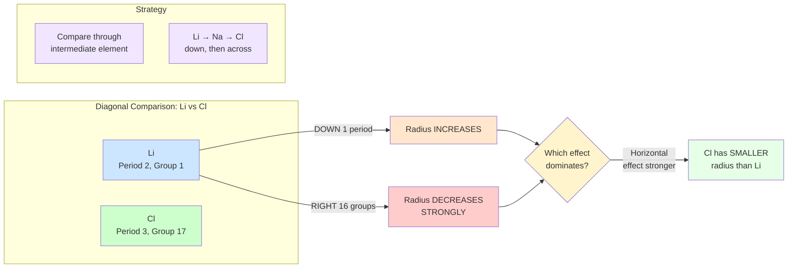

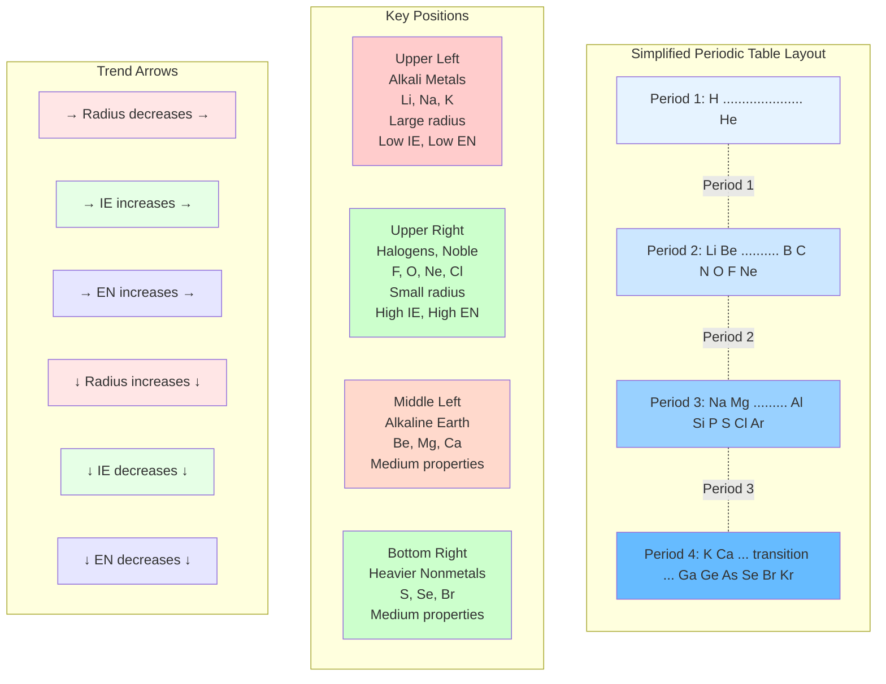

---

## SAT-Aligned Practice Problems

### Section A: Multiple Choice (Questions 1-7)

**Question 1**: Which of the following elements has the largest atomic radius?
- A) Fluorine (F)
- B) Chlorine (Cl)
- C) Sodium (Na)
- D) Magnesium (Mg)

**Question 2**: An element is found in Period 3, Group 16. How many valence electrons does this element have?
- A) 3
- B) 6
- C) 16
- D) 19

**Question 3**: Which of the following correctly arranges the elements in order of increasing ionization energy?
- A) F < O < N < C
- B) C < N < O < F
- C) F < C < N < O
- D) O < F < C < N

**Question 4**: An element has the electron configuration 2, 8, 7. Which group does this element belong to?
- A) Group 7
- B) Group 15
- C) Group 17
- D) Period 7

**Question 5**: Which statement best explains why noble gases are unreactive?
- A) They have high atomic masses
- B) They have complete outer electron shells
- C) They are gases at room temperature
- D) They have low electronegativity values

**Question 6**: Which element would have chemical properties most similar to magnesium (Mg)?
- A) Sodium (Na)
- B) Calcium (Ca)
- C) Aluminum (Al)
- D) Sulfur (S)

**Question 7**: As you move from left to right across Period 3, which property decreases?
- A) Atomic number
- B) Number of valence electrons
- C) Atomic radius
- D) Electronegativity

### Section B: Short Answer with Reasoning (Questions 8-10)

**Question 8**: Three elements X, Y, and Z are in the same period. Element X is in Group 1, element Y is in Group 14, and element Z is in Group 17.

a) Which element has the smallest atomic radius? Explain your reasoning.

b) Which element would most likely form a -1 ion? Explain why.

**Question 9**: The graph below shows ionization energy trends for elements in Period 2.

```
Ionization Energy (kJ/mol)
    ↑
2500|                                   He
2000|                               Ne
1500|                           F
1000|                   O
 500|           C   N
    |   Li  Be  B
    └―――――――――――――――――――――――――→
       Atomic Number
```

a) Explain why ionization energy generally increases from Li to Ne.

b) Explain the small decrease between Be and B, and between N and O.

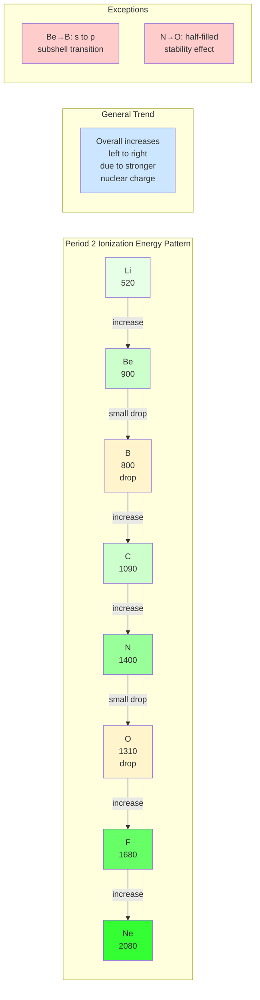

**Question 10**: Use the periodic table to answer this multi-step problem:

An unknown element Q has the following properties:
- It is a metal
- It forms ions with a +2 charge
- It is in Period 4
- It reacts moderately with water

a) Which group is element Q most likely in? Explain your reasoning.

b) Identify a possible element that Q could be.

c) Would an element in the same group but in Period 2 be more or less reactive than element Q? Explain using periodic trends.

---

## Interactive Step Checker: Trend Comparison Problem

Let's work through comparing atomic radius for three elements using an interactive approach.

**Problem**: Compare the atomic radius of Lithium (Li), Sodium (Na), and Potassium (K). Arrange them in order from smallest to largest.

??? success "Step 1: Locate the elements on the periodic table - Click to reveal"
    **Your task**: Find where Li, Na, and K are located.

    **Check your work**:
    - Li: Period 2, Group 1
    - Na: Period 3, Group 1
    - K: Period 4, Group 1

    **Key observation**: All three are in the same group (Group 1)!

    ✓ If you got this, proceed to Step 2.

??? success "Step 2: Identify which trend applies - Click to reveal"
    **Your task**: Since all elements are in the same group, which trend rule should we use?

    **Check your work**:
    - Same group → Use vertical trend
    - Atomic radius **increases** going down a group
    - Why? Each period adds a new electron shell, making atoms larger

    **Visual**:
    ```
    Li  (Period 2) ― 2 shells ― smallest
    Na  (Period 3) ― 3 shells ― medium
    K   (Period 4) ― 4 shells ― largest
    ```

    ✓ If you identified "increases down a group," proceed to Step 3.

??? success "Step 3: Order the elements - Click to reveal"
    **Your task**: Arrange Li, Na, K from smallest to largest atomic radius.

    **Check your work**:
    - Period order: Li (Period 2) < Na (Period 3) < K (Period 4)
    - Since radius increases down the group: Li < Na < K

    **Answer**: Li < Na < K (smallest to largest)

    ✓ Correct! Let's verify with electron configurations in Step 4.

??? success "Step 4: Verify with electron configurations - Click to reveal"
    **Verification**: Check that the number of shells matches our prediction.

    - Li: 2, 1 → 2 electron shells
    - Na: 2, 8, 1 → 3 electron shells
    - K: 2, 8, 8, 1 → 4 electron shells

    More shells = larger radius. Our answer Li < Na < K is confirmed!

    **Additional insight**: All three have only 1 valence electron (Group 1), but that valence electron is in increasingly distant shells, making the atoms progressively larger.

```mermaid
graph TD
    subgraph "Electron Configuration Patterns"
        direction TB
        P1[Period 1: Max 2 electrons<br/>H: 1 | He: 2]
        P2[Period 2: Max 8 electrons<br/>Li: 2,1 → Ne: 2,8]
        P3[Period 3: Max 8 electrons<br/>Na: 2,8,1 → Ar: 2,8,8]
        P4[Period 4: Max 18 electrons<br/>K: 2,8,8,1 → Kr: 2,8,18,8]
    end

    P1 --> P2
    P2 --> P3
    P3 --> P4

    subgraph "Pattern Rules"
        R1[Shell 1: Holds max 2 e⁻]
        R2[Shell 2: Holds max 8 e⁻]
        R3[Shell 3: Holds max 18 e⁻<br/>but fills to 8, then returns]
        R4[Valence electrons<br/>always in outermost shell]
    end

    subgraph "Group 1 Example: Down the Group"
        G1[Li: 2, 1<br/>1 valence e⁻<br/>SMALLEST]
        G2[Na: 2, 8, 1<br/>1 valence e⁻<br/>LARGER]
        G3[K: 2, 8, 8, 1<br/>1 valence e⁻<br/>LARGEST]
    end

    G1 --> G2
    G2 --> G3

    style P1 fill:#e6f3ff
    style P2 fill:#cce7ff
    style P3 fill:#99d1ff
    style P4 fill:#66bbff
    style R1 fill:#fff4cc
    style R2 fill:#fff4cc
    style R3 fill:#fff4cc
    style R4 fill:#ffcccc
    style G1 fill:#ffe6e6
    style G2 fill:#ffcccc
    style G3 fill:#ffb3b3
```

**Practice this method**: Use these same steps for any periodic trend problem!

---

## Complete Answer Explanations

### Section A: Multiple Choice

**Question 1: Answer C - Sodium (Na)**

**Full explanation**:
To find the largest atomic radius, we need to locate each element and apply periodic trends.

Locations:
- F: Period 2, Group 17
- Cl: Period 3, Group 17
- Na: Period 3, Group 1
- Mg: Period 3, Group 2

**Analysis**:
- F vs Cl: Both in Group 17. Cl is lower (Period 3 vs Period 2), so Cl > F in radius
- Na, Mg, Cl: All in Period 3. Radius decreases left to right: Na > Mg > Cl
- Comparing across periods: Na (Period 3, leftmost) will be largest overall

**Why Na is largest**:
- Only 11 protons pulling on 3 shells (weakest pull)
- Leftmost in its period (largest in Period 3)
- Though Cl has same number of shells, it has 17 protons pulling much tighter

**Answer**: C - Sodium has the largest atomic radius.

---

**Question 2: Answer B - 6**

**Full explanation**:
For main group elements (Groups 1, 2, 13-18), we use the group number to find valence electrons.

**Step-by-step**:
1. Period 3, Group 16 → The element is Sulfur (S)
2. For Groups 13-18: valence electrons = ones digit of group number
3. Group 16 → ones digit is 6
4. Therefore: 6 valence electrons

**Verification with electron configuration**:
- S has atomic number 16 (16 total electrons)
- Distribution: 2 in shell 1, 8 in shell 2, 6 in shell 3
- Configuration: 2, 8, 6
- Confirms 6 valence electrons in outermost shell

**Why other answers are wrong**:
- A (3): That's the period number, not valence electrons
- C (16): That's the group or atomic number, not valence electrons
- D (19): No logical connection to the problem

**Answer**: B - 6 valence electrons

---

**Question 3: Answer B - C < N < O < F**

**Full explanation**:
All four elements are in Period 2. We need to apply the horizontal trend for ionization energy.

**Location of elements in Period 2**:
```
Li  Be  B  [C]  [N]  [O]  [F]  Ne
            ↑    ↑    ↑    ↑
         Group Group Group Group
           14   15   16   17
```

**Trend**: Ionization energy **increases left to right** across a period
- Reason: More protons pull electrons closer, making them harder to remove
- Atomic radius decreases left to right
- Smaller atoms hold electrons more tightly

**Ordering**:
- Leftmost: C (Group 14) - lowest ionization energy
- Moving right: N (Group 15)
- Moving right: O (Group 16)
- Rightmost: F (Group 17) - highest ionization energy

**Order**: C < N < O < F (increasing ionization energy)

**Note**: There are small exceptions between N and O due to electron configuration stability, but the general trend still holds.

**Why other answers are wrong**:
- A: Completely reversed
- C: Random order
- D: Partially reversed

**Answer**: B - C < N < O < F

---

**Question 4: Answer C - Group 17**

**Full explanation**:
We need to interpret the electron configuration 2, 8, 7.

**What this notation means**:
- First number (2): 2 electrons in shell 1
- Second number (8): 8 electrons in shell 2
- Third number (7): 7 electrons in shell 3

**Analysis**:
1. Three numbers → 3 shells → Period 3
2. Last number (7) → 7 valence electrons
3. For main groups: 7 valence electrons → Group 17

**Verification**:
- Total electrons: 2 + 8 + 7 = 17
- Atomic number = 17
- Element with atomic number 17 = Chlorine (Cl)
- Chlorine is in Group 17 ✓

**Why other answers are wrong**:
- A (Group 7): Older notation system; modern tables use Group 17
- B (Group 15): That would have 5 valence electrons (2, 8, 5)
- D (Period 7): This is the period where the element is, but question asks for group

**Answer**: C - Group 17

---

**Question 5: Answer B - They have complete outer electron shells**

**Full explanation**:
Noble gases (Group 18) are uniquely unreactive, and we need to explain why.

**Chemical reactivity fundamentals**:
- Elements react to achieve stable electron configurations
- Stability comes from having a complete outer shell (octet rule)
- Atoms gain, lose, or share electrons to reach this stability

**Noble gas electron configurations**:
- He: 2 (full first shell)
- Ne: 2, 8 (full second shell)
- Ar: 2, 8, 8 (full third shell)
- All have complete outer shells already!

**Why this makes them unreactive**:
- Already have maximum stability
- No "motivation" to gain or lose electrons
- Don't need to form bonds to achieve stability
- Energetically unfavorable to disrupt complete shell

**Analogy**: Like a person who is perfectly content - they don't seek change because they already have what they need.

**Why other answers are wrong**:
- A (high atomic masses): Radon is heavy but still unreactive; this doesn't explain Ne or He
- C (gases at room temperature): Physical state doesn't determine reactivity (Cl₂ is also a gas but very reactive)
- D (low electronegativity): Noble gases don't form bonds, so electronegativity isn't relevant

**Answer**: B - They have complete outer electron shells

---

**Question 6: Answer B - Calcium (Ca)**

**Full explanation**:
Elements in the same group have similar chemical properties because they have the same number of valence electrons.

**Magnesium's position**:
- Mg: Period 3, Group 2
- Valence electrons: 2
- Alkaline earth metal

**Analyzing each option**:

**A - Sodium (Na)**:
- Group 1, 1 valence electron
- Forms +1 ions (Mg forms +2)
- More reactive than Mg
- Different chemical behavior

**B - Calcium (Ca)**:
- Group 2, 2 valence electrons (same as Mg!)
- Forms +2 ions (same as Mg)
- Also an alkaline earth metal
- Similar reactivity and compound formation
- Both react with water, form similar compounds (MgCl₂ and CaCl₂, MgO and CaO)

**C - Aluminum (Al)**:
- Group 13, 3 valence electrons
- Forms +3 ions (different from Mg)
- Different properties

**D - Sulfur (S)**:
- Group 16, 6 valence electrons
- Nonmetal (Mg is metal)
- Forms -2 ions (opposite of Mg)
- Completely different properties

**Why Ca is most similar**:
- Same group = same valence electrons
- Same ion charge (+2)
- Same types of compounds
- Similar (though not identical) reactivity

**Answer**: B - Calcium (Ca)

---

**Question 7: Answer C - Atomic radius**

**Full explanation**:
Period 3 elements: Na, Mg, Al, Si, P, S, Cl, Ar

As we move left to right across this period, let's examine each property:

**A - Atomic number**:
- Na (11) → Mg (12) → Al (13) → ... → Ar (18)
- Atomic number **increases** left to right
- ✗ Not the answer

**B - Number of valence electrons**:
- Na (1) → Mg (2) → Al (3) → Si (4) → P (5) → S (6) → Cl (7) → Ar (8)
- Valence electrons **increase** left to right
- ✗ Not the answer

**C - Atomic radius**:
- As nuclear charge increases (more protons) across a period
- Electrons are pulled closer to nucleus
- All elements have same number of shells (3), but increasing nuclear pull
- Atomic radius **decreases** left to right
- ✓ This is the answer!

**D - Electronegativity**:
- More protons = stronger pull on bonding electrons
- Smaller atoms = stronger attraction
- Electronegativity **increases** left to right
- ✗ Not the answer

**Visual representation**:
```
Period 3:  Na     Mg     Al  ...  Cl     Ar
Radius:   ●      ◐      ◑        ◔      ○
       (large)                      (small)
```

**Answer**: C - Atomic radius decreases left to right across Period 3

---

### Section B: Short Answer with Reasoning

**Question 8a: Element Z has the smallest atomic radius**

**Full explanation**:

**Given information**:
- X, Y, Z are in the same period
- X is in Group 1
- Y is in Group 14
- Z is in Group 17

**Reasoning**:
Since all three elements are in the same period:
- They all have the same number of electron shells
- The difference is the number of protons (nuclear charge)

**Periodic trend**:
Atomic radius **decreases left to right** across a period

**Why this happens**:
1. Moving left to right: atomic number increases (more protons)
2. Same number of shells, but stronger nuclear charge
3. Electrons are pulled closer to the nucleus
4. Result: smaller atomic radius

**Application**:
- X (Group 1) is leftmost → largest radius
- Y (Group 14) is in middle → medium radius
- Z (Group 17) is rightmost → smallest radius

**Order**: X > Y > Z (decreasing radius), so Z is smallest

**Answer**: Element Z has the smallest atomic radius because it is furthest right in the period, meaning it has the most protons pulling on the same number of electron shells, resulting in the tightest (smallest) electron cloud.

---

**Question 8b: Element Z would most likely form a -1 ion**

**Full explanation**:

**Determining valence electrons**:
- X (Group 1): 1 valence electron
- Y (Group 14): 4 valence electrons
- Z (Group 17): 7 valence electrons

**Ion formation principles**:
- Elements form ions to achieve stable, complete outer shells (8 electrons, or 2 for first shell)
- Gaining or losing fewer electrons is energetically favorable

**Analysis for each element**:

**Element X (1 valence electron)**:
- To reach 8: would need to gain 7 electrons (-7 ion) - very unfavorable
- To reach 0: lose 1 electron (+1 ion) - favorable
- Most likely: X → X⁺ + e⁻

**Element Y (4 valence electrons)**:
- To reach 8: gain 4 electrons (-4 ion)
- To reach 0: lose 4 electrons (+4 ion)
- Gaining or losing 4 is difficult
- More likely: shares electrons (covalent bonding)

**Element Z (7 valence electrons)**:
- To reach 8: gain 1 electron (-1 ion) - very favorable!
- To reach 0: lose 7 electrons (+7 ion) - very unfavorable
- Most likely: Z + e⁻ → Z⁻

**Why Z forms -1 ion**:
- Only needs 1 more electron to complete outer shell
- Highly electronegative (right side of period)
- Natural tendency to gain electrons
- Examples: Cl⁻, Br⁻ (halogens commonly form -1 ions)

**Answer**: Element Z (Group 17) would most likely form a -1 ion because it has 7 valence electrons and needs only 1 more electron to achieve a stable, complete outer shell of 8 electrons. This is energetically favorable compared to losing 7 electrons.

---

**Question 9a: Ionization energy increases from Li to Ne**

**Full explanation**:

**General trend observation**:
From the graph, ionization energy generally increases left to right across Period 2.

**Atomic structure explanation**:
As we move from Li to Ne across Period 2:

**1. Nuclear charge increases**:
- Li: 3 protons
- Be: 4 protons
- ...continues...
- Ne: 10 protons

**2. Number of electron shells stays constant**:
- All Period 2 elements have 2 electron shells
- Electrons being removed come from the same shell (shell 2)

**3. Atomic radius decreases**:
- More protons pull electrons closer
- Electrons are held more tightly to nucleus
- Distance between nucleus and outer electrons decreases

**4. Shielding remains relatively constant**:
- All have the same inner shell (2 electrons in shell 1)
- Electrons in the same shell don't shield each other effectively
- Inner shell shielding doesn't increase as we move across

**Combined effect**:
- Increasing nuclear charge + decreasing atomic radius = stronger hold on electrons
- Stronger hold = more energy needed to remove an electron
- Result: ionization energy increases

**Quantitative example**:
- Li (3 protons, larger radius): ~520 kJ/mol - easy to remove
- F (9 protons, smaller radius): ~1680 kJ/mol - hard to remove
- More than 3× the energy needed!

**Answer**: Ionization energy generally increases from Li to Ne because as atomic number increases across the period, more protons create a stronger nuclear charge pulling on electrons in the same shell. Since atomic radius decreases and shielding stays constant, electrons are held more tightly and require more energy to remove.

---

**Question 9b: Small decreases between Be-B and N-O**

**Full explanation**:

The general trend increases, but there are two small exceptions where ionization energy slightly decreases.

**Exception 1: Be to B (Beryllium to Boron)**

**Electron configurations**:
- Be: 1s² 2s² (2, 2)
- B: 1s² 2s² 2p¹ (2, 3)

**Why B has slightly lower ionization energy**:
- Be's outermost electron is in a 2s orbital (closer to nucleus, more stable)
- B's outermost electron is in a 2p orbital (slightly higher energy, farther from nucleus)
- 2p orbitals are slightly easier to remove from than filled 2s
- The first 2p electron is somewhat less tightly held

**Analogy**: Be has a "complete s subshell" - there's extra stability in this filled subshell, making it harder to remove an electron from Be than expected.

**Exception 2: N to O (Nitrogen to Oxygen)**

**Electron configurations**:
- N: 1s² 2s² 2p³ (2, 5)
- O: 1s² 2s² 2p⁴ (2, 6)

**Why O has slightly lower ionization energy**:

**Nitrogen's special stability**:
- 2p³ configuration means each of the three 2p orbitals has exactly one electron
- This "half-filled subshell" is extra stable
- Electrons are unpaired, minimizing repulsion

**Oxygen's electron pairing**:
- 2p⁴ means one of the 2p orbitals now has two electrons (paired)
- Paired electrons in the same orbital repel each other
- This electron-electron repulsion makes it slightly easier to remove one electron
- Breaking up the pair actually reduces repulsion, so less energy is needed

**Visual**:
```
N: 2p orbitals:  ↑   ↑   ↑   (half-filled, stable)
O: 2p orbitals:  ↑↓  ↑   ↑   (one pair, slight repulsion)
```

**Answer**: The small decrease between Be and B occurs because B's outermost electron is in a 2p orbital (higher energy, easier to remove) while Be's is in a 2s orbital (lower energy, more stable). The decrease between N and O occurs because N has a stable half-filled 2p subshell (2p³) while O has electron pairing in the 2p orbitals (2p⁴), and the electron-electron repulsion in the paired orbital makes it slightly easier to remove an electron from oxygen.

---

**Question 10a: Element Q is most likely in Group 2**

**Full explanation**:

**Analyzing the clues**:

**Clue 1: It is a metal**
- Eliminates nonmetals (Groups 14-18 in Period 4)
- Eliminates noble gases (Group 18)
- Possible groups: 1, 2, or transition metals (3-12)

**Clue 2: Forms +2 ions**
- Elements form ions by losing or gaining valence electrons
- +2 charge means loses 2 electrons
- Suggests 2 valence electrons

**Group analysis**:
- Group 1: 1 valence electron → forms +1 ions (not +2) ✗
- Group 2: 2 valence electrons → forms +2 ions ✓
- Transition metals: Can form +2 ions, but many also form other charges ≈
- Groups 13+: Would need to lose too many electrons ✗

**Clue 3: In Period 4**
- Narrows down to Period 4 elements only
- Period 4, Group 2 → Calcium (Ca)

**Clue 4: Reacts moderately with water**
- Group 2 alkaline earth metals react with water
- Not as vigorous as Group 1
- "Moderate" fits Group 2 behavior
- Calcium reacts with water: Ca + 2H₂O → Ca(OH)₂ + H₂

**Conclusion**:
All four clues point to Group 2 (alkaline earth metals)

**Answer**: Element Q is most likely in Group 2 (alkaline earth metals). This group forms +2 ions by losing their 2 valence electrons, they are metals, and they react moderately with water, matching all the given properties.

---

**Question 10b: Element Q is most likely Calcium (Ca)**

**Full explanation**:

**From part (a)**: Element Q is in Group 2, Period 4

**Finding the element**:
- Locate Period 4, Group 2 on the periodic table
- This position contains **Calcium (Ca)**
- Atomic number: 20

**Verifying properties**:

**1. Metal** ✓
- Ca is an alkaline earth metal
- Shiny, conductive, malleable

**2. Forms +2 ions** ✓
- Electron configuration: 2, 8, 8, 2
- Loses 2 valence electrons: Ca → Ca²⁺ + 2e⁻
- Common in compounds: CaCl₂, CaO, Ca(OH)₂

**3. Period 4** ✓
- Has 4 electron shells

**4. Reacts moderately with water** ✓
- Reaction: Ca + 2H₂O → Ca(OH)₂ + H₂
- Produces hydrogen gas and calcium hydroxide
- More reactive than Mg, less reactive than K
- "Moderate" is accurate description

**Answer**: Element Q is calcium (Ca), which is located in Period 4, Group 2. Calcium is a metal with atomic number 20, has 2 valence electrons, forms +2 ions (Ca²⁺), and reacts moderately with water to produce hydrogen gas.

---

**Question 10c: Period 2 element would be LESS reactive than element Q**

**Full explanation**:

**Identifying the elements**:
- Element Q (from part b): Calcium (Ca) - Period 4, Group 2
- Same group, Period 2: Beryllium (Be) - Period 2, Group 2

**Question**: Is Be more or less reactive than Ca?

**Applying periodic trends for reactivity in metals**:

**For metals (Groups 1 and 2)**:
- Reactivity **increases down a group**
- Reactivity **decreases up a group**

**Why this trend exists**:

**1. Atomic radius**:
- Ca (Period 4): larger atomic radius, 4 electron shells
- Be (Period 2): smaller atomic radius, 2 electron shells

**2. Ionization energy**:
- Ca: lower ionization energy (easier to lose electrons)
- Be: higher ionization energy (harder to lose electrons)

**3. Valence electron distance**:
- Ca: valence electrons are farther from nucleus (4th shell)
- Be: valence electrons are closer to nucleus (2nd shell)

**4. Shielding effect**:
- Ca: more inner shells shield valence electrons from nuclear charge
- Be: less shielding, valence electrons more tightly held

**Reactivity explanation**:
- Metals react by losing electrons to form positive ions
- Easier to lose electrons = more reactive
- Ca loses electrons more easily than Be
- Therefore, Ca is more reactive than Be

**Experimental evidence**:
- Be barely reacts with water even at high temperatures
- Ca reacts readily with water at room temperature
- This confirms Ca is more reactive

**Answer**: An element in Group 2, Period 2 (beryllium) would be LESS reactive than element Q (calcium). Metal reactivity increases down a group because atomic radius increases and ionization energy decreases, making it easier to lose valence electrons. Calcium's valence electrons are in the 4th shell, farther from the nucleus and more shielded, so they are lost more easily than beryllium's valence electrons in the 2nd shell. Therefore, calcium is more reactive than beryllium.
