# States of Matter

## Explanation

Matter exists in different physical states based on the arrangement and energy of its particles. Understanding states of matter helps explain physical properties and phase changes.

### Detailed Step-by-Step Explanations

#### Understanding States of Matter at the Molecular Level

**Step 1: Particle Arrangement and Motion**
- All matter consists of particles (atoms, molecules, or ions) that are in constant motion
- The state of matter depends on two factors:
  - **Kinetic energy**: energy of particle motion (related to temperature)
  - **Intermolecular forces**: attractions between particles
- When kinetic energy > intermolecular forces → particles move freely (gas)
- When kinetic energy ≈ intermolecular forces → particles slide past each other (liquid)
- When kinetic energy < intermolecular forces → particles are fixed in position (solid)

```mermaid
graph TD
    subgraph "Kinetic Molecular Theory: Energy vs Forces"
        A[Kinetic Energy vs<br/>Intermolecular Forces]
        A --> B[KE > IMF<br/>GAS]
        A --> C[KE ≈ IMF<br/>LIQUID]
        A --> D[KE < IMF<br/>SOLID]

        B --> B1[Particles move freely<br/>High speed, random motion]
        C --> C1[Particles slide past<br/>Moderate motion]
        D --> D1[Particles fixed<br/>Vibrate in place]
    end

    style B fill:#e3f2fd
    style C fill:#fff3e0
    style D fill:#fce4ec
```

**Step 2: Comparing the Three States**

| Property | Solid | Liquid | Gas |
|----------|-------|--------|-----|
| **Particle spacing** | Very close, touching | Close, touching | Far apart |
| **Particle arrangement** | Ordered, fixed pattern | Random, not fixed | Random, not fixed |
| **Particle motion** | Vibrate in place | Slide and flow | Move rapidly, randomly |
| **Shape** | Definite | Takes container shape | Fills container |
| **Volume** | Definite | Definite | Fills container |
| **Compressibility** | Incompressible | Incompressible | Highly compressible |
| **Density** | High | High | Low |

```mermaid
graph LR
    subgraph "SOLID"
        S1[●] --- S2[●]
        S2 --- S3[●]
        S3 --- S4[●]
        S4 --- S5[●]
        S5 --- S6[●]
        S6 --- S7[●]
        S7 --- S8[●]
        S8 --- S9[●]
        S1 --- S4
        S4 --- S7
        S2 --- S5
        S5 --- S8
        S3 --- S6
        S6 --- S9
    end

    subgraph "LIQUID"
        L1[●] -.-> L2[●]
        L2 -.-> L3[●]
        L4[●] -.-> L5[●]
        L6[●] -.-> L7[●]
        L8[●] -.-> L9[●]
        L3 -.-> L6
    end

    subgraph "GAS"
        G1[●]
        G2[●]
        G3[●]
        G4[●]
        G5[●]
    end

    SOLID -->|Melting<br/>+Energy| LIQUID
    LIQUID -->|Vaporization<br/>+Energy| GAS
    GAS -->|Condensation<br/>-Energy| LIQUID
    LIQUID -->|Freezing<br/>-Energy| SOLID

    style SOLID fill:#fce4ec
    style LIQUID fill:#fff3e0
    style GAS fill:#e3f2fd
```

**Step 3: Understanding Phase Changes**

Phase changes occur when energy is added or removed, changing the balance between kinetic energy and intermolecular forces.

**Energy Input (Endothermic) Processes**:
1. **Melting** (Solid → Liquid): Energy breaks bonds in crystal structure, allowing particles to move freely
2. **Vaporization** (Liquid → Gas): Energy overcomes all intermolecular forces, allowing particles to separate completely
3. **Sublimation** (Solid → Gas): Energy allows direct transition without liquid phase (e.g., dry ice, naphthalene)

**Energy Output (Exothermic) Processes**:
1. **Freezing** (Liquid → Solid): Particles slow down and form ordered arrangement, releasing energy
2. **Condensation** (Gas → Liquid): Intermolecular forces pull particles together, releasing energy
3. **Deposition** (Gas → Solid): Particles go directly to ordered solid state, releasing energy (e.g., frost formation)

**Step 4: Interpreting Heating and Cooling Curves**

A heating curve shows temperature changes as heat is added to a substance:

1. **Rising segments** (diagonal lines):
   - Temperature increases
   - Kinetic energy of particles increases
   - State remains constant
   - Formula: q = m × c × ΔT (where c is specific heat capacity)

2. **Flat segments** (horizontal lines):
   - Temperature stays constant during phase change
   - Energy goes into breaking intermolecular forces (potential energy)
   - Formula: q = m × ΔH (where ΔH is heat of fusion or vaporization)

3. **Key temperatures**:
   - First flat region = melting/freezing point
   - Second flat region = boiling/condensation point

```mermaid
graph LR
    subgraph "Heating Curve for Water"
        Start[Ice<br/>-20°C] -->|q = mcΔT<br/>Heating ice| A[0°C]
        A -->|q = mΔHfus<br/>MELTING<br/>Temperature constant| B[0°C]
        B -->|q = mcΔT<br/>Heating water| C[100°C]
        C -->|q = mΔHvap<br/>BOILING<br/>Temperature constant| D[100°C]
        D -->|q = mcΔT<br/>Heating steam| End[Steam<br/>120°C]
    end

    style A fill:#e1f5fe
    style B fill:#fff9c4
    style C fill:#ffe0b2
    style D fill:#ffccbc
```

```mermaid
graph TD
    Title["Temperature vs Heat Added: Heating Curve"]

    subgraph "Visual Representation"
        direction LR
        Phase1["SOLID<br/>❄️<br/>Temperature rises<br/>q = mcΔT"]
        Melt["MELTING<br/>🔄<br/>Temperature = 0°C<br/>q = mΔHfus"]
        Phase2["LIQUID<br/>💧<br/>Temperature rises<br/>q = mcΔT"]
        Boil["BOILING<br/>🔄<br/>Temperature = 100°C<br/>q = mΔHvap"]
        Phase3["GAS<br/>☁️<br/>Temperature rises<br/>q = mcΔT"]

        Phase1 --> Melt
        Melt --> Phase2
        Phase2 --> Boil
        Boil --> Phase3
    end

    style Phase1 fill:#bbdefb
    style Melt fill:#fff59d
    style Phase2 fill:#ffccbc
    style Boil fill:#ffab91
    style Phase3 fill:#e1f5fe
```

**Step 5: Calculating Energy in Phase Changes**

For heating/cooling calculations:

1. **Heating within a phase**: q = m × c × ΔT
   - q = heat energy (J or cal)
   - m = mass (g)
   - c = specific heat capacity (J/g°C)
   - ΔT = temperature change (°C)

2. **Phase change**: q = m × ΔH
   - ΔH_fus = heat of fusion (melting/freezing)
   - ΔH_vap = heat of vaporization (boiling/condensation)

3. **Multi-step problems**: Add energy for each segment of the heating curve

### Key Concepts

**Three States of Matter**:

**Solid**:
- Particles closely packed in fixed positions
- Vibrate in place but don't move around
- Definite shape and definite volume
- Incompressible
- Examples: ice, iron, salt

**Liquid**:
- Particles close together but can slide past each other
- Takes the shape of its container
- Definite volume but no definite shape
- Incompressible
- Examples: water, oil, mercury

**Gas**:
- Particles far apart and move freely at high speeds
- Fills the entire volume of its container
- No definite shape or volume
- Compressible
- Examples: air, helium, water vapor

```mermaid
graph TD
    subgraph "Gas Properties and Relationships"
        A[GAS PARTICLES]

        A --> B[Large Spaces<br/>Between Particles]
        A --> C[Random, Rapid<br/>Motion]
        A --> D[Weak Intermolecular<br/>Forces]

        B --> B1[Compressible]
        B --> B2[Low Density]
        C --> C1[Fills Container]
        C --> C2[High KE]
        D --> D1[No Fixed Shape]
        D --> D2[No Fixed Volume]
    end

    subgraph "Key Gas Relationships"
        P[Pressure P]
        V[Volume V]
        T[Temperature T]
        N[Moles n]

        P -.->|Increase P<br/>Decrease V| V
        P -.->|Increase P<br/>Increase T| T
        V -.->|Increase V<br/>Decrease P| P
        T -.->|Increase T<br/>Increase P| P
        T -.->|Increase T<br/>Increase V| V
        N -.->|Increase n<br/>Increase P| P
    end

    subgraph "Gas Behavior"
        G1[More Collisions<br/>→ Higher Pressure]
        G2[Higher Temperature<br/>→ Faster Motion]
        G3[Larger Volume<br/>→ Fewer Collisions]
    end

    style A fill:#e3f2fd,stroke:#1976d2,stroke-width:3px
    style P fill:#ffebee
    style V fill:#fff3e0
    style T fill:#e8f5e9
    style N fill:#f3e5f5
```

**Kinetic Molecular Theory**:
- All matter is made of particles in constant motion
- Temperature is a measure of average kinetic energy
- Higher temperature = faster particle motion
- Explains properties of each state

```mermaid
graph TD
    subgraph "Kinetic Molecular Theory Principles"
        A[Kinetic Molecular Theory]

        A --> B[Particles in<br/>Constant Motion]
        A --> C[Temperature ∝<br/>Average KE]
        A --> D[Energy Determines<br/>State]
        A --> E[Intermolecular Forces<br/>Affect Properties]

        B --> B1[Even in solids,<br/>particles vibrate]
        C --> C1[Higher T =<br/>Faster motion]
        C --> C2[KE = 3/2 kT]
        D --> D1[High KE: Gas<br/>Medium KE: Liquid<br/>Low KE: Solid]
        E --> E1[Weak IMF: Gas<br/>Strong IMF: Solid]
    end

    subgraph "Temperature Effects on Motion"
        T1[Low Temperature<br/>❄️<br/>Slow motion] --> T2[Medium Temperature<br/>🌡️<br/>Moderate motion] --> T3[High Temperature<br/>🔥<br/>Fast motion]
    end

    style A fill:#e8f5e9,stroke:#2e7d32,stroke-width:3px
    style T1 fill:#e3f2fd
    style T2 fill:#fff3e0
    style T3 fill:#ffebee
```

**Phase Changes**:
- **Melting**: solid → liquid (requires energy)
- **Freezing**: liquid → solid (releases energy)
- **Vaporization/Boiling**: liquid → gas (requires energy)
- **Condensation**: gas → liquid (releases energy)
- **Sublimation**: solid → gas (requires energy)
- **Deposition**: gas → solid (releases energy)

**Energy and Phase Changes**:
- Endothermic: absorbs heat (melting, vaporization, sublimation)
- Exothermic: releases heat (freezing, condensation, deposition)
- During a phase change, temperature remains constant while energy goes into changing state

**Heating Curve**: Graph showing temperature vs. heat added:
- Diagonal sections: temperature increases (kinetic energy increases)
- Flat sections: phase change occurs (potential energy changes, temperature constant)

---

## Common Mistakes

### Mistake 1: Confusing Temperature with Heat Energy
**Error**: Thinking that water at 100°C (liquid) has the same energy as water at 100°C (gas).

**Why it's wrong**: Temperature measures average kinetic energy, but water vapor contains additional energy called the heat of vaporization. At the same temperature, the gas phase always contains more total energy.

**Correct approach**: Remember that phase changes involve potential energy changes, not kinetic energy changes. Water vapor at 100°C has undergone vaporization, absorbing significant energy (≈2260 J/g) to break intermolecular forces.

---

### Mistake 2: Forgetting That Temperature Stays Constant During Phase Changes
**Error**: Assuming that when you add heat to boiling water, its temperature rises above 100°C.

**Why it's wrong**: During a phase change, all added energy goes into breaking intermolecular forces (changing potential energy), not into increasing particle motion (kinetic energy/temperature).

**Correct approach**: On a heating curve, flat regions indicate phase changes where temperature is constant. Only after the phase change is complete will temperature begin to rise again.

---

### Mistake 3: Mixing Up Endothermic and Exothermic Phase Changes
**Error**: Thinking that condensation (gas → liquid) requires heat input, or that melting (solid → liquid) releases heat.

**Why it's wrong**:
- Processes that move toward MORE order (gas → liquid → solid) release energy (exothermic)
- Processes that move toward LESS order (solid → liquid → gas) require energy (endothermic)

**Correct approach**: Remember the mnemonic "Going up takes energy" (solid → liquid → gas requires heat). Going down releases energy.

| Phase Change | Direction | Energy |
|-------------|-----------|--------|
| Melting | Solid → Liquid | Endothermic (absorbs) |
| Freezing | Liquid → Solid | Exothermic (releases) |
| Vaporization | Liquid → Gas | Endothermic (absorbs) |
| Condensation | Gas → Liquid | Exothermic (releases) |
| Sublimation | Solid → Gas | Endothermic (absorbs) |
| Deposition | Gas → Solid | Exothermic (releases) |

---

### Mistake 4: Incorrectly Calculating Total Energy for Multi-Step Heating
**Error**: Only using q = mcΔT for a problem that involves heating ice from -20°C to steam at 120°C.

**Why it's wrong**: This process involves 5 distinct steps:
1. Heating ice (-20°C to 0°C)
2. Melting ice (phase change at 0°C)
3. Heating water (0°C to 100°C)
4. Vaporizing water (phase change at 100°C)
5. Heating steam (100°C to 120°C)

**Correct approach**: Calculate energy for each step separately and add them together. Use q = mcΔT for temperature changes within a phase, and q = mΔH for phase changes.

---

### Mistake 5: Confusing Evaporation with Boiling
**Error**: Thinking evaporation and boiling are the same process.

**Why it's wrong**:
- **Evaporation**: Occurs at the surface of a liquid at any temperature below boiling point; only the highest-energy molecules escape
- **Boiling**: Occurs throughout the liquid at a specific temperature (boiling point); bubbles form inside the liquid

**Correct approach**:
- Evaporation is a gradual surface process that cools the remaining liquid
- Boiling is rapid vaporization at a specific temperature where vapor pressure equals atmospheric pressure
- Both are forms of vaporization, but occur under different conditions

---

## Worked Examples

### Example 1: Identifying States and Properties

**Problem**: Compare the properties of water in its three states: ice (solid), liquid water, and water vapor (gas). Describe the particle arrangement and motion in each.

**Solution**:
1. **Ice (solid)**:
   - Arrangement: \(H_2O\) molecules in fixed, ordered crystal structure
   - Motion: molecules vibrate in place
   - Properties: definite shape and volume, rigid
2. **Liquid water**:
   - Arrangement: molecules close together but not fixed
   - Motion: molecules slide past each other
   - Properties: takes container shape, definite volume
3. **Water vapor (gas)**:
   - Arrangement: molecules far apart, no pattern
   - Motion: molecules move rapidly and randomly
   - Properties: fills container completely, no definite shape or volume

**Answer**: Ice has fixed, ordered particle arrangement with vibration only. Liquid water has close but mobile particles. Water vapor has widely separated, rapidly moving particles.

---

### Example 2: Phase Changes and Energy

**Problem**: Identify the phase change and whether it is endothermic or exothermic:
(a) Dew forming on grass in the morning
(b) Ice melting on a warm day
(c) Dry ice (solid \(CO_2\)) turning directly to gas

**Solution**:
1. (a) Dew forming: water vapor (gas) → liquid water
   - Phase change: **condensation**
   - Gas → liquid releases energy: **exothermic**
2. (b) Ice melting: solid → liquid
   - Phase change: **melting**
   - Solid → liquid requires energy: **endothermic**
3. (c) Dry ice to gas: solid → gas (skips liquid)
   - Phase change: **sublimation**
   - Solid → gas requires energy: **endothermic**

**Answer**: (a) condensation, exothermic; (b) melting, endothermic; (c) sublimation, endothermic

---

### Example 3: Interpreting a Heating Curve

**Problem**: A heating curve for water shows temperature vs. heat added. There's a flat section at 0°C and another at 100°C. Explain what is happening during these flat sections.

**Solution**:
1. **Flat section at 0°C**:
   - Ice is melting to liquid water
   - Energy goes into breaking bonds (increasing potential energy)
   - Temperature stays at 0°C until all ice melts
   - This is the **melting point**
2. **Flat section at 100°C**:
   - Liquid water is boiling to water vapor
   - Energy goes into breaking intermolecular forces (increasing potential energy)
   - Temperature stays at 100°C until all liquid vaporizes
   - This is the **boiling point**
3. During phase changes, added energy changes the state (potential energy) rather than temperature (kinetic energy)

**Answer**: At 0°C, ice melts to water (melting). At 100°C, water boils to vapor (vaporization). Temperature remains constant during phase changes while energy breaks intermolecular forces.

---

## SAT Chemistry Practice Problems

### Problem 1: Particle Motion and Temperature
**Question**: Which of the following statements best explains why the temperature of water remains constant at 100°C while it is boiling?

A) The water has reached its maximum possible temperature
B) The heat energy is being used to increase the kinetic energy of the molecules
C) The heat energy is being used to overcome intermolecular forces
D) No more heat can be added to the system
E) The water molecules stop moving at the boiling point

**Answer**: C

**Explanation**: During a phase change like boiling, the temperature remains constant because the added heat energy is used to break intermolecular forces (hydrogen bonds in water) rather than increase kinetic energy. This energy goes into separating molecules so they can enter the gas phase. Temperature is a measure of average kinetic energy, and since kinetic energy isn't changing during the phase change, temperature stays constant. Options A and D are incorrect because more heat can be added (it's just used for the phase change), B is wrong because kinetic energy isn't increasing, and E is incorrect because molecules continue moving—in fact, they move more freely as a gas.

---

### Problem 2: Phase Change Identification
**Question**: A student observes water droplets forming on the outside of a cold glass on a humid day. Which phase change is occurring?

A) Melting
B) Freezing
C) Condensation
D) Vaporization
E) Sublimation

**Answer**: C

**Explanation**: When water droplets form on a cold surface, water vapor (gas) in the air is changing to liquid water. This phase change from gas to liquid is called condensation. The cold glass cools the air around it, reducing the kinetic energy of water vapor molecules enough that intermolecular forces can pull them together into the liquid phase. Melting (A) and freezing (B) involve solid-liquid transitions, vaporization (D) is liquid to gas (the reverse of what's happening), and sublimation (E) is solid to gas directly. This process is exothermic—the condensing water releases heat energy to the glass.

---

### Problem 3: Energy Calculations
**Question**: How much energy is required to melt 50.0 g of ice at 0°C? (Heat of fusion of water = 334 J/g)

A) 6.68 J
B) 334 J
C) 1,670 J
D) 16,700 J
E) 33,400 J

**Answer**: D

**Explanation**: For phase changes, use the formula q = m × ΔH_fus, where q is heat energy, m is mass, and ΔH_fus is the heat of fusion.

q = 50.0 g × 334 J/g = 16,700 J = 16.7 kJ

This energy breaks the hydrogen bonds in the ice crystal structure, allowing water molecules to move more freely as a liquid. The temperature stays at 0°C during this entire process. Option A incorrectly divides instead of multiplying, B forgets to multiply by mass, C has a calculation error (missing a zero), and E incorrectly multiplies 50 × 334 × 2.

---

### Problem 4: Heating Curve Interpretation
**Question**: On a heating curve for water, which segment represents the phase where water molecules have the highest average kinetic energy?

A) Solid phase (ice) before melting
B) Melting phase (ice to water)
C) Liquid phase (water) before boiling
D) Boiling phase (water to steam)
E) Gas phase (steam) after boiling

**Answer**: E

**Explanation**: Average kinetic energy of molecules is directly proportional to temperature (KE_avg = 3/2 kT). The gas phase (steam) after boiling occurs at the highest temperature on the heating curve, so it has the highest average kinetic energy. During phase changes (B and D), temperature is constant, so kinetic energy doesn't increase. The solid phase (A) is at the lowest temperature, and the liquid phase (C) is at intermediate temperatures. In the gas phase, water molecules move rapidly with high kinetic energy, have overcome all intermolecular forces, and are at temperatures above 100°C.

---

### Problem 5: Comparing States of Matter
**Question**: Which property correctly describes gases but NOT solids or liquids?

A) Particles are in constant motion
B) Particles have mass
C) The substance is easily compressed
D) Particles have kinetic energy
E) Particles experience intermolecular forces

**Answer**: C

**Explanation**: Gases are easily compressed because their particles are far apart with large amounts of empty space between them. When pressure is applied, particles can be pushed closer together. In contrast, solids and liquids have particles that are already close together with minimal space between them, making them virtually incompressible. Options A, B, D, and E are true for all three states of matter. All particles are in constant motion (even in solids, they vibrate), all have mass, all have kinetic energy (related to temperature), and all experience some intermolecular forces (though these forces are weakest in gases).

---

### Problem 6: Endothermic vs. Exothermic
**Question**: Which of the following processes is exothermic?

A) Ice melting in a warm room
B) Water evaporating from a puddle
C) Dry ice subliming to carbon dioxide gas
D) Dew forming on grass in the morning
E) Ice absorbing heat from surroundings

**Answer**: D

**Explanation**: Dew forms when water vapor (gas) in the air condenses to liquid water on cool grass surfaces. Condensation (gas → liquid) is an exothermic process that releases energy. The process moves toward greater order (gases are more disordered than liquids), and ordering processes release energy. Options A (melting), B (evaporation/vaporization), and C (sublimation) are all endothermic because they move toward less order (solid → liquid or solid/liquid → gas). Option E describes heat absorption, which is endothermic by definition. Remember: processes going "up" the phase diagram (toward gas) require energy; processes going "down" (toward solid) release energy.

---

### Problem 7: Kinetic Molecular Theory
**Question**: According to kinetic molecular theory, what happens to the motion of particles in a liquid as it is heated from 20°C to 80°C?

A) Particles stop moving
B) Particles move more slowly
C) Particles move faster
D) Particle motion remains constant
E) Particles begin to vibrate for the first time

**Answer**: C

**Explanation**: Temperature is a measure of the average kinetic energy of particles. When heat is added to a substance, the particles gain kinetic energy and move faster. In a liquid being heated from 20°C to 80°C, the water molecules slide past each other more rapidly as temperature increases. This increased motion explains why liquids flow more easily at higher temperatures (decreased viscosity). Option A is impossible—particles are always in motion. Option B is the opposite of what happens. Option D would only be true during a phase change. Option E is wrong because particles are already vibrating and moving in the liquid state.

---

### Problem 8: Phase Diagram Application
**Question**: At standard atmospheric pressure (1 atm), water boils at 100°C. What happens to the boiling point of water if the external pressure is decreased?

A) Boiling point increases
B) Boiling point decreases
C) Boiling point remains at 100°C
D) Water cannot boil at lower pressures
E) Water freezes instead of boiling

**Answer**: B

**Explanation**: A liquid boils when its vapor pressure equals the external atmospheric pressure. At lower external pressure, the vapor pressure of water reaches this point at a lower temperature, so the boiling point decreases. This is why water boils at lower temperatures at high altitudes (where atmospheric pressure is lower). For example, at the top of Mount Everest, water boils at approximately 70°C. Option A is incorrect—that would happen if pressure increased. Option C only applies at standard pressure (1 atm). Option D is wrong—water can boil at any pressure above its triple point. Option E is incorrect—pressure changes affect boiling point, not whether the substance freezes.

---

### Problem 9: Energy Comparison
**Question**: Which sample contains the most total energy?

A) 10 g of ice at 0°C
B) 10 g of water at 0°C
C) 10 g of water at 50°C
D) 10 g of water at 100°C
E) 10 g of steam at 100°C

**Answer**: E

**Explanation**: All samples must be evaluated based on their total energy content:
- Steam at 100°C (E) has absorbed: energy to heat ice to 0°C + heat of fusion + energy to heat water to 100°C + heat of vaporization
- Water at 100°C (D) has absorbed all the above except heat of vaporization
- Water at 50°C (C) has absorbed less heating energy than D
- Water at 0°C (B) has absorbed only the heat of fusion
- Ice at 0°C (A) has absorbed no additional energy

Since the heat of vaporization (≈2260 J/g) is much larger than the heat of fusion (≈334 J/g) or the energy to heat water through any temperature range, steam at 100°C contains the most energy. This is why steam burns are more severe than hot water burns at the same temperature.

---

### Problem 10: Multi-Step Energy Calculation
**Question**: How much total energy is required to convert 25.0 g of ice at 0°C to water at 20°C?
(Heat of fusion = 334 J/g; specific heat of water = 4.18 J/g°C)

A) 2,090 J
B) 8,350 J
C) 10,440 J
D) 16,700 J
E) 18,790 J

**Answer**: C

**Explanation**: This is a two-step process:

**Step 1: Melt the ice (phase change at 0°C)**
q₁ = m × ΔH_fus = 25.0 g × 334 J/g = 8,350 J

**Step 2: Heat the water from 0°C to 20°C**
q₂ = m × c × ΔT = 25.0 g × 4.18 J/g°C × (20°C - 0°C)
q₂ = 25.0 g × 4.18 J/g°C × 20°C = 2,090 J

**Total energy:**
q_total = q₁ + q₂ = 8,350 J + 2,090 J = 10,440 J = 10.44 kJ

Option A includes only step 2, option B includes only step 1, option D uses only the heat of fusion with no temperature change calculation, and option E incorrectly adds values. Always break multi-step heating problems into individual segments and use the appropriate formula for each.

---

## Step Checker: Phase Change Calculations

Use this systematic approach to solve phase change energy problems:

### Step-by-Step Process

**Step 1: Identify all phases and transitions**
- List the initial state (phase and temperature)
- List the final state (phase and temperature)
- Identify all intermediate steps required

**Step 2: Determine which formulas to use**

For each segment:
- **Temperature change within a phase**: q = m × c × ΔT
  - Need: mass (m), specific heat (c), temperature change (ΔT)
- **Phase change**: q = m × ΔH
  - Need: mass (m), heat of fusion or vaporization (ΔH)

**Step 3: Gather necessary data**

Common values for water:
- Specific heat of ice: c = 2.09 J/g°C
- Specific heat of water: c = 4.18 J/g°C
- Specific heat of steam: c = 2.01 J/g°C
- Heat of fusion (melting/freezing): ΔH_fus = 334 J/g
- Heat of vaporization (boiling/condensing): ΔH_vap = 2260 J/g

**Step 4: Calculate energy for each segment**

Example: Ice at -10°C → Steam at 110°C

| Segment | Description | Formula | Calculation |
|---------|-------------|---------|-------------|
| 1 | Heat ice to 0°C | q = mcΔT | q = m × 2.09 × 10 |
| 2 | Melt ice | q = mΔH | q = m × 334 |
| 3 | Heat water to 100°C | q = mcΔT | q = m × 4.18 × 100 |
| 4 | Vaporize water | q = mΔH | q = m × 2260 |
| 5 | Heat steam to 110°C | q = mcΔT | q = m × 2.01 × 10 |

**Step 5: Sum all energy values**
q_total = q₁ + q₂ + q₃ + q₄ + q₅

**Step 6: Check your answer**
- Are units consistent (usually Joules)?
- Does the answer make sense in magnitude?
- Phase changes (especially vaporization) should contribute the most energy
- Did you account for all segments?

### Worked Example Using Step Checker

**Problem**: Calculate the energy required to convert 50.0 g of ice at -20°C to steam at 120°C.

**Step 1: Identify phases**
- Initial: Ice at -20°C
- Final: Steam at 120°C
- Transitions: Ice → melting → water → boiling → steam

**Step 2: Identify formulas**
Need 5 calculations: 3 temperature changes (q = mcΔT) and 2 phase changes (q = mΔH)

**Step 3: Gather data**
- m = 50.0 g
- c_ice = 2.09 J/g°C, c_water = 4.18 J/g°C, c_steam = 2.01 J/g°C
- ΔH_fus = 334 J/g, ΔH_vap = 2260 J/g

**Step 4: Calculate each segment**

1. Heat ice from -20°C to 0°C:
   q₁ = 50.0 g × 2.09 J/g°C × 20°C = 2,090 J

2. Melt ice at 0°C:
   q₂ = 50.0 g × 334 J/g = 16,700 J

3. Heat water from 0°C to 100°C:
   q₃ = 50.0 g × 4.18 J/g°C × 100°C = 20,900 J

4. Vaporize water at 100°C:
   q₄ = 50.0 g × 2260 J/g = 113,000 J

5. Heat steam from 100°C to 120°C:
   q₅ = 50.0 g × 2.01 J/g°C × 20°C = 2,010 J

**Step 5: Sum all values**
q_total = 2,090 + 16,700 + 20,900 + 113,000 + 2,010 = 154,700 J = 154.7 kJ

**Step 6: Check**
- Units: All in Joules ✓
- Magnitude: Vaporization (113,000 J) contributes most energy ✓
- All segments included ✓
- Answer makes sense: ~155 kJ for 50 g ice to steam ✓

---

## Practice Problems

1. Which state of matter has particles that are closest together? Which has particles that move the fastest?

2. Explain why gases are compressible but solids and liquids are not.

3. Name the phase change: (a) frost forming on a window, (b) gasoline evaporating, (c) molten lava solidifying.

4. Is boiling water an endothermic or exothermic process? Explain.

5. At 50°C, is water a solid, liquid, or gas? What about at -10°C? At 150°C (assume standard pressure)?

6. Why does the temperature of boiling water stay at 100°C even though you keep adding heat?

7. Which contains more energy: 1 gram of liquid water at 100°C or 1 gram of water vapor at 100°C? Explain.

8. Describe what happens to the kinetic energy of particles when a gas is cooled and condenses to a liquid.

9. On a heating curve, what do the diagonal (sloped) sections represent?

10. Explain why ice floats in liquid water using particle theory. (Hint: consider particle arrangement and density)

---

## Answer Key

??? note "Click to reveal answers"
    1. **Solids** have particles closest together. **Gases** have particles that move the fastest (highest kinetic energy).

    2. **Gases are compressible** because particles are far apart with lots of empty space. **Solids and liquids are incompressible** because particles are already close together with minimal space between them.

    3. (a) **Deposition** (gas → solid), (b) **Vaporization/evaporation** (liquid → gas), (c) **Freezing/solidification** (liquid → solid)

    4. **Endothermic**. Boiling requires energy input to overcome intermolecular forces and convert liquid to gas.

    5. **50°C**: liquid. **-10°C**: solid (ice). **150°C**: gas (water vapor/steam).

    6. During boiling (phase change), the added heat energy goes into **breaking intermolecular forces** (changing potential energy) rather than increasing temperature (kinetic energy). Temperature stays constant until the phase change is complete.

    7. **Water vapor at 100°C** contains more energy. It has the same kinetic energy (same temperature) but also contains the energy that was absorbed during vaporization (heat of vaporization).

    8. Kinetic energy **decreases** as the gas cools. When particles slow down enough, intermolecular forces can hold them closer together, causing condensation to liquid.

    9. Diagonal sections represent **temperature changes** within a single state. During these sections, added heat increases the kinetic energy (and thus temperature) of particles.

    10. In ice, \(H_2O\) molecules form a **rigid crystal structure with open spaces**, making ice less dense than liquid water. In liquid water, molecules are closer together on average. Because ice is less dense, it floats on liquid water (density principle: less dense floats on more dense).
